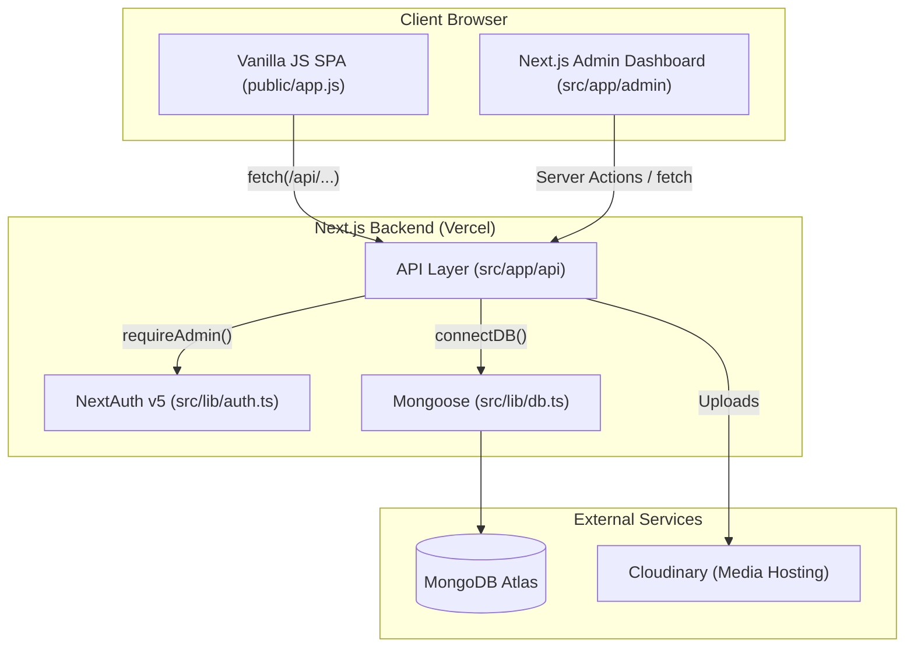
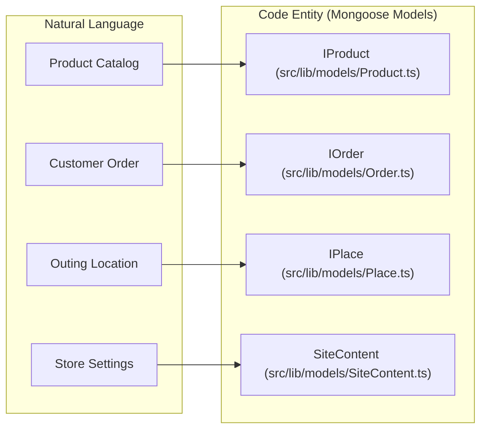

# Project Overview

Relevant source files

The following files were used as context for generating this wiki page:

- [.planning/4-admin-SUMMARY.md](.planning/4-admin-SUMMARY.md)
- [.planning/ROADMAP.md](.planning/ROADMAP.md)
- [.planning/STATE.md](.planning/STATE.md)
- [.planning/phases/07-fas7a-helwa-data/07-01-SUMMARY.md](.planning/phases/07-fas7a-helwa-data/07-01-SUMMARY.md)
- [.planning/phases/07-fas7a-helwa-data/07-02-SUMMARY.md](.planning/phases/07-fas7a-helwa-data/07-02-SUMMARY.md)
- [.planning/phases/07-fas7a-helwa-data/07-03-SUMMARY.md](.planning/phases/07-fas7a-helwa-data/07-03-SUMMARY.md)
- [AGENT-GUIDES.md](AGENT-GUIDES.md)
- [CHANGELOG.md](CHANGELOG.md)
- [DEVLOG.md](DEVLOG.md)
- [MEMORY.md](MEMORY.md)
- [PLAN.md](PLAN.md)
- [PRODUCTION-PLAN.md](PRODUCTION-PLAN.md)
- [next.config.ts](next.config.ts)
- [package-lock.json](package-lock.json)
- [package.json](package.json)
- [public/app.js](public/app.js)
- [public/index.html](public/index.html)
- [scripts/seed-new-places.ts](scripts/seed-new-places.ts)
- [src/app/api/places/route.ts](src/app/api/places/route.ts)

سِراج (Seraj Store) is an Egyptian e-commerce platform specializing in personalized Arabic children's books and educational products. The platform is designed to foster a love for reading through high-quality storytelling and interactive features like the **Story Wizard** and the **Mama World** portal.

The system utilizes a hybrid architecture: a high-performance, vanilla JavaScript Single Page Application (SPA) for the public-facing storefront, and a robust Next.js backend for the administrative dashboard and API layer.

## Hybrid Architecture

The project is structured to serve a fast, static-feeling frontend while leveraging modern server-side capabilities for management and data persistence.

*   **Frontend SPA**: Located in the `public/` directory, this is a vanilla JS application that handles routing, state, and rendering without a heavy framework [AGENT-GUIDES.md:13-22](). It uses hash-based routing (e.g., `#/home`) to manage navigation [public/app.js:25-38]().
*   **Backend API**: A Next.js App Router implementation providing RESTful endpoints for products, orders, and content management [AGENT-GUIDES.md:61-82]().
*   **Admin Dashboard**: A React-based interface built with Next.js and `shadcn/ui`, secured via NextAuth v5, allowing administrators to manage the entire store lifecycle [AGENT-GUIDES.md:124-136]().

### System Relationship Diagram

This diagram illustrates how the vanilla frontend interacts with the Next.js backend and external services.

Sources: [AGENT-GUIDES.md:3-9](), [AGENT-GUIDES.md:63-82](), [public/app.js:5-44]()

## Key Product Domains

The store is organized into four primary programmatic sections, managed via the `section` enum in the product schema [STATE.md:51-57]().

| Section | Code Identifier | Description |
| :--- | :--- | :--- |
| **Tales** | `tales` | Ready-made historical and educational stories like "Khaled Ibn Al-Walid" [public/app.js:36-42](). |
| **Seraj Stories** | `seraj-stories` | Original stories produced by the Seraj brand. |
| **Custom Stories** | `custom-stories` | Personalized books where the child's name and photo are integrated into the narrative [public/app.js:75-81](). |
| **Play & Learn** | `play-learn` | Educational tools like Daily Routine Flashcards and Coloring Workbooks [public/app.js:95-102](). |

Sources: [.planning/STATE.md:51-57](), [public/app.js:35-137]()

## Major Subsystems

### 1. Story Wizard & Personalization
The **Story Wizard** is a multi-step state machine in the frontend that collects child metadata (name, age, challenges) and handles photo uploads to `/api/upload-child-photo` [AGENT-GUIDES.md:28-29](). It culminates in a "generated" preview and adds a unique `custom-story` item to the cart [public/app.js:22-32]().

### 2. Mama World (عالم ماما)
A community-focused portal containing:
*   **Fas7a Helwa (فسحة حلوة)**: A directory of 480+ locations for children in Egypt, integrated with Google Maps [ROADMAP.md:8-24]().
*   **Coloring Workbook**: A dynamic product builder where users select pages to create a custom physical book [CHANGELOG.md:77-84]().
*   **Ask Zainab**: An AI parenting advisor using SSE streaming to provide real-time advice [CHANGELOG.md:30-36]().

### 3. Order & Payment Flow
Orders are submitted to `/api/orders`, where prices are recalculated server-side to prevent client-side tampering [AGENT-GUIDES.md:116-118](). Payments are handled via **InstaPay** integration with automated QR link generation [public/app.js:9-11]().

### Entity Mapping: Natural Language to Code

Sources: [AGENT-GUIDES.md:69-74](), [src/app/api/places/route.ts:4-5]()

## Detailed Documentation

For deeper exploration of specific subsystems, refer to the following child pages:

*   **[Architecture & Tech Stack](#1.1)**: Detailed breakdown of the hybrid SPA/Next.js setup, MongoDB schema patterns, and deployment strategy on Vercel.
*   **[Getting Started & Environment Setup](#1.2)**: Guide for setting up local development, including mandatory environment variables for Cloudinary, MongoDB, and NextAuth.
*   **[Development Log & Roadmap](#1.3)**: Historical context on the project's evolution through 8 phases, including major refactors like the Multi-Category transition.

Sources: [AGENT-GUIDES.md:1-11](), [.planning/STATE.md:1-18](), [.planning/ROADMAP.md:1-109]()
