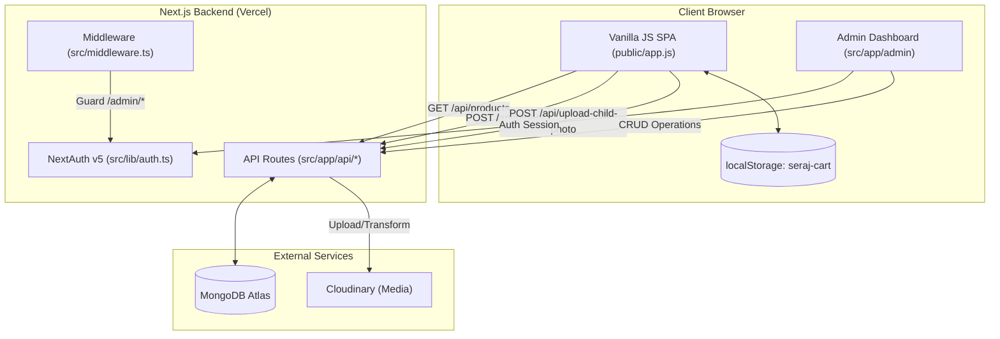

# Architecture & Tech Stack

<details>
<summary>Relevant source files</summary>

The following files were used as context for generating this wiki page:

- [.planning/4-admin-SUMMARY.md](.planning/4-admin-SUMMARY.md)
- [.planning/ROADMAP.md](.planning/ROADMAP.md)
- [.planning/STATE.md](.planning/STATE.md)
- [.planning/phases/07-fas7a-helwa-data/07-01-SUMMARY.md](.planning/phases/07-fas7a-helwa-data/07-01-SUMMARY.md)
- [.planning/phases/07-fas7a-helwa-data/07-02-SUMMARY.md](.planning/phases/07-fas7a-helwa-data/07-02-SUMMARY.md)
- [.planning/phases/07-fas7a-helwa-data/07-03-SUMMARY.md](.planning/phases/07-fas7a-helwa-data/07-03-SUMMARY.md)
- [AGENT-GUIDES.md](AGENT-GUIDES.md)
- [MEMORY.md](MEMORY.md)
- [PLAN.md](PLAN.md)
- [PRODUCTION-PLAN.md](PRODUCTION-PLAN.md)
- [components.json](components.json)
- [next.config.ts](next.config.ts)
- [package-lock.json](package-lock.json)
- [package.json](package.json)
- [public/assets/share-banner.jpg](public/assets/share-banner.jpg)
- [src/app/globals.css](src/app/globals.css)
- [src/app/layout.tsx](src/app/layout.tsx)
- [src/components/ui/button.tsx](src/components/ui/button.tsx)
- [src/lib/utils.ts](src/lib/utils.ts)

</details>


The Seraj Store (سِراج) platform utilizes a hybrid architectural model designed for high performance on mobile devices, zero-cost infrastructure, and rapid content iteration. It combines a vanilla JavaScript Single Page Application (SPA) for the customer-facing storefront with a modern Next.js App Router backend for administrative management and data persistence.

## Hybrid Architecture Overview

The system is split into two distinct execution environments:
1.  **Public Storefront**: A vanilla JS SPA located in `public/`, served as static assets. It handles routing via URL hashes and manages state locally in memory and `localStorage`.
2.  **Admin & API Layer**: A Next.js App Router application that provides RESTful API endpoints for the SPA and a React-based administrative dashboard for order and content management.

### System Data Flow
The following diagram illustrates the interaction between the vanilla frontend, the Next.js API layer, and external services.

**Diagram: System Interaction & Data Flow**

**Sources:** [AGENT-GUIDES.md:1-123](), [.planning/STATE.md:1-60]()

## Tech Stack

### Frontend (Public Storefront)
*   **Language**: Vanilla JavaScript (ES6+), HTML5, CSS3.
*   **Routing**: Custom hash-based router (`#/home`, `#/products`, `#/wizard`) implemented in `handleRoute`.
*   **State Management**: Local `state` object and `cart` array persisted in `localStorage` under the key `seraj-cart`.
*   **PWA**: Service Worker (`public/sw.js`) utilizing a network-first strategy with offline cache fallback (`seraj-v9`).
*   **Design System**: Custom CSS variables for the "Seraj" brand (e.g., `--clr-emerald`, `--clr-brass`) with RTL-first layout.

### Backend & Admin
*   **Framework**: Next.js 16.2.3 (App Router).
*   **Authentication**: NextAuth v5 (Beta 30) using the `Credentials` provider. It validates against environment variables (`ADMIN_EMAIL`, `ADMIN_PASSWORD_HASH`) rather than a users collection.
*   **Database**: MongoDB Atlas via Mongoose.
*   **Media Hosting**: Cloudinary for product images, gallery assets, and child photos.
*   **UI Components**: shadcn/ui (Radix UI + Tailwind CSS) for the admin dashboard.

**Sources:** [package.json:1-48](), [AGENT-GUIDES.md:6-10](), [.planning/STATE.md:21-28]()

## Key Architectural Decisions

The architecture was driven by specific constraints documented in `STATE.md` and `MEMORY.md`:

| Decision | Implementation Detail | Rationale |
| :--- | :--- | :--- |
| **No Users Collection** | Auth via `env` variables in `src/lib/auth.ts` | Simplifies security; only one admin is required for the MVP. |
| **Soft Deletion** | `active: false` field in Mongoose models | Preserves data integrity for historical orders while hiding items from the SPA. |
| **Recalculated Totals** | Server-side logic in `POST /api/orders` | Prevents client-side price manipulation by re-fetching prices from MongoDB. |
| **Hybrid Rendering** | Static SPA + Dynamic API | Optimized for SEO (Next.js metadata) while maintaining zero-build-step simplicity for the frontend. |
| **Rate Limiting** | In-memory sliding window in `src/lib/rateLimit.ts` | Protects `/api/orders` and `/api/upload-child-photo` from abuse. |

**Sources:** [.planning/STATE.md:20-40](), [AGENT-GUIDES.md:114-120]()

## Data Layer & Persistence

The data layer uses a singleton connection pattern to handle serverless cold starts on Vercel efficiently.

**Diagram: Code Entity Mapping (Models to API)**
```mermaid
classDiagram
    class connectDB {
        <<Singleton>>
        +globalThis.mongoose
    }
    class IProduct {
        +String slug
        +String section
        +Boolean active
        +Media media
    }
    class IOrder {
        +String orderNumber
        +IOrderItem[] items
        +Number total
        +ICustomStory customStory
    }
    class IPlace {
        +String name_ar
        +Object location
        +Number[] category_ids
    }

    connectDB --> IProduct : "manages"
    connectDB --> IOrder : "manages"
    connectDB --> IPlace : "manages"

    IOrder "1" *-- "many" IProduct : "references via items"
    
    %% API Mapping
    IProduct --o "GET/POST /api/products"
    IOrder --o "POST /api/orders"
    IPlace --o "GET /api/places"
```

### Key Implementation Details:
*   **Order Numbering**: Generated using a custom `generateOrderNumber()` function in the Order model, following the `SRJ-YYYY-XXXX` format.
*   **Multi-Category Logic**: Products are grouped by the `section` enum (e.g., `tales`, `custom-stories`) and sorted by an `order` field for display in the SPA.
*   **Fas7a Helwa (Places)**: Uses a simple `{ lat, lon }` location sub-schema instead of GeoJSON to minimize complexity for the MVP's Google Maps integration.

**Sources:** [src/lib/db.ts:1-20](), [src/lib/models/Product.ts:1-50](), [src/lib/models/Order.ts:1-100](), [.planning/STATE.md:35-51]()

## Deployment & Infrastructure

The project is optimized for the Vercel platform:
*   **Edge Middleware**: `src/middleware.ts` performs cookie-based checks to protect the `/admin` routes.
*   **Next.js Rewrites**: Used to serve the static SPA from `public/` while maintaining the App Router's API functionality.
*   **Image Optimization**: The `cloudinaryUrl()` helper in `app.js` appends `f_auto,q_auto` to Cloudinary URLs for automatic format and quality optimization.
*   **SEO**: Metadata is managed in `src/app/layout.tsx`, defining OpenGraph tags and Twitter cards for the `ar_EG` locale.

**Sources:** [src/app/layout.tsx:4-38](), [src/middleware.ts:1-30](), [AGENT-GUIDES.md:40-41]()
