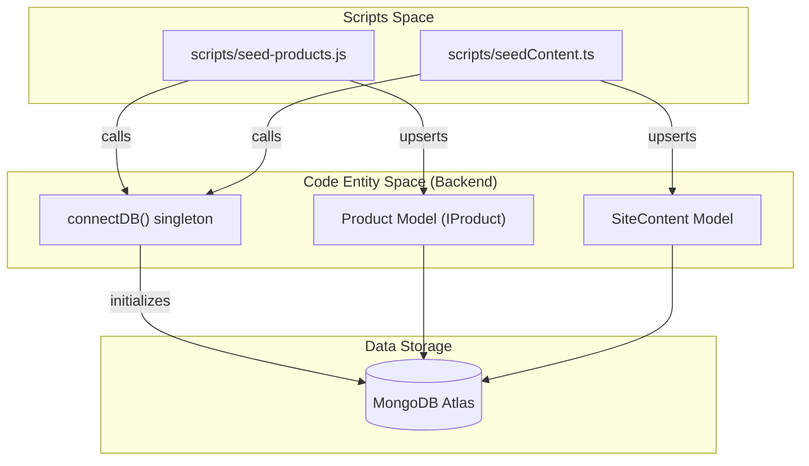
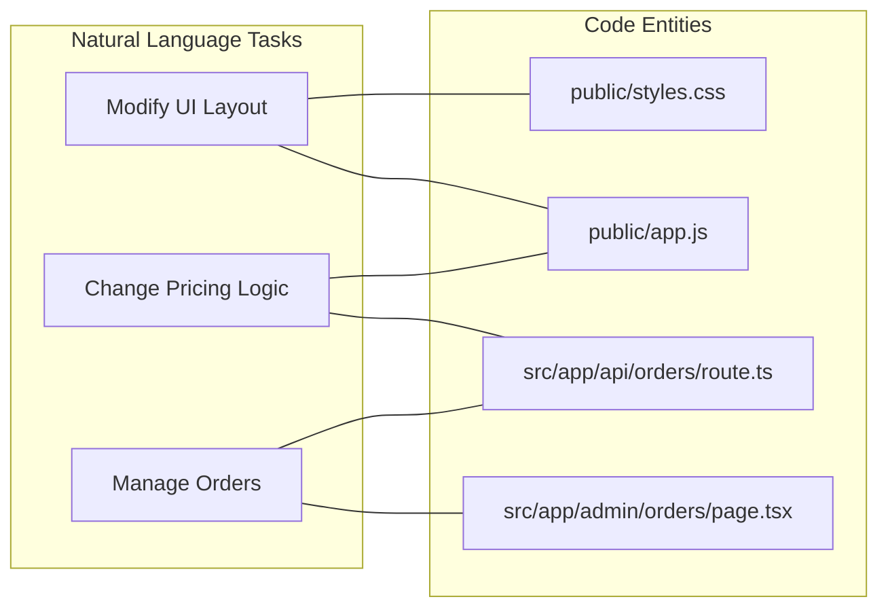

# Getting Started & Environment Setup

<details>
<summary>Relevant source files</summary>

The following files were used as context for generating this wiki page:

- [.env.example](.env.example)
- [AGENT-GUIDES.md](AGENT-GUIDES.md)
- [DEVELOPMENT_LOG.md](DEVELOPMENT_LOG.md)
- [MEMORY.md](MEMORY.md)
- [PLAN.md](PLAN.md)
- [PRODUCTION-PLAN.md](PRODUCTION-PLAN.md)
- [package-lock.json](package-lock.json)
- [package.json](package.json)
- [public/assets/instapay-qr.jpeg](public/assets/instapay-qr.jpeg)
- [scripts/audit-products.js](scripts/audit-products.js)
- [scripts/seed-products.js](scripts/seed-products.js)
- [scripts/seedContent.ts](scripts/seedContent.ts)
- [src/app/admin/testimonials/page.tsx](src/app/admin/testimonials/page.tsx)
- [src/app/api/dev/seed/route.ts](src/app/api/dev/seed/route.ts)
- [src/app/api/testimonials/[id]/route.ts](src/app/api/testimonials/[id]/route.ts)

</details>


This page provides a comprehensive technical guide for onboarding developers to the Seraj Store (سِراج) codebase. It covers repository initialization, environment configuration, database seeding, and local development workflows.

The Seraj Store architecture is a hybrid system combining a **Next.js App Router** backend with a **vanilla JavaScript SPA** frontend served from the `public/` directory [AGENT-GUIDES.md:5-9]().

## 1. System Requirements & Installation

Before starting, ensure you have **Node.js 20+** and **npm** installed. The project utilizes `dotenv-cli` for environment management and `tsx` for executing TypeScript scripts [package.json:36-44]().

### Step-by-step Setup
1. **Clone the Repository**:
   ```bash
   git clone https://github.com/Omarhussien2/-seraj-store.git
   cd -seraj-store
   ```
2. **Install Dependencies**:
   ```bash
   npm install
   ```
3. **Configure Environment**:
   Copy the example environment file and populate it with the required keys (see Section 2).
   ```bash
   cp .env.example .env.local
   ```

Sources: [package.json:1-47](), [AGENT-GUIDES.md:5-10]()

---

## 2. Environment Configuration

The application relies on several third-party integrations and internal security keys. These must be defined in `.env.local`.

### Core Backend & Auth
| Variable | Description | Source |
| :--- | :--- | :--- |
| `MONGODB_URI` | MongoDB Atlas connection string | [AGENT-GUIDES.md:98]() |
| `ADMIN_EMAIL` | Email for admin dashboard login | [AGENT-GUIDES.md:99]() |
| `ADMIN_PASSWORD` | Password for admin dashboard login | [AGENT-GUIDES.md:100]() |
| `NEXTAUTH_SECRET` | Secret used to sign NextAuth JWTs | [AGENT-GUIDES.md:101]() |

### Media & Cloudinary
The system uses Cloudinary for hosting product galleries and child photos uploaded via the Story Wizard [AGENT-GUIDES.md:75-76]().
* `CLOUDINARY_CLOUD_NAME`
* `CLOUDINARY_API_KEY`
* `CLOUDINARY_API_SECRET` [AGENT-GUIDES.md:102-104]()

### Public Business Config
These variables are exposed via the `/api/config` endpoint to the vanilla JS frontend [AGENT-GUIDES.md:77]().
* `NEXT_PUBLIC_WHATSAPP_NUMBER`: Contact for order follow-ups.
* `NEXT_PUBLIC_INSTAPAY_LINK`: Payment destination.
* `NEXT_PUBLIC_SHIPPING_FEE`: Default fee (default: 35).
* `NEXT_PUBLIC_FREE_SHIPPING_ABOVE`: Threshold for free shipping [AGENT-GUIDES.md:105-110]().

Sources: [AGENT-GUIDES.md:96-111](), [src/app/api/config/route.ts:1-20]()

---

## 3. Database Initialization & Seeding

Seraj Store uses a "Seeding Pipeline" to synchronize the hardcoded products in the frontend `app.js` with the MongoDB database. This ensures the Admin Dashboard can manage existing catalog items [scripts/seed-products.js:5-11]().

### Seeding Workflow
The following diagram illustrates how data flows from static scripts into the `connectDB` singleton and the Mongoose models.

**Data Seeding & Entity Mapping**

Sources: [scripts/seed-products.js:13-87](), [scripts/seedContent.ts:1-23](), [src/lib/db.ts:1-20]()

### Execution Commands
Run the following commands to populate your local or remote database:
1. **Seed Products**: Imports the initial catalog (e.g., Khaled Ibn Al-Walid, Custom Story) [scripts/seed-products.js:90-161]().
   ```bash
   npm run seed
   ```
2. **Seed Content**: Initializes the CMS keys (WhatsApp numbers, shipping fees, UI text) [src/app/api/dev/seed/route.ts:8-26]().
   ```bash
   npx tsx scripts/seedContent.ts
   ```

---

## 4. Development Workflow

Once configured, the development environment provides a live-reloading server for both the Next.js API/Admin and the vanilla JS SPA.

### Running the Server
```bash
npm run dev
```
* **Frontend SPA**: Accessible at `http://localhost:3000/` (served via `public/index.html`) [AGENT-GUIDES.md:17-18]().
* **Admin Dashboard**: Accessible at `http://localhost:3000/admin` [AGENT-GUIDES.md:124-133]().
* **API Endpoints**: Rooted at `/api/*` [AGENT-GUIDES.md:61-82]().

### Auditing Product Integrity
To ensure the frontend `PRODUCTS` object in `public/app.js` matches the database state, run the audit script:
```bash
node scripts/audit-products.js --base-url http://localhost:3000
```
This script checks for slug mismatches, missing sections, and unreachable Cloudinary URLs [scripts/audit-products.js:5-15]().

### Local Development Flow
The following diagram bridges the "Natural Language" requirements to specific code entities used during development.

**Development Component Mapping**

Sources: [AGENT-GUIDES.md:13-22](), [AGENT-GUIDES.md:61-82](), [AGENT-GUIDES.md:124-136]()

---

## 5. Deployment

The project is optimized for **Vercel**. 

1. **Build**: Next.js handles the compilation of the Admin React components and provides the static serving logic for the `public/` folder [package.json:7]().
2. **Environment**: Ensure all variables from Section 2 are added to the Vercel Project Settings.
3. **Database**: Whitelist Vercel's IP range or allow access from "anywhere" (0.0.0.0/0) in MongoDB Atlas to allow the serverless functions to connect [PLAN.md:26-27]().

Sources: [PLAN.md:15-35](), [AGENT-GUIDES.md:9]()
