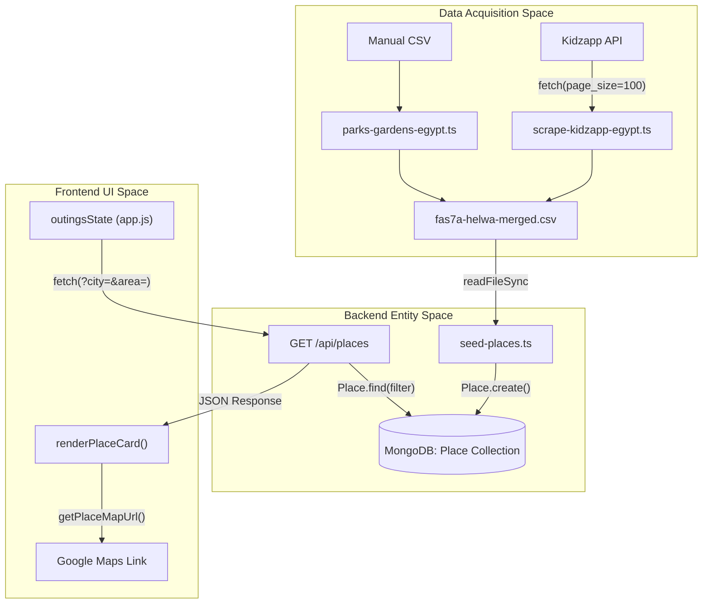
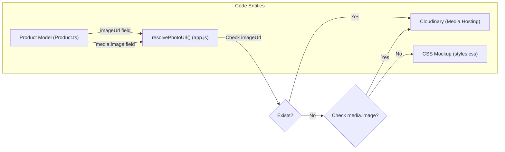

# Development Log & Roadmap

Relevant source files

The following files were used as context for generating this wiki page:

- [.planning/4-admin-SUMMARY.md](.planning/4-admin-SUMMARY.md)
- [.planning/ROADMAP.md](.planning/ROADMAP.md)
- [.planning/STATE.md](.planning/STATE.md)
- [.planning/phases/07-fas7a-helwa-data/07-01-PLAN.md](.planning/phases/07-fas7a-helwa-data/07-01-PLAN.md)
- [.planning/phases/07-fas7a-helwa-data/07-01-SUMMARY.md](.planning/phases/07-fas7a-helwa-data/07-01-SUMMARY.md)
- [.planning/phases/07-fas7a-helwa-data/07-02-PLAN.md](.planning/phases/07-fas7a-helwa-data/07-02-PLAN.md)
- [.planning/phases/07-fas7a-helwa-data/07-02-SUMMARY.md](.planning/phases/07-fas7a-helwa-data/07-02-SUMMARY.md)
- [.planning/phases/07-fas7a-helwa-data/07-03-PLAN.md](.planning/phases/07-fas7a-helwa-data/07-03-PLAN.md)
- [.planning/phases/07-fas7a-helwa-data/07-03-SUMMARY.md](.planning/phases/07-fas7a-helwa-data/07-03-SUMMARY.md)
- [CHANGELOG.md](CHANGELOG.md)
- [DEVELOPMENT_LOG.md](DEVELOPMENT_LOG.md)
- [DEVLOG.md](DEVLOG.md)
- [docs/HANDOFF-PROMPT.md](docs/HANDOFF-PROMPT.md)
- [docs/HANDOFF.md](docs/HANDOFF.md)
- [docs/PROMPTS.md](docs/PROMPTS.md)
- [scripts/audit-products.js](scripts/audit-products.js)
- [scripts/seed-new-places.ts](scripts/seed-new-places.ts)
- [scripts/seed-products.js](scripts/seed-products.js)
- [src/app/api/places/route.ts](src/app/api/places/route.ts)

This page documents the evolutionary history of the Seraj Store (سِراج) platform, detailing the architectural transitions from a single-product "Custom Story" generator to a multi-category educational brand. It covers the eight primary development phases, key design decisions, and the technical challenges encountered during implementation.

## Phased Development History

The project followed a structured roadmap transitioning through infrastructure, data modeling, and specialized domain features (e.g., "Mama World").

| Phase | Name | Focus | Status |
| :--- | :--- | :--- | :--- |
| **1** | Foundation | Next.js setup, Hybrid SPA routing, Vercel deployment | ✅ Complete |
| **2** | Database & API | Mongoose models (Product, Order), REST endpoints | ✅ Complete |
| **3** | Integration | Connecting Vanilla JS `public/app.js` to Next.js APIs | ✅ Complete |
| **4** | Admin Dashboard | NextAuth v5, Product/Order CRUD, Stats | ✅ Complete |
| **5** | Polish | UX enhancements, PWA service worker, SEO | ✅ Complete |
| **6** | Media & Shipping | Cloudinary pipeline, Dynamic shipping fees | ✅ Complete |
| **7** | Fas7a Helwa | Kidzapp scraper, 480+ venues, Google Maps integration | ✅ Complete |
| **8** | Multi-Category | Refactor to "Sections" (Tales, Play-Learn, etc.) | ✅ Complete |

**Sources:** [.planning/STATE.md:8-18](), [.planning/ROADMAP.md:3-73]()

---

## Architectural Evolution & Decisions

### 1. The Multi-Category Refactor (Phase 8)
Originally designed for a single product, the system was refactored to support a brand architecture. A key decision was made to introduce an English `section` enum for programmatic grouping while retaining Arabic `category` values for display labels to maintain compatibility with the existing CMS and admin UI [[.planning/STATE.md:51-54](), [DEVELOPMENT_LOG.md:66-77]()].

### 2. Authentication Strategy
The system uses a "No Users Collection" approach. Admin access is managed via environment variables (`ADMIN_EMAIL`, `ADMIN_PASSWORD_HASH`) and NextAuth v5 with a JWT session strategy (24h expiry). This simplified the architecture by removing the need for user management logic [[.planning/STATE.md:21-22]()].

### 3. Data Integrity & Soft Deletes
Products and Places utilize a soft-delete pattern (`active: false`) to prevent broken order history or 404s on historical links [[.planning/STATE.md:23](), [src/app/api/places/route.ts:34-36]()].

### 4. SEO for Hash-Based SPA
Since the frontend uses hash-based routing (`#/home`), which is invisible to servers, SEO was implemented via a dynamic `sitemap.ts` that pulls Article and ColoringCategory slugs directly from MongoDB, alongside JSON-LD structured data injected via Next.js metadata [[DEVLOG.md:149-164](), [CHANGELOG.md:62-65]()].

---

## Technical Challenges & Solutions (DevLog)

### Challenge: Broken Coloring Workbook Order Flow
**Problem:** Orders for custom coloring workbooks failed because the `coloring-workbook` product didn't exist in the DB, and the Zod schema rejected `coloringDetails` [[DEVLOG.md:81-94]()].
**Solution:** 
1. Seeded a virtual product `coloring-workbook` [[DEVLOG.md:103]()].
2. Implemented server-side price recalculation in `POST /api/orders` [[DEVLOG.md:107]()].
3. Unified field naming (`coverImage`) across the stack [[DEVLOG.md:106]()].

### Challenge: Cairo Area Filtering (Fas7a Helwa)
**Problem:** Cairo contained 480+ locations, making the UI overwhelming [[DEVLOG.md:30-36]()].
**Solution:** 
1. Added a sub-filter `area` to `outingsState` [[CHANGELOG.md:22]()].
2. Updated `GET /api/places` to accept an `area` parameter [[src/app/api/places/route.ts:52-54]()].
3. Implemented a dynamic UI that only shows the area group when "Cairo" is selected [[DEVLOG.md:38-41]()].

---

## Data Flow: From Scraper to UI (Phase 7)

The "Fas7a Helwa" (Outings) feature demonstrates the end-to-end data pipeline used in the project.

### Diagram: Outings Data Pipeline
Title: Outings System Data Flow

**Sources:** [.planning/phases/07-fas7a-helwa-data/07-01-PLAN.md:49-64](), [src/app/api/places/route.ts:15-93](), [CHANGELOG.md:12-25]()

---

## Roadmap Tracking

The project utilizes specific planning documents in `.planning/` to track granular tasks.

### Multi-Category Section Mapping
The refactor organized products into four distinct sections to support the brand's growth:

| Section (ID) | Category (AR) | Series Example | Logic |
| :--- | :--- | :--- | :--- |
| `tales` | قصص جاهزة | سباق الفتوحات | Programmatic Grouping |
| `custom-stories` | قصص مخصصة | — | Links to Story Wizard |
| `play-learn` | فلاش كاردز | — | Educational Tools |
| `seraj-stories` | حكايات سِراج | — | Placeholder for future expansion |
| `null` | مجموعات | — | Shown as cross-sell bundles |

**Sources:** [DEVELOPMENT_LOG.md:33-56](), [scripts/seed-products.js:90-180]()

### Logic Flow: Product Resolution
Title: Product Image & Data Resolution Flow

**Sources:** [.planning/STATE.md:30](), [scripts/seed-products.js:49-85](), [DEVLOG.md:189-192]()

---

## Maintenance & Auditing
To ensure the hybrid architecture remains in sync, the `scripts/audit-products.js` utility was created. It performs the following checks:
*   **Slug Sync:** Compares `app.js` `PRODUCTS` fallback object against the MongoDB database [[scripts/audit-products.js:168-185]()].
*   **Media Reachability:** Validates that `imageUrl` and Cloudinary assets are reachable via HTTP HEAD requests [[scripts/audit-products.js:44-58]()].
*   **Price Consistency:** Ensures `priceText` (Arabic display) matches the numeric `price` field [[scripts/audit-products.js:12]()].

**Sources:** [scripts/audit-products.js:1-15]()
