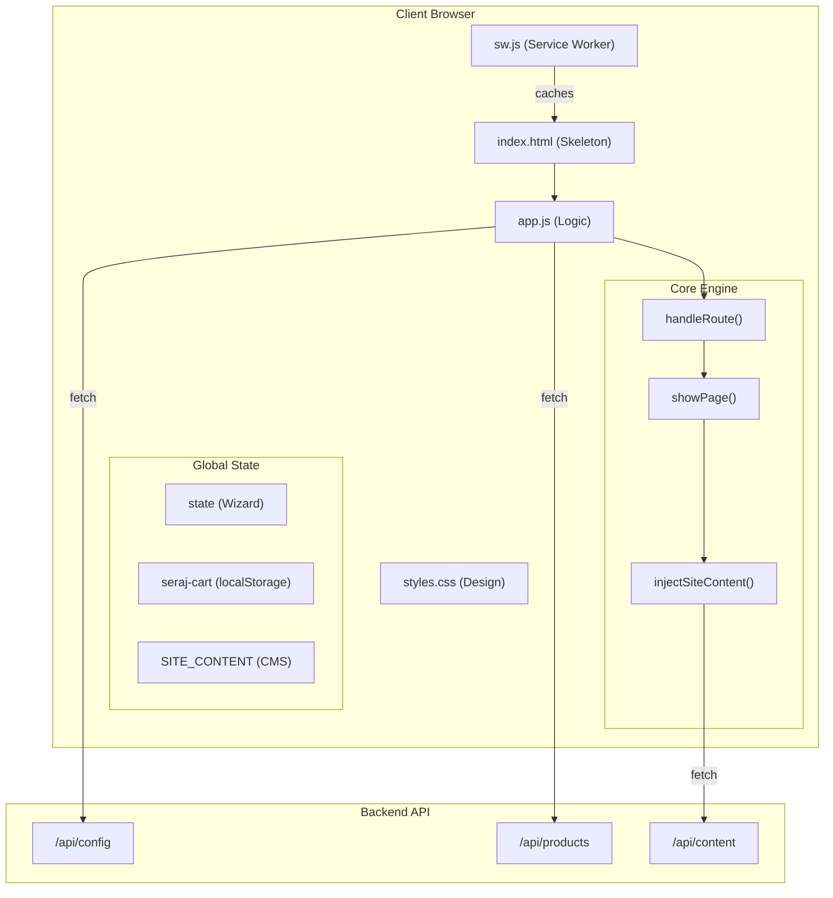
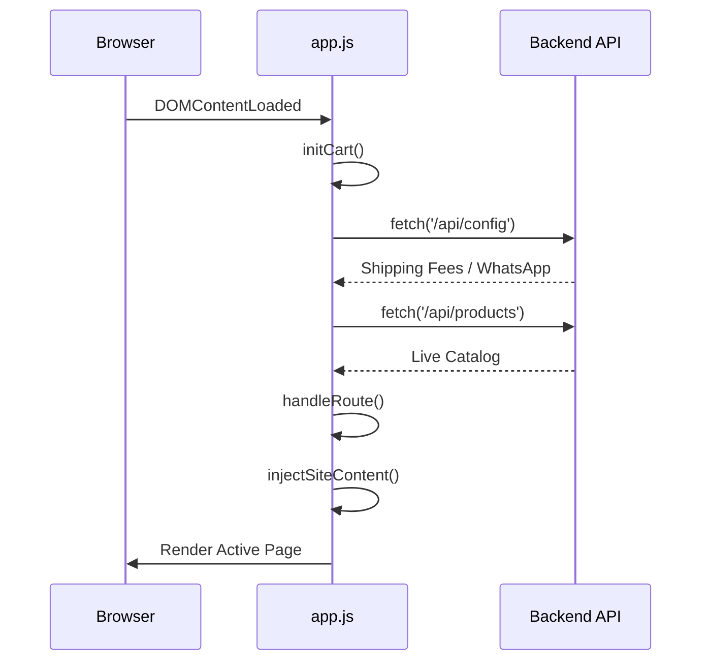

# Frontend SPA (public/)

Relevant source files

The following files were used as context for generating this wiki page:

- [.claude/settings.local.json](.claude/settings.local.json)
- [public/app.js](public/app.js)
- [public/index.html](public/index.html)
- [public/styles.css](public/styles.css)
- [public/sw.js](public/sw.js)

The frontend of Seraj Store is a vanilla JavaScript Single Page Application (SPA) located in the `public/` directory. It is designed for high performance, offline capability (PWA), and a rich, interactive user experience without the overhead of a modern framework like React or Vue. 

The SPA is served as a static asset by the Next.js server, with a rewrite rule ensuring that deep-linked routes are handled by the client-side router.

### System Architecture Overview

The SPA follows a "Reactive Vanilla" pattern where a global `state` object and a centralized `handleRoute` function manage the UI lifecycle.

#### SPA Component Relationship
Title: Frontend SPA Architecture

Sources: [public/app.js:5-32](), [public/index.html:127-132](), [public/sw.js:2-19]()

---

### Core Components

#### 1. Routing & Rendering Engine
The application uses a hash-based router (`#/home`, `#/products`, etc.). The `handleRoute` function parses the URL hash and invokes `showPage`, which toggles visibility of sections defined in `index.html` and triggers data fetching or DOM manipulation for that specific view.
*   **For details, see [Routing, State & Rendering Engine](#2.1)**

#### 2. Design System & Styles
The visual identity is defined in `styles.css`, featuring a "Warm Parchment + Steampunk Brass" aesthetic. It utilizes CSS variables for the Seraj color palette and includes complex 3D CSS transforms for product mockups like `book3d`.
*   **For details, see [Design System & Styles](#2.2)**

#### 3. Story Wizard Flow
A multi-step state machine that guides users through creating a personalized story. It handles child details, photo uploads via `Cloudinary`, and simulates a "generation" process before adding the custom item to the cart.
*   **For details, see [Story Wizard Flow](#2.3)**

#### 4. Mama World Portal
A specialized hub for parents containing an article blog, a directory of child-friendly outings (Fas7a Helwa), a dynamic coloring workbook builder, and an AI chat assistant (Ask Zainab).
*   **For details, see [Mama World Portal](#2.4)**

#### 5. Cart, Checkout & PWA
Manages the shopping lifecycle from `localStorage` persistence to the final checkout form. It includes an InstaPay payment integration and a Service Worker for offline resilience.
*   **For details, see [Cart, Checkout & PWA](#2.5)**

---

### Code Entity Mapping

The following table maps conceptual system features to their primary implementation points in the `public/` directory.

| System Feature | Code Entity | File Path |
| :--- | :--- | :--- |
| **Hash Router** | `window.addEventListener('hashchange', handleRoute)` | [public/app.js:1255-1255]() |
| **Global State** | `var state = { ... }` | [public/app.js:23-32]() |
| **Product Data** | `var PRODUCTS = { ... }` | [public/app.js:35-137]() |
| **CMS Injection** | `function injectSiteContent()` | [public/app.js:460-475]() |
| **Offline Cache** | `const CACHE_NAME = 'seraj-v9'` | [public/sw.js:2-2]() |
| **Design Tokens** | `:root { --seraj: #6bbf3f; ... }` | [public/styles.css:6-48]() |

### Data Flow: Page Initialization
Title: SPA Initialization Sequence

Sources: [public/app.js:1240-1256](), [public/app.js:420-450]()

---

### Navigation Links
- [Routing, State & Rendering Engine](#2.1)
- [Architecture & Tech Stack](#1.1)
