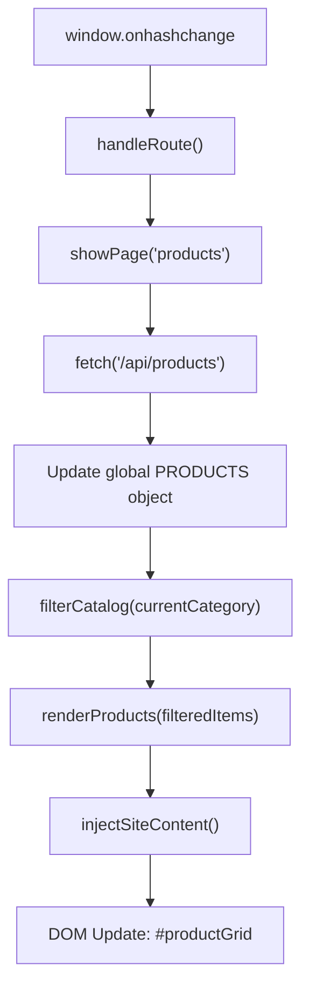
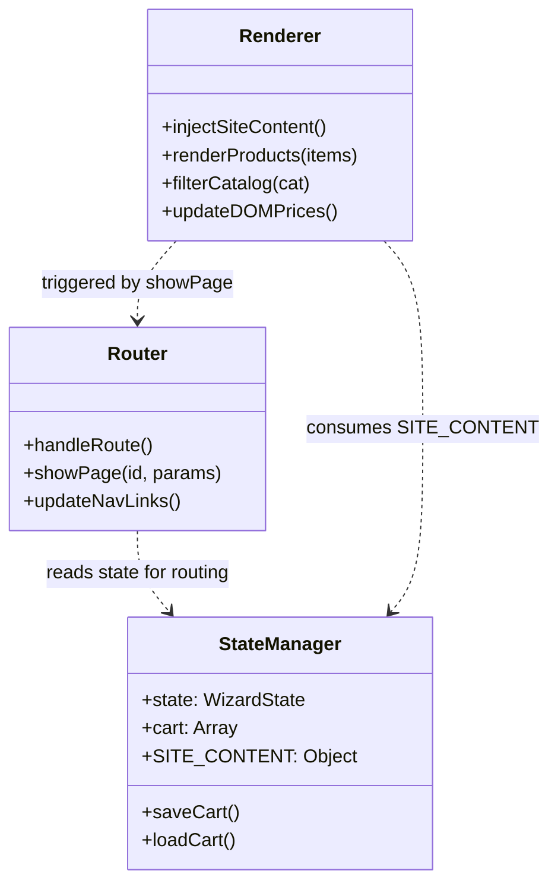

# Routing, State & Rendering Engine

Relevant source files

The following files were used as context for generating this wiki page:

- [fix-html.js](fix-html.js)
- [inject-html-keys.js](inject-html-keys.js)
- [inject-wizard-keys.js](inject-wizard-keys.js)
- [public/app.js](public/app.js)
- [public/assets/catagory/catalog-all.png](public/assets/catagory/catalog-all.png)
- [public/assets/catagory/catalog-custom-stories.png](public/assets/catagory/catalog-custom-stories.png)
- [public/assets/catagory/catalog-play-learn.png](public/assets/catagory/catalog-play-learn.png)
- [public/assets/catagory/catalog-seraj-stories.png](public/assets/catagory/catalog-seraj-stories.png)
- [public/assets/catagory/catalog-tales.png](public/assets/catagory/catalog-tales.png)
- [public/assets/catagory/desktop.ini](public/assets/catagory/desktop.ini)
- [public/index.html](public/index.html)

This page provides a deep dive into the frontend architecture of the Seraj Store (سِراج) Single Page Application (SPA). It covers the hash-based routing mechanism, the global state management system, and the dynamic rendering pipeline used to inject content and catalog data.

## 1. Hash-Based Router

The Seraj Store frontend uses a custom-built vanilla JavaScript router that listens for hash changes to navigate between views without reloading the page.

### Core Mechanism
The router initializes by attaching a `hashchange` event listener to the `window` object. It maps URL hashes (e.g., `#/products`) to specific page IDs defined in the HTML structure.

*   **`handleRoute()`**: Parses the current `window.location.hash`. If the hash is empty, it defaults to `#/home`. It extracts the page name and any optional parameters (like product slugs). [public/app.js:15461-15488]()
*   **`showPage(pageId, params)`**: Manages the DOM transitions. It removes the `active` class from all sections with the `.page` class and applies it to the target `pageId`. It also triggers specific initialization logic based on the route (e.g., loading the catalog or the Story Wizard). [public/app.js:15490-15545]()

### Route Definitions
The router handles several primary paths:
| Route | Function | Target Section |
| :--- | :--- | :--- |
| `#/home` | Landing page with Hero and Featured sections | `[data-page="home"]` |
| `#/products` | Full product catalog with filtering | `[data-page="products"]` |
| `#/product/:slug` | Detailed view for a specific product | `[data-page="product-detail"]` |
| `#/mama-world` | Content portal for articles and outings | `[data-page="mama-world"]` |
| `#/wizard` | Custom Story creation flow | `[data-page="wizard"]` |

**Sources:** [public/app.js:15461-15545](), [public/index.html:127-132]()

---

## 2. Global State & Persistence

The application maintains a centralized `state` object and utilizes `localStorage` to ensure data persistence across sessions.

### State Objects
1.  **`state`**: Holds ephemeral data for the UI, primarily the **Story Wizard** progress (hero name, age, challenge, and photo upload status). [public/app.js:23-32]()
2.  **`cart`**: An array of objects representing items added by the user. [public/app.js:12-14]()
3.  **`SITE_CONTENT`**: A global dictionary populated from the `/api/content` endpoint, used for CMS-driven text injection. [public/app.js:15300-15310]()

### Persistence Logic
The system synchronizes the cart and wizard progress to `localStorage` keys (`seraj-cart`, `seraj-wizard`). On page load, the application attempts to hydrate these objects from storage.
*   **Cart Sync**: Any change to the cart triggers a re-render of the top-bar counter and the cart page. [public/app.js:15700-15720]()

**Sources:** [public/app.js:12-32](), [public/app.js:15300-15310]()

---

## 3. Rendering Pipeline

The rendering engine transforms raw data (from the API or fallback constants) into interactive HTML components.

### CMS Injection System
The "Inject Site Content" system allows administrators to update text across the SPA without modifying the HTML file.
*   **`injectSiteContent()`**: Scans the DOM for elements with the `data-content-key` attribute. It then replaces the element's `innerText` or `innerHTML` with the corresponding value from the `SITE_CONTENT` state. [public/app.js:15315-15330]()
*   **Fallback**: If the API fails or a key is missing, the original HTML content remains as a fallback. [public/index.html:110-112]()

### Product Catalog Pipeline
The catalog rendering is a multi-step process that handles filtering, formatting, and optimization.

1.  **`filterCatalog(category)`**: Filters the global `PRODUCTS` object based on the selected UI tab. [public/app.js:15560-15580]()
2.  **`renderProducts(items)`**: Iterates through the filtered list and generates HTML strings. It uses helper functions to determine the "Media Type" (e.g., `book3d` or `bundle-stack`). [public/app.js:15585-15620]()
3.  **Cloudinary Optimization**: Image URLs are processed to include transformation parameters (e.g., `q_auto,f_auto`) to reduce bandwidth usage. [public/app.js:18-20]()

### Logic Flow: Data to DOM
The following diagram illustrates how the system transitions from a URL change to a rendered product list.

**Title: Catalog Rendering Data Flow**

**Sources:** [public/app.js:15461-15620](), [public/app.js:15315-15330]()

---

## 4. Code Entity Mapping

To assist developers in navigating the codebase, the following diagram maps natural language concepts to the specific JavaScript functions and state objects in `app.js`.

**Title: System Concepts to Code Entities**

### Key Functions Reference
| Function | File Location | Responsibility |
| :--- | :--- | :--- |
| `handleRoute` | [public/app.js:15461]() | Entry point for all navigation logic. |
| `injectSiteContent` | [public/app.js:15315]() | Core of the CMS injection system. |
| `filterCatalog` | [public/app.js:15560]() | Business logic for product categorization. |
| `updateDOMPrices` | [public/app.js:140]() | Syncs UI prices with dynamic config (e.g., discounts). |

**Sources:** [public/app.js:140-160](), [public/app.js:15315-15330](), [public/app.js:15461-15560]()
