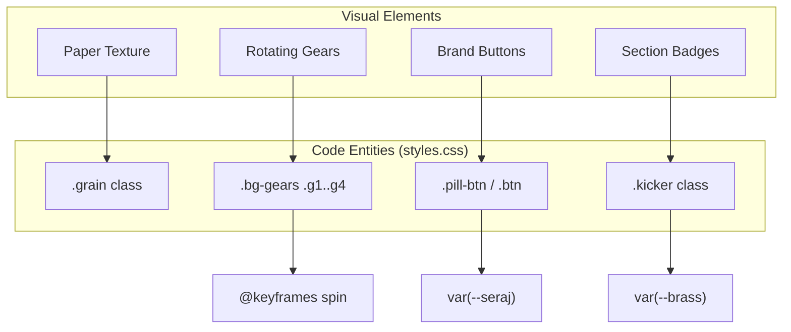
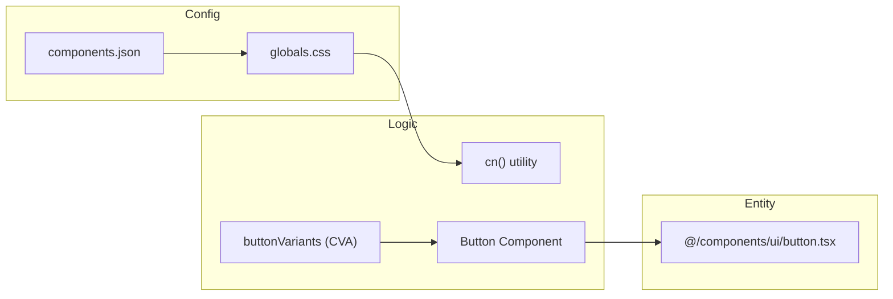

# Design System & Styles

Relevant source files

The following files were used as context for generating this wiki page:

- [components.json](components.json)
- [public/assets/logo/1.svg](public/assets/logo/1.svg)
- [public/assets/logo/2.svg](public/assets/logo/2.svg)
- [public/styles.css](public/styles.css)
- [src/app/globals.css](src/app/globals.css)
- [src/components/ui/button.tsx](src/components/ui/button.tsx)
- [src/lib/utils.ts](src/lib/utils.ts)

The Seraj Store (سِراج) design system is built to evoke a "Warm parchment + steampunk brass + Duolingo-bold" aesthetic [public/styles.css:1-4](). It leverages a custom CSS variable architecture to maintain consistency across the vanilla JS SPA frontend and the Next.js admin dashboard.

## Color Palette & CSS Variables

The system uses a set of semantic CSS variables defined in the `:root` of the global stylesheet. These variables are categorized into functional groups: Ink & Paper (base colors), Seraj Palette (brand greens), Brass (accents), and Status colors.

### Core Brand Colors
| Variable | Value | Usage |
| :--- | :--- | :--- |
| `--seraj` | `#6bbf3f` | Primary brand color, main buttons [public/styles.css:17](). |
| `--seraj-dark` | `#4a9128` | Button shadows and hover states [public/styles.css:18](). |
| `--brass` | `#c9974e` | Decorative elements and "Kicker" icons [public/styles.css:23](). |
| `--ink` | `#231a14` | Primary text color [public/styles.css:8](). |
| `--paper` | `#ffffff` | Background color for pages [public/styles.css:13](). |

### Layout & Spacing Constants
The system defines fixed heights and radii to ensure a consistent tactile feel:
*   `--radius`: `22px` (Standard rounded corners) [public/styles.css:39]().
*   `--radius-lg`: `32px` (Large containers) [public/styles.css:40]().
*   `--topbar-h`: `68px` [public/styles.css:41]().
*   `--bottomnav-h`: `76px` [public/styles.css:42]().

Sources: [public/styles.css:6-48]()

## Typography

The design system uses a hierarchical font strategy optimized for Arabic (RTL) and English readability.

*   **Display (`--display`)**: `Baloo Bhaijaan 2` and `Tajawal`. Used for headings (`h1`-`h5`) with a font weight of 800 [public/styles.css:45,68]().
*   **Body (`--body`)**: `Tajawal`. Used for paragraph text and general interface elements [public/styles.css:46,54]().
*   **Accent (`--accent`)**: `Lalezar`. Used for decorative cursive callouts [public/styles.css:47]().

Sources: [public/styles.css:44-48](), [public/styles.css:68-70]()

## Animation & Visual Effects

Seraj uses a combination of CSS Keyframes and utility classes to provide a playful, interactive experience.

### Global Decor Layers
The "Steampunk" aesthetic is reinforced by two persistent background layers:
1.  **.grain**: A fixed overlay providing a paper-like texture using radial gradients [public/styles.css:73-85]().
2.  **.bg-gears**: A background layer of SVG gears that rotate at different speeds (`spin` and `spinR` animations) [public/styles.css:86-101]().

### Animation Classes
| Class | Effect | Implementation |
| :--- | :--- | :--- |
| `.reveal` | Fade in and scale up | `opacity: 0; transform: scale(.95)` to `1` [public/styles.css:243-247](). |
| `.fadeUp` | Slide up from bottom | `translateY(20px)` to `0` [public/styles.css:249-253](). |
| `.float` | Continuous bobbing | `translateY(-10px)` 50% cycle [public/styles.css:102,255](). |
| `.page-in` | Standard page transition | `translateY(8px)` with `0.4s` ease [public/styles.css:170-175](). |

### Relationship: Visual Entities to Code
This diagram maps the visual "Seraj" brand elements to their specific CSS implementations.

**Visual to CSS Mapping**

Sources: [public/styles.css:73-102](), [public/styles.css:124-136](), [public/styles.css:178-193]()

## 3D Product Mockups

The system includes specialized CSS for rendering 3D-like product presentations without heavy WebGL dependencies.

*   **Book 3D (`.book3d`)**: Creates a perspective-shifted book cover with a "spine" effect using `:before` and `:after` pseudo-elements.
*   **Cards Fan (`.cards-fan`)**: Positions multiple items in a radial fan using `transform: rotate()` and `z-index` offsets.
*   **Bundle Stack (`.bundle-stack`)**: Overlays products with slight offsets to simulate a physical pile.

*(Note: Specific implementation details for these are located in the component-specific sections of `styles.css` starting around line 300)*.

## Responsive Breakpoints & RTL

The application is "Mobile First" with specific overrides for larger screens. As the primary language is Arabic, the layout defaults to RTL (Right-to-Left) behavior.

### Breakpoints
*   **Mobile (< 820px)**: Default. Top navigation links are hidden [public/styles.css:121](), and the bottom navigation bar is visible.
*   **Desktop (>= 820px)**:
    *   `.topnav` becomes `display: flex` [public/styles.css:138-140]().
    *   `.section` padding increases from `60px` to `80px` [public/styles.css:201-202]().

### RTL Conventions
The system avoids `left` and `right` properties in favor of logical properties:
*   `margin-inline-start` is used for spacing that should flip in LTR/RTL [public/styles.css:121,125]().
*   `padding-inline` handles horizontal inner spacing.

Sources: [public/styles.css:138-140](), [public/styles.css:201-202]()

## Admin UI Components (Shadcn/UI)

The Admin Dashboard uses a separate styling system based on Tailwind CSS and Shadcn/UI, defined in `src/app/globals.css` and `components.json`.

### Component Architecture
Admin components like `Button` use `class-variance-authority` (CVA) to manage states and variants.

**Data Flow: Admin Component Styling**

### Key Admin Utilities
*   **`cn()`**: A utility function in `src/lib/utils.ts` that merges Tailwind classes using `clsx` and `tw-merge` to prevent class conflicts [src/lib/utils.ts:4-6]().
*   **`buttonVariants`**: Defines semantic variants like `default`, `outline`, `destructive`, and `ghost` for the admin panel [src/components/ui/button.tsx:6-41]().

Sources: [src/app/globals.css:1-49](), [src/components/ui/button.tsx:6-58](), [src/lib/utils.ts:1-7]()
