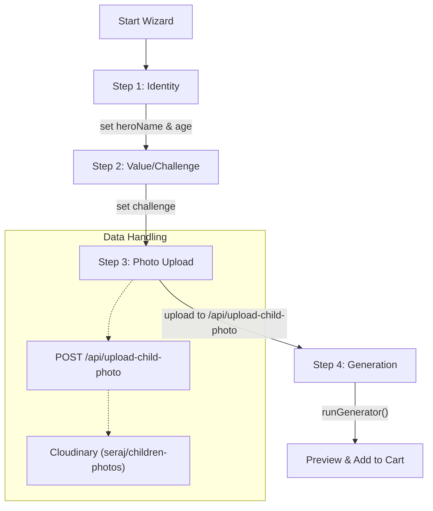

# Story Wizard Flow

<details>
<summary>Relevant source files</summary>

The following files were used as context for generating this wiki page:

- [public/app.js](public/app.js)
- [public/index.html](public/index.html)
- [public/styles.css](public/styles.css)
- [src/app/admin/stories/page.tsx](src/app/admin/stories/page.tsx)
- [src/app/api/upload-child-photo/route.ts](src/app/api/upload-child-photo/route.ts)
- [src/lib/db.ts](src/lib/db.ts)
- [src/lib/rateLimit.ts](src/lib/rateLimit.ts)

</details>


The **Story Wizard** is a multi-step state machine implemented in the vanilla SPA frontend that allows customers to personalize stories for their children. It handles data collection, photo uploads via a dedicated API, and a simulated "generation" process before adding the customized product to the cart.

## 1. Wizard State Machine

The wizard's logic is driven by a global `state` object and a `wizardStep` counter. This state is ephemeral and lives in memory during the session, though it can be persisted to `localStorage` under the `WIZARD_KEY` [public/app.js:13, 23-32]().

### State Schema
| Property | Type | Description |
| :--- | :--- | :--- |
| `heroName` | `string` | The child's name to be featured in the story. |
| `age` | `number` | Child's age for content tailoring. |
| `challenge` | `string` | The value or challenge the story should address (e.g., courage). |
| `customChallenge`| `string` | User-defined value if the presets don't match. |
| `photoUrl` | `string` | The Cloudinary URL returned after a successful upload. |
| `photoFile` | `File` | The raw file object selected by the user. |
| `wizardStep` | `number` | Current active step in the UI (1-4). |

**Sources:** [public/app.js:23-32]()

## 2. Step-by-Step Flow

The wizard is rendered within the `wizard-shell` container in the DOM [public/index.html:437](). Each step transitions the UI and updates the `state` object.

### Flow Diagram: Wizard Progression
This diagram maps the logical steps to the internal state updates and UI transitions.


**Sources:** [public/app.js:23-32](), [src/app/api/upload-child-photo/route.ts:65-66]()

## 3. Child Photo Upload Pipeline

Unlike standard product media, child photos are uploaded through a public endpoint `POST /api/upload-child-photo` which does not require admin authentication [src/app/api/upload-child-photo/route.ts:15-18]().

### Implementation Details
- **Rate Limiting:** The endpoint uses `isRateLimited` to restrict IPs to 20 uploads per 10 minutes to prevent abuse [src/app/api/upload-child-photo/route.ts:20-21]().
- **Validation:** Only `image/jpeg`, `image/png`, and `image/webp` are allowed, with a maximum file size of 5MB [src/app/api/upload-child-photo/route.ts:40-58]().
- **Transformation:** Images are automatically resized to 800x800 (limit) and optimized with `quality: "auto:good"` via the Cloudinary SDK [src/app/api/upload-child-photo/route.ts:68-71]().

**Sources:** [src/app/api/upload-child-photo/route.ts:18-93](), [src/lib/rateLimit.ts:29-42]()

## 4. The Simulated Generator (`runGenerator`)

Once all data is collected, the wizard executes `runGenerator`. This is a visual feedback mechanism that simulates the "AI writing" process to build anticipation.

- **Progress Bar:** A UI element increments while simulating tasks like "Writing story," "Designing pages," and "Preparing preview."
- **Finalization:** Once complete, the function calls `addCustomStoryToCart` [public/app.js:23-32]().

### Logic to Code Mapping
The following table associates the wizard UI components with the underlying JavaScript state.

| UI Component | Code Entity / Selector | Purpose |
| :--- | :--- | :--- |
| **Hero Name Input** | `state.heroName` | Captured in Step 1. |
| **Value Selection** | `state.challenge` | Radio buttons in Step 2. |
| **File Picker** | `state.photoFile` | `input[type="file"]` in Step 3. |
| **Progress Fill** | `.wizard-progress-fill` | Visualized during `runGenerator`. |
| **Cart Integration**| `addCustomStoryToCart()` | Merges wizard state into the `seraj-cart`. |

**Sources:** [public/app.js:12-32](), [public/index.html:437-480]()

## 5. Cart Integration & Checkout Redirect

When the story is "generated," the `addCustomStoryToCart` function is triggered. This creates a special cart item where the `customStory` property contains the wizard's collected data [src/app/admin/stories/page.tsx:32-39]().

### Cart Object Structure
The customized item is pushed to the `seraj-cart` array in `localStorage` [public/app.js:12]():
```json
{
  "slug": "custom-story",
  "heroName": "Zain",
  "age": 5,
  "challenge": "الشجاعة",
  "photoUrl": "https://res.cloudinary.com/...",
  "price": 220
}
```

After the item is added, the router redirects the user to `#/cart` to review the story preview and proceed to checkout [public/app.js:140-160]().

## 6. Admin Fulfillment Workflow

Orders containing custom stories appear in the **Admin Stories Page** (`/admin/stories`). Admins manage the lifecycle of these stories through a specific state machine [src/app/admin/stories/page.tsx:38-50]().

### Story Status Transitions
1. **`pending` (بانتظار المراجعة):** Default state upon order creation.
2. **`reviewed` (تمت المراجعة):** Admin has verified the photo and text.
3. **`sent_to_print` (أُرسلت للطباعة):** Data sent to the printing partner.
4. **`delivered` (تم التسليم):** Final physical product delivered to customer.

**Sources:** [src/app/admin/stories/page.tsx:45-57](), [src/app/admin/stories/page.tsx:80-113]()
