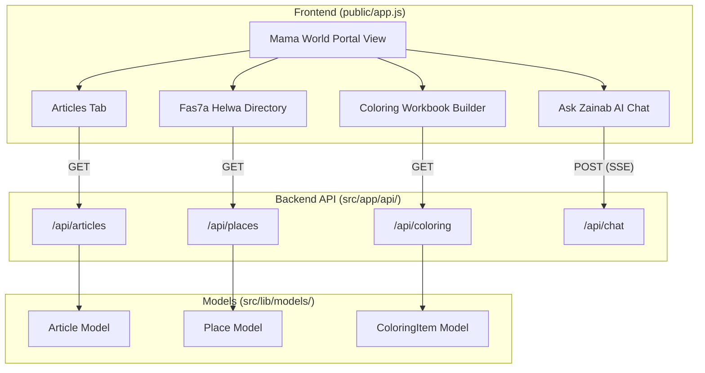
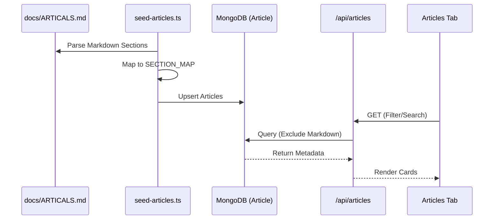
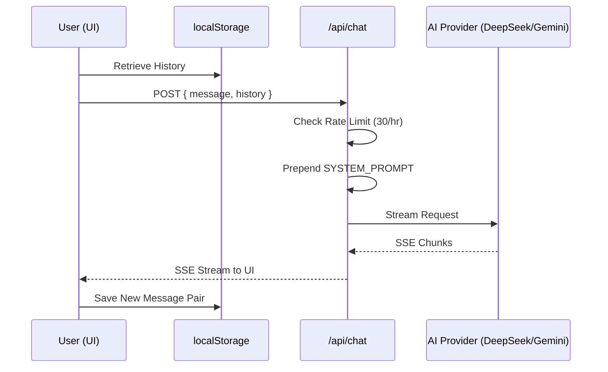

# Mama World Portal

Relevant source files

The following files were used as context for generating this wiki page:

- [docs/ARTICALS.md](docs/ARTICALS.md)
- [public/app.js](public/app.js)
- [public/index.html](public/index.html)
- [public/styles.css](public/styles.css)
- [scripts/seed-articles.ts](scripts/seed-articles.ts)
- [src/app/admin/articles/page.tsx](src/app/admin/articles/page.tsx)
- [src/app/api/articles/[slug]/route.ts](src/app/api/articles/[slug]/route.ts)
- [src/app/api/articles/route.ts](src/app/api/articles/route.ts)
- [src/app/api/chat/route.ts](src/app/api/chat/route.ts)
- [src/lib/models/Article.ts](src/lib/models/Article.ts)

The **Mama World Portal** (عالم ماما) is a multi-faceted content and utility hub designed to support Egyptian mothers. It serves as a centralized gateway for educational articles, a directory for family outings, a custom workbook builder, and an AI-driven parenting assistant.

## Architecture & Integration

The portal is implemented as a set of dynamic views within the vanilla JavaScript SPA. It communicates with several Next.js API routes to fetch CMS-driven content, manage directory listings, and stream AI responses.

### Component Relationship Diagram
This diagram maps the logical portal components to their respective code entities and API endpoints.

**Sources:** `public/app.js` [5-100](), `src/app/api/articles/route.ts` [60-123](), `src/app/api/chat/route.ts` [73-120]()

---

## Articles Tab (CMS-Driven Blog)

The Articles section provides parenting advice categorized by age group and topic. The content is managed via a dedicated `Article` Mongoose model and populated through a Markdown-based seeding pipeline.

### Key Features
- **Pagination & Filtering:** Articles are fetched with pagination and filtered by `section` (e.g., "العلاقة مع الأم نفسيا") or `ageGroup` [src/app/api/articles/route.ts:60-82]().
- **Full-Text Search:** Uses MongoDB text indexes on `title`, `excerpt`, and `contentMarkdown` [src/lib/models/Article.ts:79-80]().
- **Metadata:** Each article includes `readingTime` (auto-calculated based on word count) and `sources` for academic credibility [src/app/api/articles/route.ts:158-162]().

### Data Flow: Seeding to Display

**Sources:** `scripts/seed-articles.ts` [13-55](), `src/app/api/articles/route.ts` [97-102](), `src/lib/models/Article.ts` [43-77]()

---

## Fas7a Helwa (Outings Directory)

**Fas7a Helwa** (فسحة حلوة) is a directory of family-friendly locations in Egypt. It features a sophisticated filtering system to help mothers find specific types of outings.

- **Filter Chips:** Users can filter by category (e.g., Play Areas, Parks, Museums).
- **Sub-filters:** Supports area-based filtering (e.g., Maadi, New Cairo) and attributes like `is_free`, `indoor_outdoor`, and `price_range`.
- **Place Modals:** Clicking a place opens a detail view with location coordinates, descriptions, and current offers [src/app/api/places/route.ts]().

**Sources:** `public/app.js` [Section: Fas7a Helwa](), `src/app/api/places/route.ts` [1-50]()

---

## Coloring Workbook Builder

This interactive tool allows users to compile a custom coloring book. It uses a dynamic pricing engine and specific item metadata.

- **Selection Logic:** Users browse categories (Coloring, Worksheets, Crafts) and select specific pages to include in their physical book.
- **Dynamic Pricing:** The price is calculated in real-time based on the number of pages, cover type (soft/hard), and current pricing rules fetched from `/api/coloring/pricing` [src/app/api/coloring/pricing/route.ts]().
- **Interaction Tracking:** The system tracks `printCount`, `savedCount`, and `shareCount` for each item to surface "Featured" content [src/app/api/coloring/items/route.ts]().

**Sources:** `public/app.js` [Section: Coloring Builder](), `src/app/api/coloring/pricing/route.ts` [10-40]()

---

## Ask Zainab (AI Chat)

**Ask Zainab** (اسألي زينب) is an AI parenting assistant utilizing the "Mama Zainab" persona—a wise Egyptian grandmother.

### Implementation Details
- **Persona Injection:** The `SYSTEM_PROMPT` defines the persona: Egyptian slang only, warm tone, Egyptian proverbs, and references to Islamic upbringing [src/app/api/chat/route.ts:32-70]().
- **Streaming (SSE):** The API supports Server-Sent Events (SSE) for real-time response streaming to the frontend.
- **Multi-Provider Fallback:** The backend attempts to use **DeepSeek** first, falling back to multiple **Gemini** API keys if the primary provider fails [src/app/api/chat/route.ts:122-150]().
- **Context Persistence:** Conversation history is stored in `localStorage` and the last 10 messages are sent to the API to maintain context window efficiency [src/app/api/chat/route.ts:110-116]().
- **Safety Rails:** Strict rules prevent the AI from giving medical advice or religious fatwas [src/app/api/chat/route.ts:47-53]().

### Chat Sequence Diagram

**Sources:** `src/app/api/chat/route.ts` [6-30](), [73-120](), `public/app.js` [Section: Chat Interaction]()

---

## Technical Summary Table

| Feature | Data Source | Key Logic | Persistence |
| :--- | :--- | :--- | :--- |
| **Articles** | MongoDB (`Article`) | Markdown Parser / Text Search | Server-side |
| **Fas7a Helwa** | MongoDB (`Place`) | Multi-facet Filtering | Server-side |
| **Coloring Builder** | MongoDB (`ColoringItem`) | Dynamic Price Recalculation | `seraj-cart` (Local) |
| **Ask Zainab** | AI (DeepSeek/Gemini) | SSE Streaming / System Prompt | `zainab-history` (Local) |

**Sources:** `src/lib/models/Article.ts` [85-87](), `src/app/api/chat/route.ts` [122-140](), `public/app.js` [12-16]()
