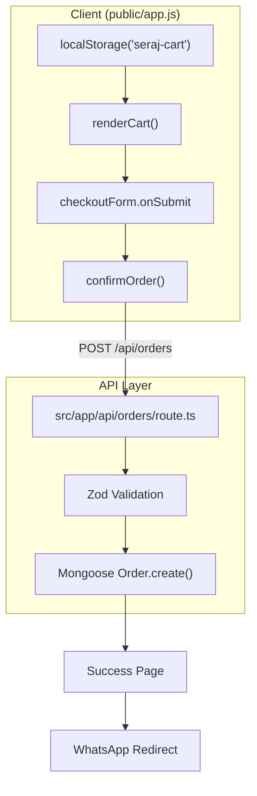
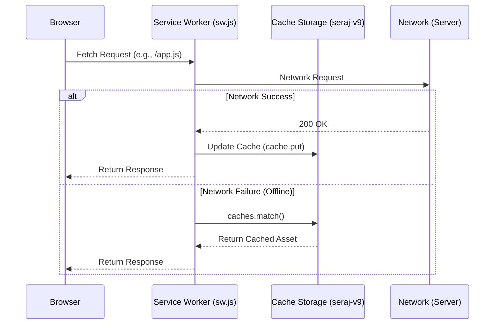

# Cart, Checkout & PWA

Relevant source files

The following files were used as context for generating this wiki page:

- [.claude/settings.local.json](.claude/settings.local.json)
- [public/app.js](public/app.js)
- [public/assets/1-.mp4](public/assets/1-.mp4)
- [public/assets/2.mp4](public/assets/2.mp4)
- [public/assets/3.mp4](public/assets/3.mp4)
- [public/assets/family-photo.mp4](public/assets/family-photo.mp4)
- [public/assets/logo/logo-icon.svg](public/assets/logo/logo-icon.svg)
- [public/assets/logo/logo.svg](public/assets/logo/logo.svg)
- [public/index.html](public/index.html)
- [public/manifest.json](public/manifest.json)
- [public/sw.js](public/sw.js)
- [src/app/admin/login/page.tsx](src/app/admin/login/page.tsx)

This section documents the end-to-end shopping experience within the Seraj Store (سِراج) vanilla SPA. It covers the client-side cart management using `localStorage`, the checkout and payment integration (InstaPay QR), and the Progressive Web App (PWA) implementation including the Service Worker caching strategy.

## Shopping Cart Management

The cart is managed entirely on the client side to ensure a snappy user experience without constant server round-trips.

### Persistence and State
The cart state is persisted in `localStorage` under the key `seraj-cart` `[public/app.js:12-12]()`. The global `cart` array stores items with their metadata, including specialized details for custom products like the Story Wizard or Coloring Workbook `[public/app.js:161-161]()`.

### Key Functions
| Function | Responsibility |
| :--- | :--- |
| `addToCart(slug, options)` | Adds a product to the `cart` array. If the item exists, it increments quantity unless it's a custom story `[public/app.js:338-360]()`. |
| `removeFromCart(index)` | Removes an item from the array by its index and triggers a DOM re-render `[public/app.js:371-375]()`. |
| `updateCartCount()` | Updates the badge on the `topbarCart` element and toggles its visibility `[public/app.js:327-336]()`. |
| `renderCart()` | Generates the HTML for the `cart` page, including the free shipping progress bar and the total price calculation `[public/app.js:1146-1230]()`. |

### Free Shipping Progress Bar
The store features a dynamic progress bar in the cart to encourage higher order values.
- **Threshold**: Defaults to 500 EGP, but is dynamically fetched from `/api/config` `[public/app.js:16-16]()`.
- **Logic**: Calculates `FREE_SHIPPING_ABOVE - subtotal`. If the subtotal is below the threshold, it displays the remaining amount; otherwise, it confirms free shipping `[public/app.js:1186-1205]()`.

## Checkout Flow & Order Submission

The checkout process transitions the user from the cart to a payment and data collection phase.

### Payment Integration: InstaPay
Seraj Store utilizes **InstaPay** for payments. 
- **QR Code**: Users are presented with an InstaPay QR code (`assets/instapay-qr.jpeg`) to scan `[public/app.js:1330-1330]()`.
- **Manual Details**: The UI displays the InstaPay address (e.g., `omarhussien22`) and provides a direct payment link `[public/app.js:10-11]()`.
- **Verification**: Users are instructed to send a screenshot of the transaction via WhatsApp after submitting the order `[public/app.js:1406-1406]()`.

### Order Submission Logic
When the user clicks "Confirm Order" (`confirmOrder` function), the following sequence occurs:
1. **Validation**: Ensures all required fields (name, phone, address) are filled `[public/app.js:1373-1378]()`.
2. **Data Transformation**: Maps the local `cart` array into the schema expected by the backend `[public/app.js:1385-1393]()`.
3. **API Call**: Sends a `POST` request to `/api/orders` `[public/app.js:1395-1395]()`.
4. **Success Handling**: Clears the cart, saves the order ID to `localStorage` (`seraj-last-order`), and redirects to the success page `[public/app.js:1401-1404]()`.

### Data Flow: Cart to API
The following diagram illustrates the transition from local cart state to a persisted server order.

**Order Submission Pipeline**

**Sources:** `[public/app.js:1371-1418]()`, `[public/app.js:12-14]()`

## Progressive Web App (PWA)

Seraj Store is configured as a PWA to provide an app-like experience on mobile devices, including offline support for core assets.

### Manifest Configuration
The `public/manifest.json` defines the app's identity:
- **Display**: `standalone` mode removes browser UI elements `[public/manifest.json:6-6]()`.
- **Direction**: `rtl` (Right-to-Left) to match the Arabic localization `[public/manifest.json:9-9]()`.
- **Theme Color**: `#6bbf3f` (Seraj Green) `[public/manifest.json:8-8]()`.
- **Icons**: Uses SVG icons (`logo-icon.svg`) for high-resolution scaling on all devices `[public/manifest.json:12-25]()`.

### Service Worker Strategy
The Service Worker (`public/sw.js`) implements a **Network-First** caching strategy to ensure users always see the latest content while having offline fallbacks for static assets.

- **Cache Name**: `seraj-v9` `[public/sw.js:2-2]()`.
- **Pre-caching**: Essential assets like `app.js`, `styles.css`, and core brand images are cached during the `install` event `[public/sw.js:3-19]()`.
- **Fetch Interception**:
    - **Exclusions**: Non-GET requests and `/api/` calls are never cached to prevent stale data in dynamic features `[public/sw.js:46-47]()`.
    - **Logic**: Attempts to fetch from the network. If successful, it updates the cache with a clone of the response. If the network fails, it falls back to `caches.match(event.request)` `[public/sw.js:49-65]()`.

**Service Worker Caching Logic**

**Sources:** `[public/sw.js:44-66]()`, `[public/index.html:79-82]()`

## Code Entity Mapping

| System Name | Code Entity | File Path |
| :--- | :--- | :--- |
| Cart Persistence | `CART_KEY = 'seraj-cart'` | `[public/app.js:12-12]()` |
| Order Submission | `confirmOrder()` | `[public/app.js:1371-1371]()` |
| Payment Info | `INSTAPAY_LINK` / `INSTAPAY_NUMBER` | `[public/app.js:10-11]()` |
| PWA Entry | `manifest.json` | `[public/manifest.json:1-27]()` |
| Cache Controller | `CACHE_NAME = 'seraj-v9'` | `[public/sw.js:2-2]()` |

**Sources:** `[public/app.js:8-16]()`, `[public/sw.js:1-19]()`, `[public/manifest.json:1-12]()`
