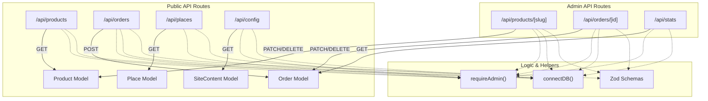
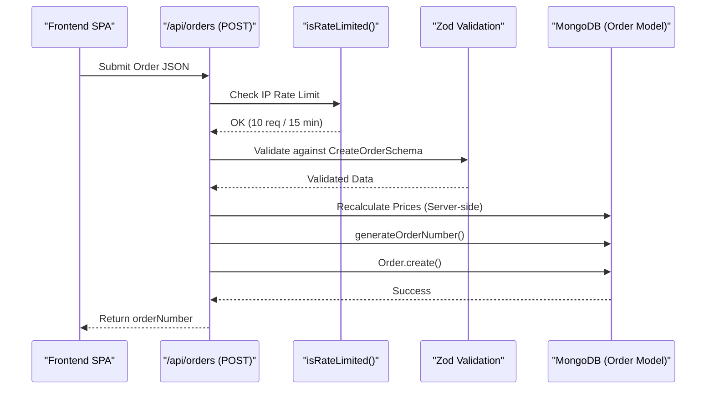

# Backend API Layer

Relevant source files

The following files were used as context for generating this wiki page:

- [scripts/seed.ts](scripts/seed.ts)
- [src/app/admin/orders/page.tsx](src/app/admin/orders/page.tsx)
- [src/app/admin/page.tsx](src/app/admin/page.tsx)
- [src/app/admin/places/page.tsx](src/app/admin/places/page.tsx)
- [src/app/api/admin/settings/route.ts](src/app/api/admin/settings/route.ts)
- [src/app/api/config/route.ts](src/app/api/config/route.ts)
- [src/app/api/orders/[id]/route.ts](src/app/api/orders/[id]/route.ts)
- [src/app/api/orders/route.ts](src/app/api/orders/route.ts)
- [src/app/api/places/[id]/route.ts](src/app/api/places/[id]/route.ts)
- [src/app/api/products/[slug]/route.ts](src/app/api/products/[slug]/route.ts)
- [src/app/api/products/route.ts](src/app/api/products/route.ts)
- [src/app/api/stats/route.ts](src/app/api/stats/route.ts)
- [src/app/api/upload/route.ts](src/app/api/upload/route.ts)
- [src/lib/models/Order.ts](src/lib/models/Order.ts)
- [src/lib/models/Place.ts](src/lib/models/Place.ts)
- [src/lib/models/Product.ts](src/lib/models/Product.ts)

The Backend API Layer of Seraj Store (سِراج) is built using **Next.js App Router API Routes**. These routes act as the bridge between the vanilla JavaScript SPA frontend and the MongoDB/Mongoose data layer. They provide a RESTful interface for product catalogs, order processing, AI-driven chat, and administrative management.

All routes follow a consistent pattern: they ensure database connectivity via a singleton, validate incoming data using **Zod**, and enforce administrative authorization where necessary.

### Core Architectural Patterns

Most API routes in `src/app/api/` implement the following shared behaviors:

*   **Database Connectivity**: Every handler calls `connectDB()` to ensure a connection to the MongoDB cluster [src/app/api/products/route.ts:16]().
*   **Security**: Admin-only routes (POST, PATCH, DELETE) invoke `requireAdmin()` to verify the NextAuth session [src/app/api/products/route.ts:113-114]().
*   **Validation**: Inbound request bodies are parsed against **Zod** schemas (e.g., `CreateProductSchema`, `CreateOrderSchema`) to ensure type safety before database operations [src/app/api/products/route.ts:119](), [src/app/api/orders/route.ts:123]().
*   **Dynamic Execution**: Routes are marked with `export const dynamic = "force-dynamic"` to bypass Vercel's static optimization, ensuring real-time data for the SPA [src/app/api/products/route.ts:7](), [src/app/api/orders/route.ts:11]().
*   **Soft Deletion**: For critical entities like Products and Places, the `DELETE` method typically sets an `active: false` flag rather than removing the record immediately [src/app/api/products/[slug]/route.ts:178-189](), [src/app/api/places/[id]/route.ts:172-189]().

### API Route Overview

The following diagram maps the logical API domains to their physical file entities and primary Mongoose models.

**API Entity Map**

Sources: [src/app/api/products/route.ts:1-158](), [src/app/api/orders/route.ts:1-197](), [src/app/api/stats/route.ts:1-64](), [src/app/api/config/route.ts:1-36]()

---

### Domain Modules

#### 3.1 Products API
Handles the catalog of ready-made stories, custom stories, and flashcards. It supports filtering by `category`, `section`, and `series`. Admin routes allow for full CRUD with gallery management (images/videos).
For details, see [Products API](#3.1).

#### 3.2 Orders API
Manages the checkout flow and order lifecycle. It includes server-side price recalculation to prevent client-side tampering [src/app/api/orders/route.ts:125-148]() and a custom atomic order number generator (`SRJ-YYYY-XXXX`) [src/lib/models/Order.ts:158-184]().
For details, see [Orders API](#3.2).

#### 3.3 Places API (Fas7a Helwa)
Serves the "Fas7a Helwa" directory of child-friendly outings. It supports advanced filtering (indoor/outdoor, free/paid) and full-text search across Arabic and English names [src/lib/models/Place.ts:94]().
For details, see [Places API (Fas7a Helwa)](#3.3).

#### 3.4 Articles API & Content CMS
Manages the blog content and the site-wide key-value CMS. The CMS allows admins to update global settings like WhatsApp numbers or shipping fees without code changes [src/app/api/config/route.ts:13-20]().
For details, see [Articles API & Content CMS](#3.4).

#### 3.5 Coloring Workbook API
A specialized subsystem for the dynamic coloring book builder. It tracks interaction counters (saved, shared, printed) and manages hierarchical categories for coloring pages.
For details, see [Coloring Workbook API](#3.5).

#### 3.6 Supporting APIs: Config, Upload, Chat & Stats
Covers infrastructure endpoints:
*   **Stats**: Uses MongoDB `$facet` aggregation to generate dashboard metrics (revenue, pending orders, etc.) [src/app/api/stats/route.ts:17-44]().
*   **Upload**: Integrates with Cloudinary for media hosting.
*   **Chat**: Provides an SSE (Server-Sent Events) stream for the "Mama Zainab" AI assistant.
*   **Config**: Exposes environment variables and CMS settings to the frontend [src/app/api/config/route.ts:25-35]().
For details, see [Supporting APIs: Config, Upload, Chat & Stats](#3.6).

---

### Request Flow & Security

The backend utilizes a strict request flow to ensure data integrity and security.

**Order Submission Flow**

Sources: [src/app/api/orders/route.ts:110-182](), [src/lib/models/Order.ts:158-184](), [src/lib/rateLimit.ts]()

### Sources:
* [src/app/api/products/route.ts]()
* [src/app/api/products/[slug]/route.ts]()
* [src/app/api/orders/route.ts]()
* [src/app/api/orders/[id]/route.ts]()
* [src/app/api/stats/route.ts]()
* [src/app/api/config/route.ts]()
* [src/lib/models/Order.ts]()
* [src/lib/models/Product.ts]()
* [src/lib/models/Place.ts]()
* [src/app/api/places/[id]/route.ts]()
