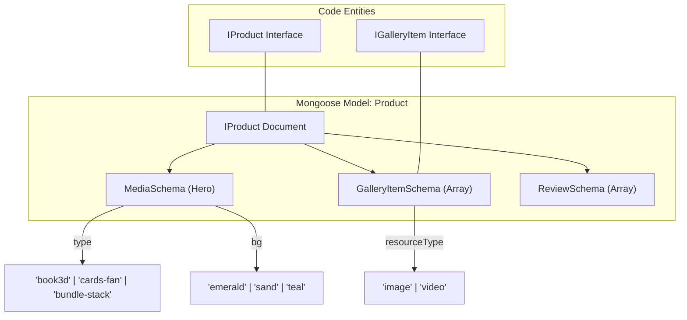
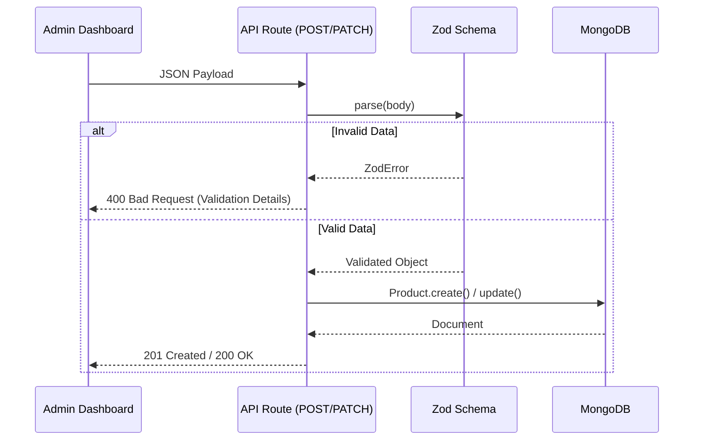

# Products API

Relevant source files

The following files were used as context for generating this wiki page:

- [scripts/migrate-product-images.ts](scripts/migrate-product-images.ts)
- [scripts/seed.ts](scripts/seed.ts)
- [src/app/admin/products/page.tsx](src/app/admin/products/page.tsx)
- [src/app/api/products/[slug]/route.ts](src/app/api/products/[slug]/route.ts)
- [src/app/api/products/route.ts](src/app/api/products/route.ts)
- [src/lib/models/Product.ts](src/lib/models/Product.ts)

The Products API provides a robust interface for managing the Seraj Store catalog. It handles product metadata, multi-format media (3D mockups, galleries), and complex categorization including sections and series. The API supports soft-deletion for safe catalog management and hard-deletion for database cleanup.

## Data Model: IProduct

The `IProduct` model is the core entity for the store. It utilizes nested sub-schemas for reviews, hero media, and gallery items to support rich frontend rendering.

### Schema Implementation
- **Text Indexes**: The schema defines a text index on `name`, `category`, and `section` to support future search capabilities [src/lib/models/Product.ts:144-144]().
- **Compound Indexes**: An index on `{ section: 1, order: 1 }` optimizes catalog sorting within specific UI sections [src/lib/models/Product.ts:145-145]().
- **Media Sub-schema**: Defines the 3D mockup type (`book3d`, `cards-fan`, `bundle-stack`) and background color themes [src/lib/models/Product.ts:16-32]().
- **Gallery Sub-schema**: Supports both images and videos via Cloudinary URLs and `publicId` tracking [src/lib/models/Product.ts:35-49]().

### Model to Code Mapping
The following diagram maps the logical product entities to their Mongoose schema definitions.

**Product Entity Relationship**

Sources: [src/lib/models/Product.ts:1-151]()

---

## API Endpoints

### GET /api/products
Fetches a list of products based on query filters.

| Parameter | Type | Description |
| :--- | :--- | :--- |
| `category` | String | Filter by category (e.g., "قصص جاهزة") [src/app/api/products/route.ts:19-29]() |
| `section` | String | Filter by UI section (e.g., "tales") [src/app/api/products/route.ts:20-32]() |
| `series` | String | Filter by product series [src/app/api/products/route.ts:21-35]() |
| `all` | Boolean | If `true`, includes inactive (soft-deleted) products. Requires no auth for GET [src/app/api/products/route.ts:22-27]() |

**Logic Flow**:
1. Connects to MongoDB via `connectDB()` [src/app/api/products/route.ts:16-16]().
2. Constructs a filter object. If `all` is not present, `active: true` is enforced [src/app/api/products/route.ts:25-27]().
3. Returns products sorted by the `order` field [src/app/api/products/route.ts:38-40]().

### POST /api/products
Creates a new product. Restricted to administrators via `requireAdmin()` [src/app/api/products/route.ts:113-114]().

- **Validation**: Uses `CreateProductSchema` (Zod) to enforce strict typing on fields like `category`, `action`, and `media.type` [src/app/api/products/route.ts:80-105]().
- **Slug Uniqueness**: Manually checks for existing slugs before creation to prevent 11000 Mongo errors [src/app/api/products/route.ts:122-128]().

### GET /api/products/[slug]
Retrieves a single product. Publicly available for active products; admins can use `?all=true` to view inactive ones [src/app/api/products/[slug]/route.ts:21-28]().

### PATCH /api/products/[slug]
Updates an existing product. Uses `PatchProductSchema` where all fields are optional [src/app/api/products/[slug]/route.ts:51-93]().
- **Implementation**: Uses `findOneAndUpdate` with `{ runValidators: true }` to ensure data integrity during updates [src/app/api/products/[slug]/route.ts:113-117]().

### DELETE /api/products/[slug]
Implements a two-stage deletion process:
1. **Soft Delete**: If the product is `active: true`, the API sets `active: false`. The product remains in the DB but disappears from the public frontend [src/app/api/products/[slug]/route.ts:177-189]().
2. **Hard Delete**: If the product is already `active: false`, the API performs a `findOneAndDelete` to permanently remove it [src/app/api/products/[slug]/route.ts:190-199]().

Sources: [src/app/api/products/route.ts:1-157](), [src/app/api/products/[slug]/route.ts:1-207]()

---

## Validation Schemas (Zod)

The API uses Zod for request body validation. This ensures that the frontend (Admin Dashboard) and backend stay in sync regarding data structures.

**Validation Flow Diagram**

Sources: [src/app/api/products/route.ts:57-105](), [src/app/api/products/[slug]/route.ts:51-93]()

---

## Administrative Operations

The Admin Dashboard (`AdminProductsPage`) interacts with these APIs to provide a full CRUD interface.

### Key Admin Functions
- **Fetch with `all=true`**: The dashboard always requests all products to allow management of hidden items [src/app/admin/products/page.tsx:122-122]().
- **Soft/Hard Delete Toggle**: The `handleDelete` function checks the `active` status to determine whether to prompt for hiding or permanent deletion [src/app/admin/products/page.tsx:195-212]().
- **Restore**: A dedicated `handleRestore` function sends a `PATCH` request with `{ active: true }` [src/app/admin/products/page.tsx:214-230]().

### Data Migration
The script `migrate-product-images.ts` is used to handle legacy data where Cloudinary URLs were stored in `media.image` instead of the top-level `imageUrl` field [scripts/migrate-product-images.ts:10-31]().

Sources: [src/app/admin/products/page.tsx:110-230](), [scripts/migrate-product-images.ts:1-40]()
