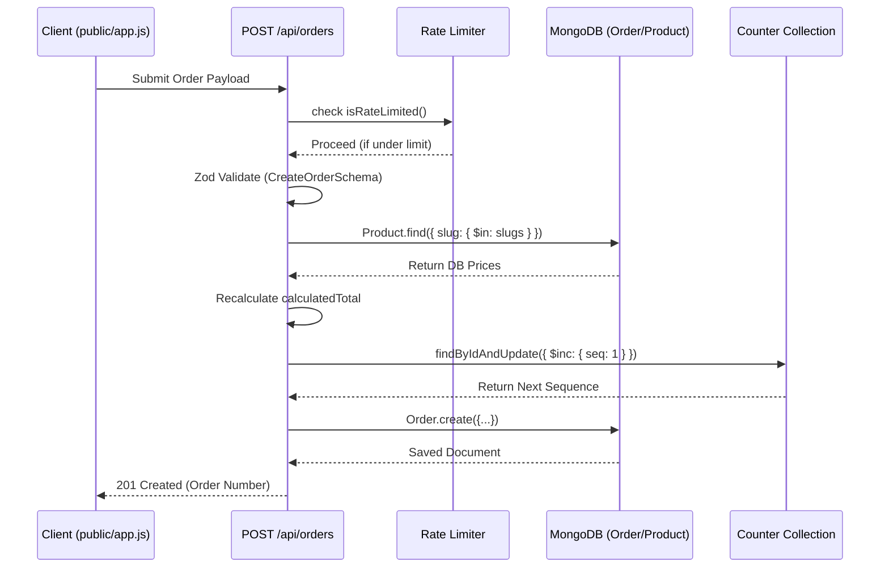
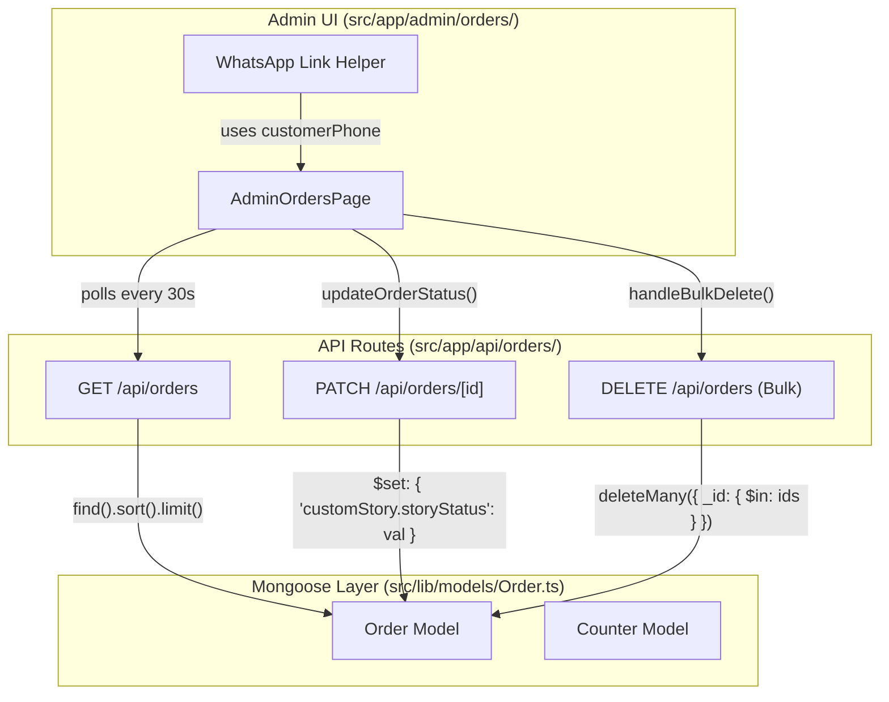

# Orders API

Relevant source files

The following files were used as context for generating this wiki page:

- [src/app/admin/orders/page.tsx](src/app/admin/orders/page.tsx)
- [src/app/api/orders/[id]/route.ts](src/app/api/orders/[id]/route.ts)
- [src/app/api/orders/route.ts](src/app/api/orders/route.ts)
- [src/app/api/stats/route.ts](src/app/api/stats/route.ts)
- [src/app/api/upload/route.ts](src/app/api/upload/route.ts)
- [src/lib/models/Order.ts](src/lib/models/Order.ts)

The Orders API manages the lifecycle of customer purchases, including creation, status tracking, and administrative oversight. It handles complex data structures for personalized products like the **Custom Story Wizard** and the **Coloring Workbook builder**, ensuring data integrity through server-side price recalculation and atomic order numbering.

## Data Flow: Order Creation

When a customer submits an order from the frontend, the backend performs several critical validation and calculation steps before persisting the data to MongoDB.

### 1. Rate Limiting & Validation
The API implements an in-memory sliding window rate limit of 10 orders per 15 minutes per IP address to prevent automated spam [src/app/api/orders/route.ts:110-117](). Incoming payloads are validated against `CreateOrderSchema`, a strict Zod schema that enforces phone number formats and required fields [src/app/api/orders/route.ts:45-58]().

### 2. Server-Side Price Recalculation
To prevent client-side price manipulation, the server fetches the latest prices for all items in the cart directly from the `Product` model [src/app/api/orders/route.ts:125-131](). 
*   **Standard Products:** Prices are mapped from the database based on the `productSlug` [src/app/api/orders/route.ts:140-148]().
*   **Special Case (Coloring Workbook):** Since the workbook price is dynamic based on the number of selected pages, the API trusts the client-provided price for the `coloring-workbook` slug [src/app/api/orders/route.ts:135-139]().

### 3. Atomic Order Numbering
Order numbers follow the format `SRJ-YYYY-XXXX`. To prevent race conditions in a serverless environment, the system uses a dedicated `Counter` collection. The `generateOrderNumber` function performs an atomic `$inc` operation on the counter for the current year [src/lib/models/Order.ts:158-184]().

### Creation Sequence Diagram
The following diagram illustrates the interaction between the API, the Database, and the Validation logic during the `POST /api/orders` flow.

**Order Submission Process**

Sources: [src/app/api/orders/route.ts:109-180](), [src/lib/models/Order.ts:158-184](), [src/lib/rateLimit.ts:1-20]()

---

## Order Data Models

The `IOrder` model uses nested sub-schemas to handle the diverse product types offered by Seraj Store.

### Sub-Schemas
*   **ColoringDetailsSchema:** Stores metadata for custom coloring books/sheets, including the array of selected `ColoringItem` IDs and the `printStatus` [src/lib/models/Order.ts:4-23]().
*   **CustomStorySchema:** Captures the inputs from the Story Wizard (hero name, age, challenge) and tracks the `storyStatus` state machine [src/lib/models/Order.ts:38-52]().

### State Machines
Orders transition through two primary state fields:
1.  **orderStatus:** `pending` → `in_progress` → `shipped` → `delivered` (or `cancelled`) [src/lib/models/Order.ts:123-128]().
2.  **paymentStatus:** `unpaid` → `deposit_paid` → `fully_paid` [src/lib/models/Order.ts:117-122]().

Sources: [src/lib/models/Order.ts:54-136]()

---

## Admin Management & Operations

The Admin Dashboard provides a real-time interface for managing orders, utilizing specialized API endpoints for updates and bulk actions.

### Dot-Notation Updates
The `PATCH /api/orders/[id]` endpoint uses MongoDB dot-notation (e.g., `"customStory.storyStatus"`) when updating nested fields. This prevents the `findByIdAndUpdate` call from accidentally overwriting the entire `customStory` subdocument and losing data like the `heroName` or `photoUrl` [src/app/api/orders/[id]/route.ts:92-104]().

### Bulk Actions & Polling
*   **Bulk Delete:** The `DELETE /api/orders` endpoint (implemented in the main route) accepts an array of IDs for permanent removal of test or junk data [src/app/api/orders/route.ts:241-267]().
*   **Real-time Updates:** The Admin Orders page implements a 30-second polling mechanism using `setInterval` to refresh the current page and detect new incoming orders via total count changes [src/app/admin/orders/page.tsx:159-167]().

### Code-to-Entity Mapping
This diagram maps the API route logic to the specific Mongoose model operations and the Admin UI components.

**Admin Operations Map**

Sources: [src/app/admin/orders/page.tsx:125-212](), [src/app/api/orders/[id]/route.ts:71-104](), [src/app/api/orders/route.ts:241-267]()

---

## Statistics & Aggregation

The dashboard utilizes the MongoDB `$facet` aggregation pipeline in `GET /api/stats` to calculate multiple metrics in a single database pass:
*   **totalRevenue:** Sum of all `total` fields across all orders [src/app/api/stats/route.ts:34-36]().
*   **pendingStories:** Filters for orders where `customStory.heroName` exists and the status is not yet delivered [src/app/api/stats/route.ts:25-33]().
*   **recentOrders:** Retrieves the 5 most recent orders with projected fields for the dashboard table [src/app/api/stats/route.ts:37-41]().

Sources: [src/app/api/stats/route.ts:10-63]()
