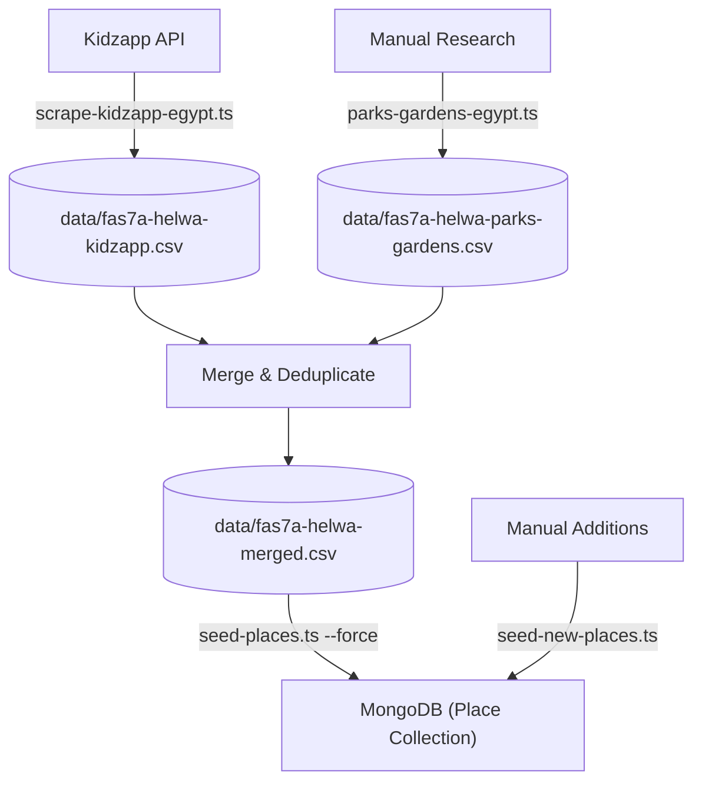
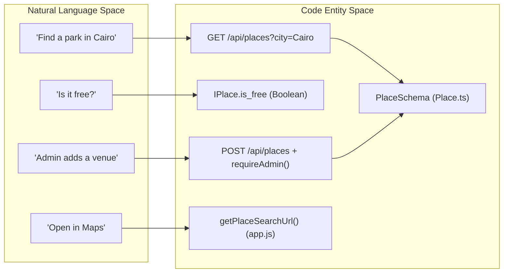
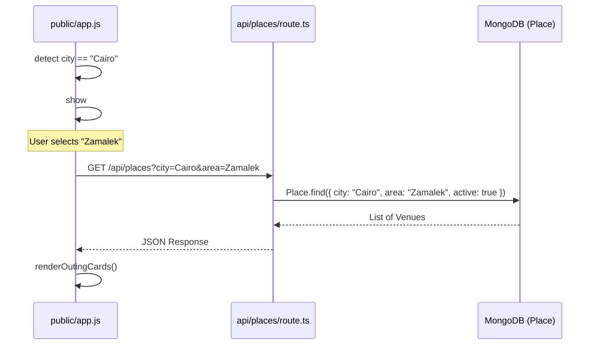

# 3.3 Places API (Fas7a Helwa)

Relevant source files

The following files were used as context for generating this wiki page:

- [.gitignore](.gitignore)
- [.planning/phases/07-fas7a-helwa-data/07-01-PLAN.md](.planning/phases/07-fas7a-helwa-data/07-01-PLAN.md)
- [.planning/phases/07-fas7a-helwa-data/07-02-PLAN.md](.planning/phases/07-fas7a-helwa-data/07-02-PLAN.md)
- [.planning/phases/07-fas7a-helwa-data/07-03-PLAN.md](.planning/phases/07-fas7a-helwa-data/07-03-PLAN.md)
- [CHANGELOG.md](CHANGELOG.md)
- [DEVLOG.md](DEVLOG.md)
- [data/.gitkeep](data/.gitkeep)
- [scripts/kidzapp-types.ts](scripts/kidzapp-types.ts)
- [scripts/parks-gardens-egypt.ts](scripts/parks-gardens-egypt.ts)
- [scripts/scrape-kidzapp-egypt.ts](scripts/scrape-kidzapp-egypt.ts)
- [scripts/seed-new-places.ts](scripts/seed-new-places.ts)
- [scripts/seed-places.ts](scripts/seed-places.ts)
- [src/app/admin/places/page.tsx](src/app/admin/places/page.tsx)
- [src/app/api/places/[id]/route.ts](src/app/api/places/[id]/route.ts)
- [src/app/api/places/route.ts](src/app/api/places/route.ts)
- [src/lib/models/Place.ts](src/lib/models/Place.ts)

The **Places API** (internally referred to as **Fas7a Helwa** / فسحة حلوة) provides a comprehensive directory of family-friendly outings across Egypt. It serves as the backend engine for the "Mama World" portal, allowing parents to discover venues based on budget, location, age appropriateness, and activity type.

## Purpose & Scope

The system manages over 480 venues, including parks, museums, play areas, and restaurants. It utilizes a hybrid data approach:
1.  **Scraped Data:** 400+ venues originally extracted from the Kidzapp Egypt API [scripts/scrape-kidzapp-egypt.ts:91-104]().
2.  **Manual Enrichment:** Hardcoded datasets for Egyptian public parks and gardens [scripts/parks-gardens-egypt.ts:31-190]().
3.  **Admin CRUD:** A dedicated dashboard for manual entry and offer management [src/app/api/places/route.ts:136-171]().

## Data Model (IPlace)

The `IPlace` model is defined in `src/lib/models/Place.ts`. It uses a flat structure for location (lat/lon) to simplify Google Maps link generation without the overhead of GeoJSON [src/lib/models/Place.ts:3-10]().

### Key Schema Attributes
| Field | Type | Description |
| :--- | :--- | :--- |
| `name_ar` / `name_en` | String | Bilingual naming (Required) [src/lib/models/Place.ts:54-55]() |
| `city` | String | Indexed for filtering (e.g., "Cairo", "Alexandria") [src/lib/models/Place.ts:58]() |
| `area` | String | Sub-region (e.g., "Zamalek", "New Cairo") [src/lib/models/Place.ts:57]() |
| `category_ids` | Number[] | Array of IDs (1: Fun, 3: Parks, 5: Animals, etc.) [src/lib/models/Place.ts:81]() |
| `price_range_id` | Number | 1-5 scale for UI budget filtering [src/lib/models/Place.ts:63]() |
| `indoor_outdoor` | Enum | `indoor`, `outdoor`, `mixed`, `unknown` [src/lib/models/Place.ts:68-73]() |
| `offer_text` | String | Promotional text displayed on the card [src/lib/models/Place.ts:84]() |
| `active` | Boolean | Soft-delete flag (defaults to `true`) [src/lib/models/Place.ts:87]() |

### Search & Indexing
The model implements a text index for multi-field search and a compound index for optimized filtering:
*   **Text Index:** `{ name_en, name_ar, city, area }` [src/lib/models/Place.ts:94]().
*   **Compound Index:** `{ active: 1, city: 1, category_ids: 1 }` [src/lib/models/Place.ts:97]().

**Sources:** `src/lib/models/Place.ts`, `.planning/phases/07-fas7a-helwa-data/07-02-PLAN.md`

## API Reference

### GET /api/places
Fetches a paginated list of active places.

**Query Parameters:**
*   `city`: Exact match (e.g., `Cairo`).
*   `area`: Sub-filter for Cairo regions [DEVLOG.md:37-43]().
*   `category`: Matches if the ID exists in `category_ids`.
*   `is_free`: Boolean string (`true`/`false`).
*   `indoor_outdoor`: Enum match.
*   `q`: Text search query.
*   `all`: If `true`, includes inactive places (Admin only) [src/app/api/places/route.ts:26-36]().

**Logic Flow:**
1.  Connects to MongoDB via `connectDB()` [src/app/api/places/route.ts:17]().
2.  Constructs a `filter` object based on provided params [src/app/api/places/route.ts:33-66]().
3.  Executes `Place.find()` with text score sorting if `q` is present [src/app/api/places/route.ts:69-70]().
4.  Returns paginated results with `totalPages` and `count` [src/app/api/places/route.ts:79-85]().

### Admin CRUD Operations
*   **POST /api/places**: Creates a new venue. Validates input using `CreatePlaceSchema` (Zod) and checks for duplicate `name_en` [src/app/api/places/route.ts:136-166]().
*   **PATCH /api/places/[id]**: Updates specific fields. Includes date conversion for `offer_expiry` [src/app/api/places/[id]/route.ts:94-133]().
*   **DELETE /api/places/[id]**: Performs a **soft delete** by setting `active: false` [src/app/api/places/[id]/route.ts:161-189]().

**Sources:** `src/app/api/places/route.ts`, `src/app/api/places/[id]/route.ts`

## Data Pipeline & Seeding

The system was populated through a multi-stage pipeline to ensure data density.

### Pipeline Architecture

### Key Scripts
1.  **`scrape-kidzapp-egypt.ts`**: Fetches 600+ experiences with retry logic and transforms them into the `PlaceRow` schema [.planning/phases/07-fas7a-helwa-data/07-01-PLAN.md:91-104]().
2.  **`seed-places.ts`**: Clears the collection and performs a bulk `insertMany` from the merged CSV [scripts/seed-places.ts:208-215]().
3.  **`seed-new-places.ts`**: Adds 35+ specific Cairo venues (e.g., Africano Park, Magic Galaxy) to fill gaps in scraped data [scripts/seed-new-places.ts:14-33]().

**Sources:** `scripts/seed-places.ts`, `scripts/seed-new-places.ts`, `.planning/phases/07-fas7a-helwa-data/07-01-PLAN.md`

## Code Entity Space Mapping

The following diagram maps the logical "Fas7a Helwa" features to the physical code entities that implement them.

### Feature-to-Code Map

### Implementation Flow: Cairo Area Filter
A specific UX enhancement allows filtering by Cairo sub-districts.

**Sources:** `DEVLOG.md:30-48`, `CHANGELOG.md:12-16`, `public/app.js` (referenced in context)
