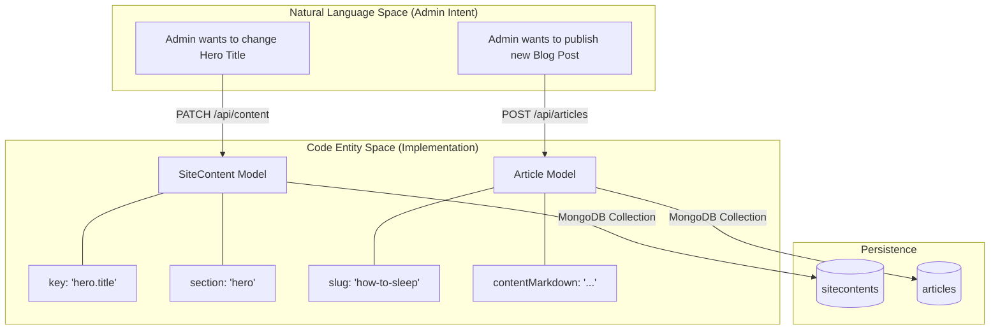
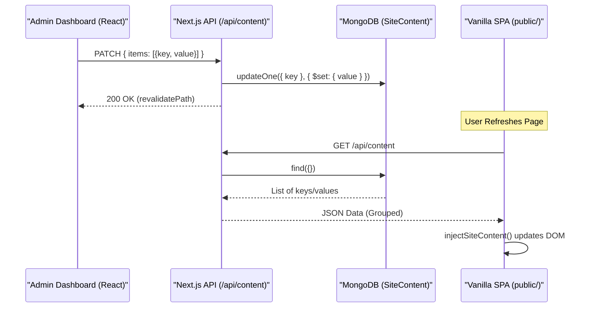

# Articles API & Content CMS

Relevant source files

The following files were used as context for generating this wiki page:

- [docs/ARTICALS.md](docs/ARTICALS.md)
- [docs/implementation_plan.md](docs/implementation_plan.md)
- [scripts/inject-keys.js](scripts/inject-keys.js)
- [scripts/seed-articles.ts](scripts/seed-articles.ts)
- [scripts/seed-content.ts](scripts/seed-content.ts)
- [scripts/seedContent.ts](scripts/seedContent.ts)
- [src/app/admin/articles/page.tsx](src/app/admin/articles/page.tsx)
- [src/app/admin/content/page.tsx](src/app/admin/content/page.tsx)
- [src/app/admin/testimonials/page.tsx](src/app/admin/testimonials/page.tsx)
- [src/app/api/articles/[slug]/route.ts](src/app/api/articles/[slug]/route.ts)
- [src/app/api/articles/route.ts](src/app/api/articles/route.ts)
- [src/app/api/content/route.ts](src/app/api/content/route.ts)
- [src/app/api/dev/seed/route.ts](src/app/api/dev/seed/route.ts)
- [src/app/api/testimonials/[id]/route.ts](src/app/api/testimonials/[id]/route.ts)
- [src/lib/models/Article.ts](src/lib/models/Article.ts)
- [src/lib/models/SiteContent.ts](src/lib/models/SiteContent.ts)

This section covers the management of educational articles and the dynamic site-wide Content Management System (CMS). These systems allow the store to serve Arabic educational content and provide administrators with the ability to modify any text on the website without changing the source code.

## Articles API

The Articles system serves the "Mama World" (عالم ماما) portal. It supports rich-text content via Markdown, categorized by developmental sections and child age groups.

### Data Model: IArticle

The `IArticle` model is defined in `src/lib/models/Article.ts`. It includes comprehensive fields for SEO, content, and metadata.

| Field | Type | Description |
|:---|:---|:---|
| `slug` | `String` | Unique identifier used in URLs. Indexed for performance. |
| `section` | `String` | One of 13 predefined categories (e.g., "الحمل والرضاعة"). |
| `ageGroup` | `String` | Target age range (e.g., "0-2", "2-5", "متنوع"). |
| `contentMarkdown` | `String` | The main body of the article in Markdown format. |
| `readingTime` | `Number` | Estimated minutes to read, auto-calculated if not provided. |
| `sources` | `Array` | List of `ISource` sub-documents (label, url, note). |
| `active` | `Boolean` | Soft-delete/Visibility flag. |

Sources: [src/lib/models/Article.ts:43-77](), [src/lib/models/Article.ts:4-11]()

### API Implementation

The Articles API consists of two primary route files handling public listing and admin CRUD operations.

1.  **GET `/api/articles`**: Returns a paginated list of articles. To optimize bandwidth, it excludes `contentMarkdown` and `sources` from the listing results [[src/app/api/articles/route.ts:98-102]()]. It supports filtering by `section`, `ageGroup`, and `tag`, as well as full-text search [[src/app/api/articles/route.ts:74-89]()].
2.  **GET `/api/articles/[slug]`**: Fetches the full article content and dynamically finds up to 3 related articles within the same section [[src/app/api/articles/[slug]/route.ts:58-67]()].
3.  **POST/PATCH/DELETE**: Admin-only routes protected by `requireAdmin()`.
    *   **POST**: Automatically generates a slug from the title if missing [[src/app/api/articles/route.ts:148-154]()] and calculates `readingTime` based on a 200 words-per-minute average [[src/app/api/articles/route.ts:159-162]()].
    *   **DELETE**: Implements a soft-delete by setting `active: false` [[src/app/api/articles/[slug]/route.ts:162-166]()].

### Data Pipeline: seed-articles.ts

The codebase includes a sophisticated parsing script, `scripts/seed-articles.ts`, which transforms a raw Markdown file (`docs/ARTICALS.md`) into structured database entries.

*   **Regex Parsing**: Uses a global regex to split the Markdown file by headers like `## **المقال N**` [[scripts/seed-articles.ts:146-159]()].
*   **Taxonomy Mapping**: Maps article IDs to a `SECTION_MAP` and `AGE_GROUP_MAP` to ensure consistent categorization across 40+ articles [[scripts/seed-articles.ts:14-71]()].
*   **Cleaning**: Removes common phrases like "المقال N" or "المقدمة" from the final content body to ensure a clean UI presentation [[scripts/seed-articles.ts:192-202]()].

Sources: [scripts/seed-articles.ts:137-210](), [src/app/api/articles/route.ts:60-131](), [src/app/api/articles/[slug]/route.ts:41-81]()

## Content CMS

The Content CMS is a flat key-value store designed to make the vanilla JS frontend dynamic. It replaces hardcoded Arabic strings with database-managed values.

### Architecture & Data Flow

The CMS uses a "Flat Key-Value" approach rather than a single nested document. This prevents race conditions when multiple admins edit different sections simultaneously [[docs/implementation_plan.md:34-37]()].

**Article & Content Entity Mapping**

Sources: [docs/implementation_plan.md:20-32](), [src/lib/models/SiteContent.ts]()

### CMS Integration (Frontend)

The frontend SPA in `public/` uses a specific pattern to consume this data:
1.  **Injection Markers**: HTML elements are decorated with `data-content-key` attributes [[docs/implementation_plan.md:109-110]()].
2.  **`injectSiteContent`**: A frontend utility (documented in `implementation_plan.md`) that fetches `/api/content`, iterates through the DOM, and replaces inner text with values from the database [[docs/implementation_plan.md:9-10]()].
3.  **Fallback**: The original hardcoded text in `index.html` serves as a fallback if the API call fails [[docs/implementation_plan.md:110-111]()].

### Admin Management

The Admin Dashboard provides a tabbed interface (`ContentEditor`) for managing these keys by section.

*   **Grouping**: Content is grouped into sections like "الرئيسية" (Hero), "الفوتر" (Footer), and "عالم ماما" (Mama World) [[docs/implementation_plan.md:88-97]()].
*   **Bulk Updates**: The `PATCH /api/content` route accepts an array of items, allowing an admin to save an entire section at once [[docs/implementation_plan.md:71-72]()].
*   **Seeding**: The `scripts/seedContent.ts` utility and `/api/dev/seed` route use `DEFAULT_CONTENT` to populate the database without overwriting existing manual edits by using `$setOnInsert` for the section and `$set` for the value [[src/app/api/dev/seed/route.ts:15-22]()].

**CMS Update Sequence**

Sources: [src/app/api/content/route.ts](), [src/app/admin/content/page.tsx](), [scripts/seedContent.ts:11-21]()
