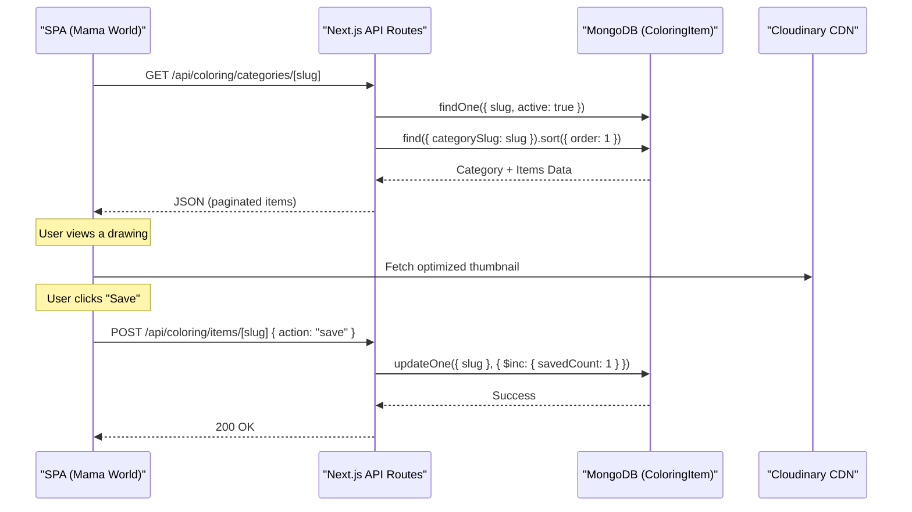
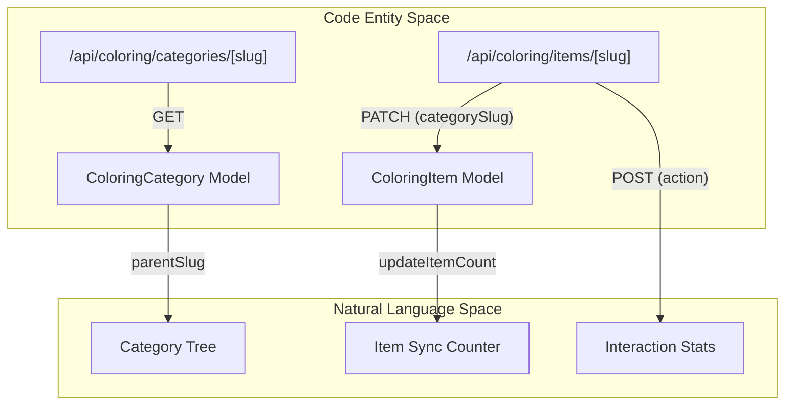

# Coloring Workbook API

Relevant source files

The following files were used as context for generating this wiki page:

- [.planning/implementation_plan.colorseraj.md](.planning/implementation_plan.colorseraj.md)
- [debug-sc.png](debug-sc.png)
- [index_diff.patch](index_diff.patch)
- [public/index.css](public/index.css)
- [public/index_clean.html](public/index_clean.html)
- [scripts/seed-coloring.ts](scripts/seed-coloring.ts)
- [scripts/seed-debug.js](scripts/seed-debug.js)
- [scripts/seed-playwright.js](scripts/seed-playwright.js)
- [scripts/seed-supercoloring-bulk.js](scripts/seed-supercoloring-bulk.js)
- [scripts/seed-supercoloring-direct.js](scripts/seed-supercoloring-direct.js)
- [scripts/seed-supercoloring-final.js](scripts/seed-supercoloring-final.js)
- [src/app/admin/coloring/categories/page.tsx](src/app/admin/coloring/categories/page.tsx)
- [src/app/admin/coloring/page.tsx](src/app/admin/coloring/page.tsx)
- [src/app/admin/coloring/pricing/page.tsx](src/app/admin/coloring/pricing/page.tsx)
- [src/app/api/coloring/categories/[slug]/route.ts](src/app/api/coloring/categories/[slug]/route.ts)
- [src/app/api/coloring/categories/route.ts](src/app/api/coloring/categories/route.ts)
- [src/app/api/coloring/featured/route.ts](src/app/api/coloring/featured/route.ts)
- [src/app/api/coloring/items/[slug]/route.ts](src/app/api/coloring/items/[slug]/route.ts)
- [src/app/api/coloring/items/route.ts](src/app/api/coloring/items/route.ts)
- [src/app/api/coloring/pricing/route.ts](src/app/api/coloring/pricing/route.ts)
- [src/lib/models/ColoringCategory.ts](src/lib/models/ColoringCategory.ts)
- [src/lib/models/ColoringItem.ts](src/lib/models/ColoringItem.ts)

The Coloring Workbook API manages a vast library of coloring pages, educational worksheets, and craft activities within the **Mama World (عالم ماما)** portal. It provides endpoints for hierarchical category browsing, item filtering, interaction tracking (saves, shares, prints), and a dynamic pricing engine for the physical "Coloring Workbook" product.

## 1. System Architecture & Data Flow

The coloring subsystem is built on a hybrid content model. High-quality CC0 or original Seraj content is hosted on Cloudinary, while external resources are linked via a "free-link" license to minimize storage costs while maintaining a massive catalog [src/app/api/coloring/pricing/route.ts:9-16]().

### API Interaction Flow
The following diagram illustrates how the frontend SPA interacts with the coloring API to render the catalog and manage user interactions.

**Coloring Interaction Logic**

**Sources:** [src/app/api/coloring/categories/[slug]/route.ts:18-71](), [src/app/api/coloring/items/[slug]/route.ts:48-85]()

---

## 2. Item & Interaction Management

The `ColoringItem` model tracks specific drawings or worksheets. The API provides granular control over visibility and performance metrics.

### Interaction Counters
To drive the "Most Popular" and "Featured" logic, the system tracks three specific user actions via `POST /api/coloring/items/[slug]` [src/app/api/coloring/items/[slug]/route.ts:48-51]():
*   **savedCount**: Incremented when a user saves a drawing to their local library.
*   **shareCount**: Incremented when the share button is triggered.
*   **printCount**: Incremented when a user adds the item to their physical workbook order.

### Item Lifecycle (Soft vs. Hard Delete)
The API implements a two-stage deletion process to maintain referential integrity with `ColoringCategory.itemCount`:
1.  **Soft Delete**: `DELETE /api/coloring/items/[slug]` sets `active: false`. The item remains in the DB but is hidden from public GET requests [src/app/api/coloring/items/[slug]/route.ts:213-226]().
2.  **Hard Delete**: If an item is already inactive, a subsequent `DELETE` call removes it permanently and decrements the `itemCount` in its parent category [src/app/api/coloring/items/[slug]/route.ts:227-239]().

**Sources:** [src/app/api/coloring/items/[slug]/route.ts:189-242]()

---

## 3. Hierarchical Categories

Categories are organized in a parent-child tree structure (e.g., `Coloring` -> `Animals` -> `Cats`).

### Category Sync Logic
The system maintains a cached `itemCount` on each category to avoid expensive aggregation queries during catalog browsing. This count is automatically adjusted during item operations:
*   **Item Creation**: Increments `itemCount` of the target category.
*   **Item Category Change**: When an item's `categorySlug` is updated via `PATCH`, the API decrements the old category's count and increments the new one [src/app/api/coloring/items/[slug]/route.ts:150-162]().
*   **Hard Delete**: Decrements the count [src/app/api/coloring/items/[slug]/route.ts:228-231]().

**Entity Mapping: API to Model**

**Sources:** [src/app/api/coloring/categories/[slug]/route.ts:1-79](), [src/app/api/coloring/items/[slug]/route.ts:114-164]()

---

## 4. Pricing & Configuration

The Coloring Workbook pricing is dynamic and admin-configurable, allowing for seasonal adjustments without code changes.

### PricingData Structure
The pricing engine uses `SiteContent` as a persistent key-value store. The `KEY_MAP` object bridges human-readable API fields to database keys [src/app/api/coloring/pricing/route.ts:19-28]():

| API Field | SiteContent Key | Default | Description |
| :--- | :--- | :--- | :--- |
| `pricePerPage` | `coloring_price_per_page` | 3 EGP | Cost per printed page |
| `coverPrice` | `coloring_cover_price` | 20 EGP | Extra cost for the physical cover |
| `minPages` | `coloring_min_pages` | 5 | Minimum pages for a workbook |
| `maxPages` | `coloring_max_pages` | 50 | Maximum pages for a workbook |
| `freeShippingMin` | `coloring_free_shipping_min` | 100 EGP | Threshold for free shipping |

### Persistence Logic
*   **GET /api/coloring/pricing**: Aggregates individual `SiteContent` entries into a single `PricingData` object. It uses hardcoded `DEFAULTS` if the database is unreachable or keys are missing [src/app/api/coloring/pricing/route.ts:35-55]().
*   **PUT /api/coloring/pricing**: Requires admin authentication. It performs a `bulkWrite` operation to update or create multiple `SiteContent` entries simultaneously using `upsert: true` [src/app/api/coloring/pricing/route.ts:71-115]().

**Sources:** [src/app/api/coloring/pricing/route.ts:9-28](), [src/app/api/coloring/pricing/route.ts:80-96]()

---

## 5. Seeding & Data Acquisition

The coloring catalog is populated via specialized scripts that scrape sources like SuperColoring using Playwright.

### Scraper Pipeline (`seed-supercoloring-final.js`)
1.  **Target Selection**: Defines categories (e.g., `col-animals`, `ws-numbers`) and their target URLs [scripts/seed-supercoloring-final.js:23-34]().
2.  **Browser Execution**: Launches a headless Chromium instance, blocking CSS and fonts to optimize speed [scripts/seed-supercoloring-final.js:53-61]().
3.  **Lazy Load Handling**: Scrolls the page to trigger image loading before extracting CDN URLs [scripts/seed-supercoloring-final.js:70-74]().
4.  **License Assignment**: Items are tagged as `free-link` (external thumbnail) or `cc0` (uploaded to Cloudinary) [scripts/seed-supercoloring-final.js:106-124]().

**Sources:** [scripts/seed-supercoloring-final.js:23-148](), [scripts/seed-playwright.js:61-138]()
