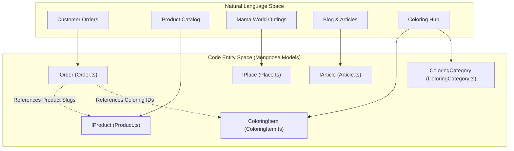
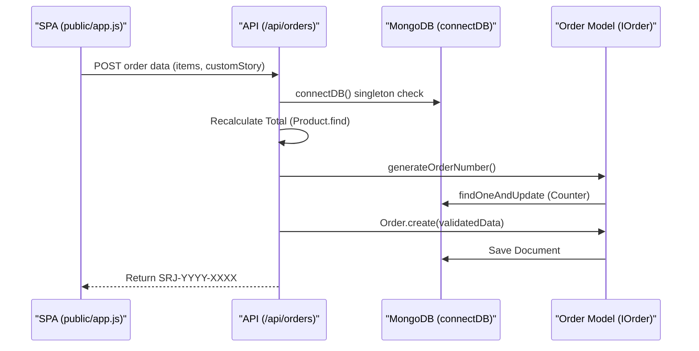

# Data Models

Relevant source files

The following files were used as context for generating this wiki page:

- [scripts/seed.ts](scripts/seed.ts)
- [src/app/admin/orders/page.tsx](src/app/admin/orders/page.tsx)
- [src/app/admin/places/page.tsx](src/app/admin/places/page.tsx)
- [src/app/admin/stories/page.tsx](src/app/admin/stories/page.tsx)
- [src/app/api/orders/route.ts](src/app/api/orders/route.ts)
- [src/app/api/places/[id]/route.ts](src/app/api/places/[id]/route.ts)
- [src/app/api/products/[slug]/route.ts](src/app/api/products/[slug]/route.ts)
- [src/app/api/products/route.ts](src/app/api/products/route.ts)
- [src/app/api/upload-child-photo/route.ts](src/app/api/upload-child-photo/route.ts)
- [src/lib/db.ts](src/lib/db.ts)
- [src/lib/models/Order.ts](src/lib/models/Order.ts)
- [src/lib/models/Place.ts](src/lib/models/Place.ts)
- [src/lib/models/Product.ts](src/lib/models/Product.ts)
- [src/lib/models/SiteContent.ts](src/lib/models/SiteContent.ts)
- [src/lib/rateLimit.ts](src/lib/rateLimit.ts)

The Seraj Store (سِراج) data layer is built on **MongoDB** using the **Mongoose ODM**. The architecture emphasizes high-performance reads for the public SPA and robust state management for the admin dashboard. The system utilizes shared patterns across all models, including soft deletion for data safety, unique slug generation for SEO-friendly routing, and specialized counter collections for atomic operations in a serverless environment.

## Connection Management

Database connectivity is managed via a singleton pattern in `src/lib/db.ts`. This ensures that in a serverless environment (like Vercel), the application does not exhaust connection pools by creating a new connection for every API request.

*   **`connectDB` Singleton**: Caches the Mongoose connection promise on `globalThis` to prevent race conditions during concurrent requests [src/lib/db.ts:18-54]().
*   **Pool Settings**: Configured with a `maxPoolSize` of 10 and a `serverSelectionTimeoutMS` of 10,000 to balance responsiveness with resource constraints [src/lib/db.ts:29-33]().

### Data Architecture Overview

The following diagram maps the relationship between the natural language business domains and the technical Mongoose models.

**System Entity Mapping**

Sources: [src/lib/models/Order.ts:1-190](), [src/lib/models/Product.ts:1-151](), [src/lib/models/Place.ts:1-103]()

---

## Shared Patterns & Features

The codebase implements several consistent patterns across the `src/lib/models/` directory to ensure data integrity and searchability.

### 1. Soft Deletion & Visibility
Most primary entities (`Product`, `Place`, `Article`) use an `active: boolean` field [src/lib/models/Product.ts:137](). 
*   **Public API**: Filters for `{ active: true }` by default [src/app/api/products/route.ts:25-27]().
*   **Admin API**: Allows viewing and toggling inactive items [src/app/api/products/[slug]/route.ts:19-26]().
*   **Lifecycle**: The `DELETE` routes implement a two-stage process: the first call sets `active: false`, and a second call on an inactive item performs a hard delete [src/app/api/products/[slug]/route.ts:157-207]().

### 2. Indexing Strategy
*   **Text Indexes**: Models like `Product` and `Place` use MongoDB text indexes to support the search functionality in the SPA [src/lib/models/Product.ts:144](), [src/lib/models/Place.ts:94]().
*   **Compound Indexes**: Used to optimize common admin queries, such as sorting orders by status and date [src/lib/models/Order.ts:139]().
*   **Unique Slugs**: Entities use indexed `slug` fields instead of raw IDs for public-facing URLs [src/lib/models/Product.ts:103]().

### 3. Atomic Counters
To generate human-readable, sequential order numbers (e.g., `SRJ-2024-0001`) without race conditions, the system uses a dedicated `Counter` collection and the `generateOrderNumber` utility [src/lib/models/Order.ts:142-184]().

---

## Model Groups

The data models are logically grouped into three main domains. Detailed schema references for each are available in their respective child pages.

### [Product & Order Models](#4.1)
This group manages the core e-commerce flow. The `IProduct` model handles complex media types (`book3d`, `cards-fan`) and gallery arrays [src/lib/models/Product.ts:15-49](). The `IOrder` model acts as a state machine for both financial transactions (`paymentStatus`) and custom production workflows like `storyStatus` [src/lib/models/Order.ts:79-88]().
*   **Key Models**: `Product`, `Order`, `Counter`.

### [Place, Article & Content Models](#4.2)
Powers the "Mama World" (عالم ماما) portal. `IPlace` supports a sophisticated outing directory with geo-coordinates and an offer system [src/lib/models/Place.ts:13-49](). `SiteContent` provides a flat key-value store for the CMS, allowing admins to update UI text without code changes.
*   **Key Models**: `Place`, `Article`, `SiteContent`, `Testimonial`.

### [Coloring Models](#4.3)
Supports the dynamic coloring workbook builder. This domain includes hierarchical categories and items with interaction counters (print/share/save counts). It includes a specialized integrity mechanism to sync `itemCount` across the category tree.
*   **Key Models**: `ColoringItem`, `ColoringCategory`.

---

## Data Flow Diagram

This diagram illustrates how data flows from the public Wizard/Cart through the API layer into the Mongoose models.

**Checkout & Order Creation Flow**

Sources: [src/app/api/orders/route.ts:109-180](), [src/lib/models/Order.ts:158-184](), [src/lib/db.ts:18-21]()

**Sources:**
*   `src/lib/db.ts`
*   `src/lib/models/Product.ts`
*   `src/lib/models/Order.ts`
*   `src/lib/models/Place.ts`
*   `src/app/api/products/route.ts`
*   `src/app/api/orders/route.ts`
