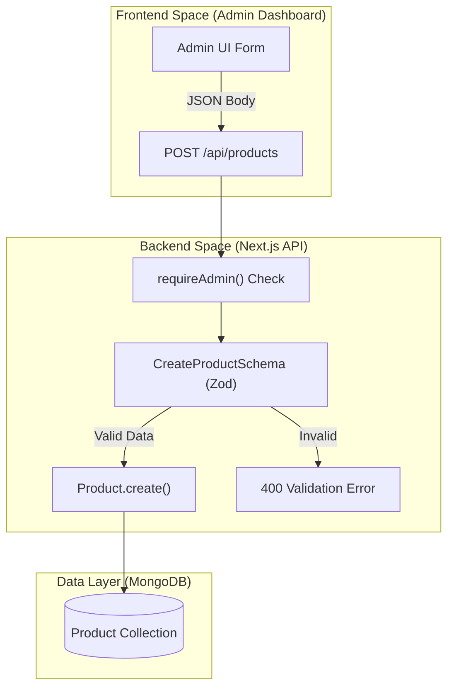
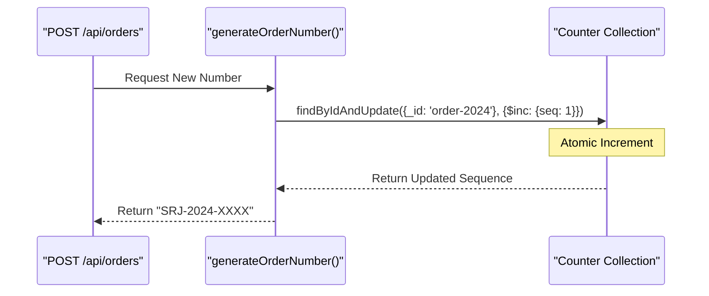
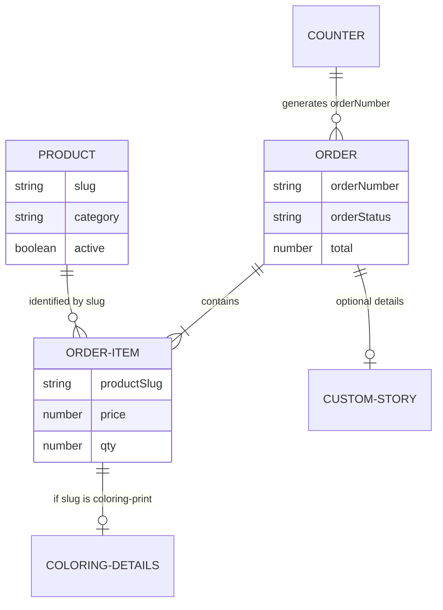

# Product & Order Models

Relevant source files

The following files were used as context for generating this wiki page:

- [scripts/seed.ts](scripts/seed.ts)
- [src/app/admin/orders/page.tsx](src/app/admin/orders/page.tsx)
- [src/app/api/orders/[id]/route.ts](src/app/api/orders/[id]/route.ts)
- [src/app/api/orders/route.ts](src/app/api/orders/route.ts)
- [src/app/api/products/[slug]/route.ts](src/app/api/products/[slug]/route.ts)
- [src/app/api/products/route.ts](src/app/api/products/route.ts)
- [src/app/api/stats/route.ts](src/app/api/stats/route.ts)
- [src/app/api/upload/route.ts](src/app/api/upload/route.ts)
- [src/lib/models/Order.ts](src/lib/models/Order.ts)
- [src/lib/models/Product.ts](src/lib/models/Product.ts)

This page provides a detailed technical reference for the data models governing the Seraj Store e-commerce engine. The system utilizes Mongoose (MongoDB) to manage a flexible product catalog and a robust order processing pipeline that handles standard products, custom stories, and dynamic coloring workbooks.

## 1. Product Model (`IProduct`)

The `Product` model is designed to support diverse physical and digital goods. It includes specific fields for 3D UI rendering, category-based filtering, and administrative control over visibility.

### Schema Structure
The schema is defined in `src/lib/models/Product.ts` and validated during API operations using Zod schemas in `src/app/api/products/route.ts`.

| Field | Type | Description |
| :--- | :--- | :--- |
| `slug` | `String` | Unique identifier used in URLs. Indexed for fast lookups [src/lib/models/Product.ts:103](). |
| `category` | `Enum` | Top-level grouping: "قصص جاهزة", "قصص مخصصة", "فلاش كاردز", "مجموعات" [src/lib/models/Product.ts:111-115](). |
| `section` | `Enum` | Sub-grouping for UI placement: `tales`, `seraj-stories`, `custom-stories`, `play-learn` [src/lib/models/Product.ts:116-120](). |
| `media` | `Sub-schema` | Defines the 3D mockup type (`book3d`, `cards-fan`, `bundle-stack`) and background color [src/lib/models/Product.ts:16-32](). |
| `gallery` | `Array` | List of Cloudinary assets (images/videos) with sort order [src/lib/models/Product.ts:35-49](). |
| `action` | `Enum` | Determines UI behavior: `cart` (direct add), `wizard` (custom story flow), or `none` [src/lib/models/Product.ts:128-132](). |
| `active` | `Boolean` | Flag for soft-deletion and visibility control [src/lib/models/Product.ts:137](). |

### Product Data Flow & Validation
The following diagram illustrates how product data moves from the Admin Dashboard to the Database.

**Diagram: Product Creation Flow**

**Sources:** [src/app/api/products/route.ts:108-157](), [src/lib/models/Product.ts:101-141]()

### Key Functions
- **Soft Delete Logic**: The `DELETE` route in `src/app/api/products/[slug]/route.ts` implements a two-stage deletion. If a product is `active: true`, it sets it to `false`. If already inactive, it performs a hard delete from the database [src/app/api/products/[slug]/route.ts:157-207]().
- **Search Indexes**: A compound text index is maintained on `name`, `category`, and `section` to support administrative search [src/lib/models/Product.ts:144]().

---

## 2. Order Model (`IOrder`)

The `Order` model manages the lifecycle of a purchase. It is highly polymorphic, containing sub-schemas for specific product types like custom stories and coloring workbooks.

### Core Schema & Sub-documents
The order system relies on three primary sub-schemas defined in `src/lib/models/Order.ts`:

1.  **`OrderItemSchema`**: Standard line items including `productSlug`, `price`, and `qty` [src/lib/models/Order.ts:26-35]().
2.  **`CustomStorySchema`**: Metadata for personalized stories, including `heroName`, `age`, and a `storyStatus` state machine [src/lib/models/Order.ts:38-52]().
3.  **`ColoringDetailsSchema`**: Specific to the "Coloring Workbook" builder, tracking selected item IDs and `printStatus` [src/lib/models/Order.ts:4-23]().

### Order Number Generation
To ensure unique, sequential, and human-readable order numbers (e.g., `SRJ-2024-0001`), the system uses an atomic counter in MongoDB.

**Diagram: Atomic Counter Logic**

**Sources:** [src/lib/models/Order.ts:158-184]()

### State Machines
Orders transition through predefined statuses for both logistics and payments:
- **`orderStatus`**: `pending` → `in_progress` → `shipped` → `delivered` (or `cancelled`) [src/lib/models/Order.ts:124-128]().
- **`paymentStatus`**: `unpaid` → `deposit_paid` → `fully_paid` [src/lib/models/Order.ts:117-122]().
- **`storyStatus`**: `pending` → `reviewed` → `sent_to_print` → `delivered` [src/lib/models/Order.ts:45-49]().

### Implementation Details
- **Price Recalculation**: The `POST /api/orders` route does not trust the `total` sent by the client. It fetches current prices from the `Product` collection and recalculates the subtotal and total server-side [src/app/api/orders/route.ts:125-148]().
- **Compound Indexes**: Optimized for admin dashboard performance using `{ orderStatus: 1, createdAt: -1 }` [src/lib/models/Order.ts:139]().
- **Dot-Notation Updates**: When updating order statuses, the API uses MongoDB dot-notation (e.g., `customStory.storyStatus`) to avoid overwriting the entire sub-document [src/app/api/orders/[id]/route.ts:94-98]().

---

## 3. Data Relationships

The relationship between products and orders is primarily through the `productSlug`. This allows the catalog to change (prices, descriptions) without altering historical order data, while still allowing the system to link items back to current product entries.

**Diagram: Entity Relationship Map**

**Sources:** [src/lib/models/Product.ts](), [src/lib/models/Order.ts]()

### Dashboard Statistics
The `GET /api/stats` route uses a MongoDB `$facet` aggregation to provide a real-time overview of the system's health, calculating `totalOrders`, `pendingStories`, and `totalRevenue` in a single database pass [src/app/api/stats/route.ts:17-44]().

**Sources:**
- [src/lib/models/Product.ts:1-152]()
- [src/lib/models/Order.ts:1-191]()
- [src/app/api/products/route.ts:1-157]()
- [src/app/api/orders/route.ts:1-216]()
- [src/app/api/orders/[id]/route.ts:68-138]()
- [src/app/api/stats/route.ts:10-63]()
