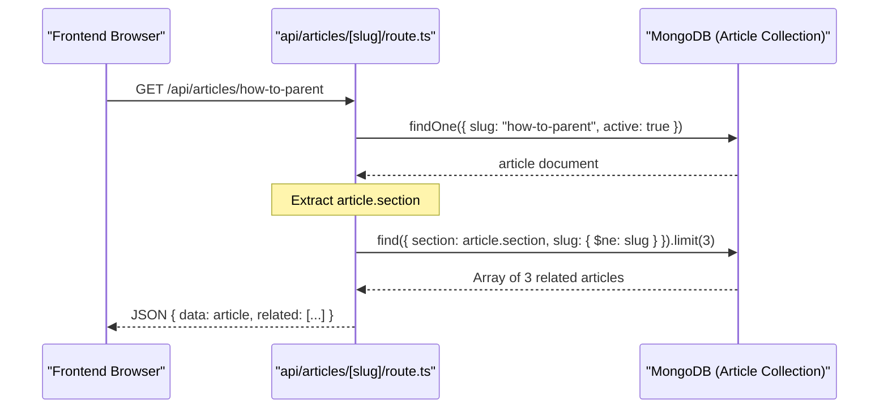
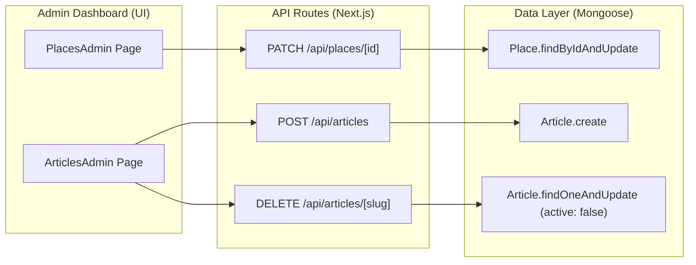

# Place, Article & Content Models

<details>
<summary>Relevant source files</summary>

The following files were used as context for generating this wiki page:

- [docs/ARTICALS.md](docs/ARTICALS.md)
- [scripts/seed-articles.ts](scripts/seed-articles.ts)
- [src/app/admin/articles/page.tsx](src/app/admin/articles/page.tsx)
- [src/app/admin/places/page.tsx](src/app/admin/places/page.tsx)
- [src/app/api/articles/[slug]/route.ts](src/app/api/articles/[slug]/route.ts)
- [src/app/api/articles/route.ts](src/app/api/articles/route.ts)
- [src/app/api/places/[id]/route.ts](src/app/api/places/[id]/route.ts)
- [src/lib/models/Article.ts](src/lib/models/Article.ts)
- [src/lib/models/Place.ts](src/lib/models/Place.ts)
- [src/lib/models/SiteContent.ts](src/lib/models/SiteContent.ts)
- [src/lib/models/Testimonial.ts](src/lib/models/Testimonial.ts)

</details>


This page documents the schema definitions and management logic for the content-heavy subsystems of Seraj Store: the **Fas7a Helwa** outings directory (`IPlace`), the **Mama World** blog (`IArticle`), and the global key-value CMS (`SiteContent`). These models are designed for high-performance retrieval and administrative flexibility, utilizing Mongoose features such as full-text indexing and compound indexes.

## 1. Fas7a Helwa (Places) Model

The `IPlace` model represents physical locations in the outings directory. It includes geographic coordinates, price range categorization, age-appropriateness metadata, and a promotional offer system.

### Data Schema: IPlace
The schema is defined in [src/lib/models/Place.ts:52-91](). It uses a sub-schema `LocationSchema` [src/lib/models/Place.ts:4-10]() to store coordinates without creating unique IDs for the sub-object.

| Field | Type | Description |
| :--- | :--- | :--- |
| `name_ar` / `name_en` | String | Bilingual names for the venue. |
| `location` | Object | Nested `{ lat: number, lon: number }`. |
| `price_range_id` | Number | Integer mapping (1-5) for price tiers. |
| `category_ids` | Number[] | Array of category IDs (e.g., 1 for "Play", 5 for "Animals"). |
| `indoor_outdoor` | Enum | One of `["indoor", "outdoor", "mixed", "unknown"]`. |
| `offer_active` | Boolean | Toggle for showing a promotional badge. |
| `active` | Boolean | Soft-delete flag [src/lib/models/Place.ts:87-87](). |

### Search and Indexing
To support the Fas7a Helwa search bar and filter chips, the model implements:
*   **Text Index**: Combines `name_en`, `name_ar`, `city`, and `area` for keyword searches [src/lib/models/Place.ts:94-94]().
*   **Compound Index**: Optimizes filtered listings using `{ active: 1, city: 1, category_ids: 1 }` [src/lib/models/Place.ts:97-97]().

### Administrative Operations
Places are managed via `GET`, `PATCH`, and `DELETE` routes in `src/app/api/places/[id]/route.ts`.
*   **Soft Delete**: The `DELETE` method updates `active: false` rather than removing the document [src/app/api/places/[id]/route.ts:161-197]().
*   **Validation**: The `PatchPlaceSchema` (Zod) ensures data integrity for updates, including coordinate types and enum constraints [src/app/api/places/[id]/route.ts:54-88]().

**Sources:** [src/lib/models/Place.ts:13-49](), [src/app/api/places/[id]/route.ts:54-88]()

---

## 2. Mama World (Articles) Model

The `IArticle` model powers the "Mama World" blog portal. It is optimized for SEO and RTL (Arabic) content delivery, featuring reading time estimation and source citations.

### Data Schema: IArticle
Defined in [src/lib/models/Article.ts:43-77](), this model supports rich-text content via Markdown.

| Field | Type | Description |
| :--- | :--- | :--- |
| `slug` | String | Unique URL identifier, indexed for performance. |
| `section` | String | Taxonomy category (e.g., "الحمل والرضاعة"). |
| `contentMarkdown`| String | The raw Markdown body of the article. |
| `sources` | Array | List of `ISource` objects (label, url, note). |
| `readingTime` | Number | Calculated automatically based on word count. |
| `publishedAt` | Date | Used for scheduling and visibility [src/app/api/articles/route.ts:77-77](). |

### Article Lifecycle & Seeding
Articles are often bulk-ingested from Markdown files using a dedicated script:
1.  **Parsing**: `scripts/seed-articles.ts` reads `ARTICALS.md`, splitting content by headers [scripts/seed-articles.ts:137-159]().
2.  **Mapping**: Articles are mapped to sections (e.g., "العلاقة مع الأم نفسيا") using a `SECTION_MAP` [scripts/seed-articles.ts:14-55]().
3.  **Reading Time**: The API automatically calculates `readingTime` if not provided, assuming ~200 words per minute [src/app/api/articles/route.ts:159-162]().

### Related Articles Logic
The `GET /api/articles/:slug` route includes a "Related Articles" feature that fetches up to 3 active articles from the same `section`, excluding the current one [src/app/api/articles/[slug]/route.ts:59-67]().

**Sources:** [src/lib/models/Article.ts:20-40](), [scripts/seed-articles.ts:14-55](), [src/app/api/articles/route.ts:158-162]()

---

## 3. Site Content & Testimonials

### SiteContent (Flat CMS)
The `SiteContent` model [src/lib/models/SiteContent.ts:12-21]() serves as a flat key-value store for UI strings, hero text, and configuration values.
*   **Key**: A unique string identifier used by the frontend `injectSiteContent` utility.
*   **Section**: Groups keys (e.g., "Home", "Footer") for the Admin CMS editor.
*   **Data Flow**: The frontend SPA fetches all content in a single call and stores it in the global `SITE_CONTENT` object.

### ITestimonial
Stores customer reviews displayed on the landing page [src/lib/models/Testimonial.ts:17-29]().
*   **Visuals**: Includes `avatarInitials` and `avatarColor` to generate placeholder avatars without requiring image uploads.
*   **Ordering**: Uses an `order` field to control the sequence in the testimonial carousel.

**Sources:** [src/lib/models/SiteContent.ts:3-10](), [src/lib/models/Testimonial.ts:3-15]()

---

## 4. System Diagrams

### Data Entity Relationship
This diagram shows how the different content models relate to the site's taxonomy and administrative controls.

Title: Content Model Relationships
```mermaid
classDiagram
    class IPlace {
        +String name_ar
        +String city
        +Number[] category_ids
        +Object location
        +Boolean offer_active
        +Boolean active
    }

    class IArticle {
        +String slug
        +String section
        +String contentMarkdown
        +ISource[] sources
        +Number readingTime
        +Boolean active
    }

    class SiteContent {
        +String key
        +String value
        +String section
    }

    class ITestimonial {
        +String quote
        +String avatarColor
        +Number order
    }

    IPlace ..> "Taxonomy" : Filtered by
    IArticle ..> "Taxonomy" : Grouped by
    SiteContent ..> "Admin UI" : Edited via
```
**Sources:** [src/lib/models/Place.ts](), [src/lib/models/Article.ts](), [src/lib/models/SiteContent.ts]()

### Article Retrieval Flow
Bridges the natural language request for "Related Articles" to the code entities and logic.

Title: Article Retrieval & Related Logic Flow

**Sources:** [src/app/api/articles/[slug]/route.ts:41-81]()

### Admin Management Logic
Mapping Admin UI actions to the API and Model layer.

Title: Admin CRUD Operations Mapping

**Sources:** [src/app/admin/places/page.tsx:151-181](), [src/app/admin/articles/page.tsx:129-171](), [src/app/api/articles/[slug]/route.ts:162-165]()
