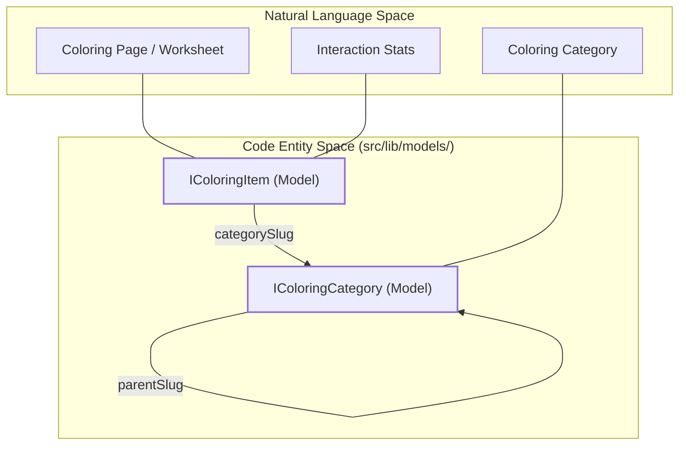
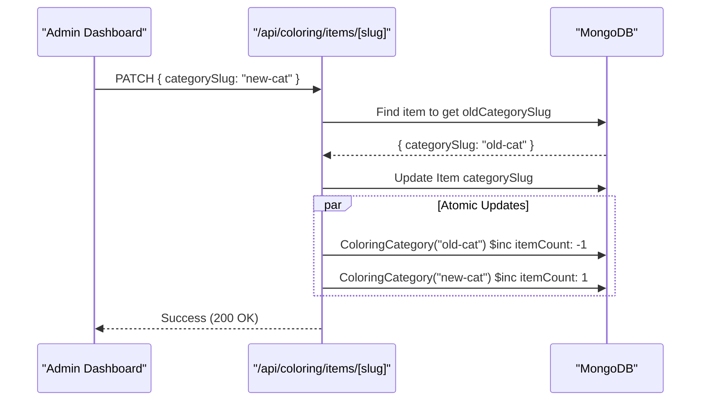

# Coloring Models

Relevant source files

The following files were used as context for generating this wiki page:

- [src/app/admin/coloring/categories/page.tsx](src/app/admin/coloring/categories/page.tsx)
- [src/app/api/coloring/categories/[slug]/route.ts](src/app/api/coloring/categories/[slug]/route.ts)
- [src/app/api/coloring/items/[slug]/route.ts](src/app/api/coloring/items/[slug]/route.ts)
- [src/lib/models/ColoringCategory.ts](src/lib/models/ColoringCategory.ts)
- [src/lib/models/ColoringItem.ts](src/lib/models/ColoringItem.ts)

This section provides a technical reference for the coloring subsystem's data models. The system is designed to handle hierarchical categories and individual printable items (coloring pages, worksheets, and crafts) while maintaining strict data integrity for item counts and interaction statistics.

## Overview of Coloring Entities

The coloring subsystem consists of two primary Mongoose models: `ColoringCategory` and `ColoringItem`. These models support a "Mama World" portal where users can browse, save, and print educational materials.

### Data Relationship Diagram
The following diagram illustrates the relationship between the physical storage entities and the logical concepts used in the application.

**Entity-Relationship Bridge**

Sources: [src/lib/models/ColoringCategory.ts:4-19](), [src/lib/models/ColoringItem.ts:9-42]()

---

## 1. ColoringItem Model

The `ColoringItem` model represents a single asset. It includes metadata for filtering (age, difficulty, type) and tracking user engagement.

### Schema Definition (`IColoringItem`)
| Field | Type | Description |
| :--- | :--- | :--- |
| `slug` | `string` | Unique URL identifier. [src/lib/models/ColoringItem.ts:46]() |
| `type` | `enum` | `coloring`, `worksheet`, or `craft`. [src/lib/models/ColoringItem.ts:60]() |
| `difficulty` | `enum` | `easy`, `medium`, or `hard`. [src/lib/models/ColoringItem.ts:66]() |
| `ageRange` | `enum` | `3-6`, `7-10`, or `11+`. [src/lib/models/ColoringItem.ts:72]() |
| `license` | `enum` | Defines usage rights (e.g., `cc0`, `free-link`, `seraj`). [src/lib/models/ColoringItem.ts:81]() |
| `categorySlug` | `string` | Foreign key to `ColoringCategory.slug`. [src/lib/models/ColoringItem.ts:48]() |
| `printable` | `boolean` | If true, item can be added to a custom workbook. [src/lib/models/ColoringItem.ts:94]() |

### Interaction Counters
Items track lightweight statistics that are updated via atomic `$inc` operations in `POST /api/coloring/items/[slug]`:
*   `savedCount`: Number of times users bookmarked the item.
*   `printCount`: Number of times the item was printed or added to a workbook.
*   `shareCount`: Number of times the share link was triggered.

Sources: [src/lib/models/ColoringItem.ts:87-89](), [src/app/api/coloring/items/[slug]/route.ts:59-75]()

---

## 2. ColoringCategory Model

Categories are organized in a parent-child hierarchy to facilitate navigation in the frontend.

### Schema Definition (`IColoringCategory`)
*   **`parentSlug`**: References the `slug` of another category. A `null` value indicates a top-level category. [src/lib/models/ColoringCategory.ts:26]()
*   **`itemCount`**: A cached integer representing the number of active items in the category. This is used to avoid expensive aggregation queries during catalog rendering. [src/lib/models/ColoringCategory.ts:30]()
*   **`featured`**: A flag that determines if the category appears on the Mama World landing page. [src/lib/models/ColoringCategory.ts:38]()

### Hierarchy Management
The admin dashboard flattens this hierarchy for display, while the API can return a nested tree structure using the `?tree=1` query parameter.

Sources: [src/lib/models/ColoringCategory.ts:4-19](), [src/app/admin/coloring/categories/page.tsx:47]()

---

## 3. Counter Integrity Mechanisms

To ensure `itemCount` remains accurate, the system implements specific logic during item migration and deletion.

### Item Migration (PATCH)
When an admin changes the `categorySlug` of an item, the system performs a dual update:
1.  Decrements `itemCount` on the `oldCategorySlug`.
2.  Increments `itemCount` on the new `categorySlug`.

**Data Flow: Category Migration**

Sources: [src/app/api/coloring/items/[slug]/route.ts:128-162]()

### Deletion Logic
The system employs a two-stage deletion process:
*   **Soft Delete**: Sets `active: false`. The `itemCount` is **not** adjusted, as the item still exists in the database. [src/app/api/coloring/items/[slug]/route.ts:213-225]()
*   **Hard Delete**: If an item is already inactive, a second DELETE request removes the document and decrements the `itemCount` of the parent category. [src/app/api/coloring/items/[slug]/route.ts:227-232]()

### Category Deletion
When a category is hard-deleted, the system automatically deactivates all items associated with that category's slug to prevent orphaned active items. [src/app/api/coloring/categories/[slug]/route.ts:192-196]()

Sources: [src/app/api/coloring/items/[slug]/route.ts:189-239](), [src/app/api/coloring/categories/[slug]/route.ts:158-204]()
