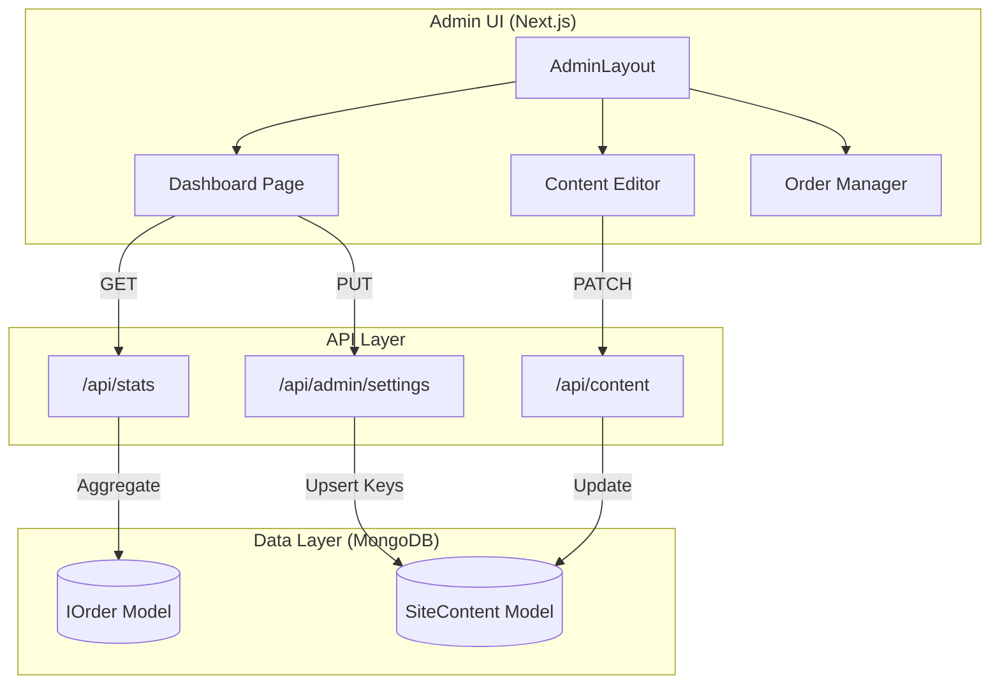

# Admin Dashboard

Relevant source files

The following files were used as context for generating this wiki page:

- [public/assets/logo/logo-icon.svg](public/assets/logo/logo-icon.svg)
- [public/assets/logo/logo.svg](public/assets/logo/logo.svg)
- [public/manifest.json](public/manifest.json)
- [src/app/admin/content/ContentEditor.tsx](src/app/admin/content/ContentEditor.tsx)
- [src/app/admin/error.tsx](src/app/admin/error.tsx)
- [src/app/admin/layout.tsx](src/app/admin/layout.tsx)
- [src/app/admin/login/page.tsx](src/app/admin/login/page.tsx)
- [src/app/admin/page.tsx](src/app/admin/page.tsx)
- [src/app/api/admin/settings/route.ts](src/app/api/admin/settings/route.ts)
- [src/app/api/config/route.ts](src/app/api/config/route.ts)
- [src/lib/seed/contentDefaults.ts](src/lib/seed/contentDefaults.ts)

The Seraj Store Admin Dashboard is a centralized management interface built with Next.js App Router and [shadcn/ui](https://ui.shadcn.com/) components. It provides store administrators with tools to manage products, process orders, curate educational content, and monitor system health. Located under `src/app/admin/`, the dashboard is protected by a multi-layered authentication system and serves as the command center for the entire platform.

### System Architecture Overview

The admin panel operates as a server-side rendered (SSR) application within the Next.js framework, contrasting with the vanilla JS SPA used for the public storefront. It communicates with the backend via internal API calls and direct database interactions through Mongoose models.

#### Admin Navigation & Layout
The dashboard utilizes a persistent sidebar layout defined in `AdminLayout` [src/app/admin/layout.tsx:20-92](). This layout manages navigation across nine primary modules:

| Module | Icon | Description |
| :--- | :--- | :--- |
| **Dashboard** | 📊 | Real-time stats and global settings. |
| **Orders** | 📦 | Order fulfillment and status tracking. |
| **Products** | 📚 | Catalog management and stock control. |
| **Coloring** | 🎨 | Educational coloring items and pricing. |
| **Articles** | 📝 | Blog and "Mama World" content. |
| **Stories** | 📖 | Custom AI-generated story review. |
| **Content** | ✏️ | Key-value CMS for site-wide text. |
| **Testimonials** | 💬 | Customer feedback management. |
| **Places** | 🎡 | "Fas7a Helwa" directory management. |

**Code Entry Point:** [src/app/admin/layout.tsx:8-18]()

### Authentication & Access Control
Access to the `/admin/*` route tree is strictly controlled via **NextAuth v5** and a custom middleware guard. Users must authenticate through the `AdminLoginPage` [src/app/admin/login/page.tsx:100-112]() using credentials verified against environment-stored hashes.

*   **Middleware Guard:** Intercepts requests to `/admin` to ensure a valid session exists.
*   **API Protection:** Write operations in the backend utilize the `requireAdmin()` utility [src/app/api/admin/settings/route.ts:11-12]() to prevent unauthorized POST/PATCH/DELETE requests.

For details on session strategy and credential verification, see [Authentication & Access Control](#5.1).

### Dashboard Home & Global Settings
The landing page [src/app/admin/page.tsx:48-105]() provides an immediate overview of business health using a `$facet` aggregation via `/api/stats`.

#### Stats & Monitoring
The dashboard displays four primary metrics cards [src/app/admin/page.tsx:98-103]():
1.  **Total Orders:** Lifetime order count.
2.  **New Orders:** Count of orders with `pending` status.
3.  **Pending Stories:** Custom stories awaiting admin review.
4.  **Total Revenue:** Aggregated income in EGP.

#### Shipping Configuration
Administrators can modify global shipping parameters directly from the dashboard. These settings are stored in the `SiteContent` collection under the `shipping` section [src/app/api/admin/settings/route.ts:48-55]().
*   **Shipping Fee:** Flat rate applied to orders.
*   **Free Shipping Threshold:** Minimum order value to waive fees.

For details on statistics aggregation and shipping logic, see [Places Admin & Dashboard Stats](#5.4).

### Content Management System (CMS)
The platform features a flexible, key-value based CMS allowed for real-time updates to the public SPA without code deployments.

#### The Content Editor
The `ContentEditor` component [src/app/admin/content/ContentEditor.tsx:25-112]() organizes site text into logical sections (e.g., `hero`, `how`, `wizard`). It allows admins to edit values using a tabbed interface.
*   **Live Injection:** Changes saved here are immediately reflected in the SPA via the `injectSiteContent` mechanism.
*   **Formatting:** Supports HTML tags like ` ` and `` for typography control [src/app/admin/content/ContentEditor.tsx:94-96]().

For details on CMS sections and Markdown editing, see [Coloring, Articles & Content Admin](#5.3).

### Operational Workflow
The following diagram illustrates how the Admin Dashboard interacts with the underlying data layer and the public SPA configuration.

**Admin System Interaction Map**

**Sources:** [src/app/admin/page.tsx:56-88](), [src/app/admin/content/ContentEditor.tsx:43-67](), [src/app/api/admin/settings/route.ts:39-73]()

### Management Modules Summary

#### Products & Orders
Handles the lifecycle of physical products and custom stories. Admins can track an order from `pending` to `delivered` and manage the complex "Story Status" workflow (Reviewing -> Printing -> Delivery).
*   **See also:** [Products & Orders Management](#5.2).

#### Educational & Social Content
Manages the "Mama World" ecosystem, including the hierarchical coloring category tree and the articles repository.
*   **See also:** [Coloring, Articles & Content Admin](#5.3).

#### Places & Venues
A dedicated CRUD interface for the "Fas7a Helwa" directory, allowing admins to manage venue details, offers, and geographic metadata.
*   **See also:** [Places Admin & Dashboard Stats](#5.4).

**Sources:**
- [src/app/admin/layout.tsx:1-92]()
- [src/app/admin/page.tsx:1-205]()
- [src/app/admin/login/page.tsx:1-112]()
- [src/app/admin/content/ContentEditor.tsx:1-113]()
- [src/app/api/admin/settings/route.ts:1-74]()
- [src/app/api/config/route.ts:1-37]()
