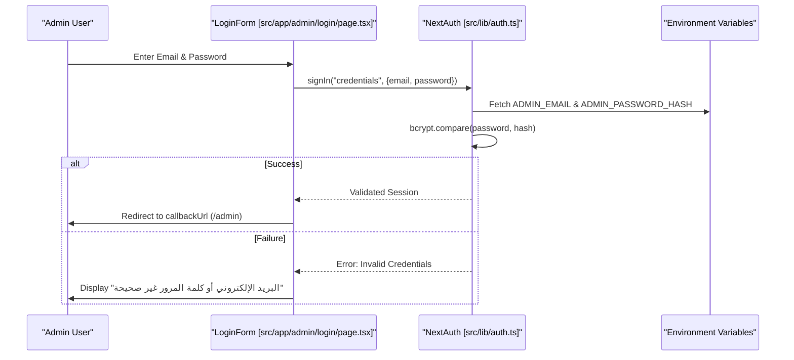
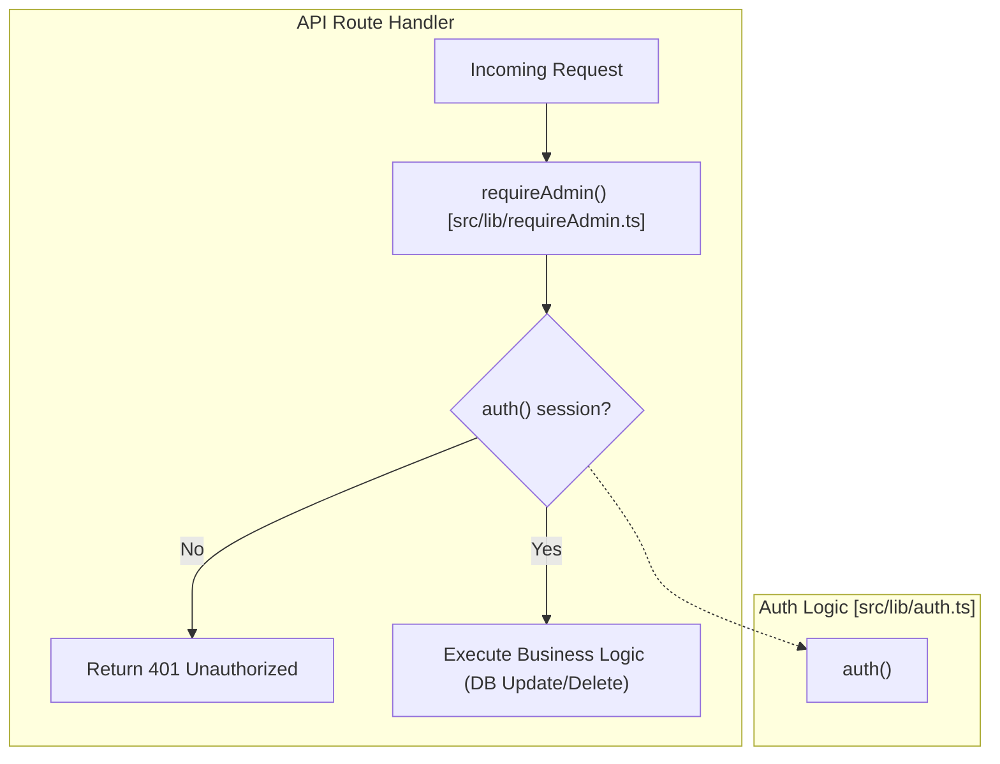

# Authentication & Access Control

Relevant source files

The following files were used as context for generating this wiki page:

- [public/assets/logo/logo-icon.svg](public/assets/logo/logo-icon.svg)
- [public/assets/logo/logo.svg](public/assets/logo/logo.svg)
- [public/manifest.json](public/manifest.json)
- [public/robots.txt](public/robots.txt)
- [src/app/admin/login/page.tsx](src/app/admin/login/page.tsx)
- [src/app/api/auth/[...nextauth]/route.ts](src/app/api/auth/[...nextauth]/route.ts)
- [src/app/sitemap.ts](src/app/sitemap.ts)
- [src/lib/auth.ts](src/lib/auth.ts)
- [src/lib/requireAdmin.ts](src/lib/requireAdmin.ts)
- [src/middleware.ts](src/middleware.ts)

The Seraj Store implements a centralized authentication system designed specifically for administrative access. Given the hybrid nature of the application (Vanilla JS SPA for the storefront and Next.js for the admin dashboard), the security model focuses on protecting administrative routes and API write operations while maintaining an open, crawlable public interface.

## System Architecture

Authentication is managed via **NextAuth.js v5**, utilizing a single-user `Credentials` provider. This approach avoids the overhead of a database-backed user collection by verifying credentials against environment variables.

### Admin Authentication Flow

The authentication flow transitions from a client-side login form to a server-side validation against hashed environment variables.

Title: Admin Authentication Sequence

**Sources:**
* [src/lib/auth.ts:9-45]()
* [src/app/admin/login/page.tsx:21-44]()

---

## Implementation Details

### NextAuth Configuration
The system uses a JWT (JSON Web Token) strategy with a strict expiration policy.

*   **Provider**: `CredentialsProvider` configured in `src/lib/auth.ts` [src/lib/auth.ts:11-45]().
*   **Strategy**: `jwt` [src/lib/auth.ts:51]().
*   **Session Max Age**: 24 hours (`24 * 60 * 60`) [src/lib/auth.ts:52]().
*   **Credential Verification**:
    1.  Checks `ADMIN_EMAIL` against provided email [src/lib/auth.ts:22]().
    2.  Uses `bcrypt.compare` to validate against `ADMIN_PASSWORD_HASH` [src/lib/auth.ts:29]().
    3.  Maintains fallback for `ADMIN_PASSWORD` (plain text) for backwards compatibility [src/lib/auth.ts:30-33]().

### Middleware Edge Guard
The `middleware.ts` file acts as an edge-level security layer, intercepting requests before they reach the App Router.

| Logic Check | Action | Path |
| :--- | :--- | :--- |
| **API Exemption** | Passes through directly | `/api/*` [src/middleware.ts:13-15]() |
| **Login Exemption** | Allows access to login page | `/admin/login` [src/middleware.ts:18-20]() |
| **Admin Protection** | Checks for `authjs.session-token` or `__Secure-authjs.session-token` | `/admin/*` [src/middleware.ts:23-26]() |
| **Unauthorized** | Redirects to `/admin/login?callbackUrl=...` | `/admin/*` [src/middleware.ts:28-32]() |

**Sources:**
* [src/middleware.ts:9-48]()

---

## Access Control Utilities

### `requireAdmin()` Utility
For server-side protection of API routes (specifically POST, PATCH, and DELETE operations), the codebase utilizes a standardized `requireAdmin()` helper.

Title: API Access Control Integration

**Function Signature:**
`export async function requireAdmin(): Promise<NextResponse | null>` [src/lib/requireAdmin.ts:12]()

**Behavior:**
*   Calls `auth()` to retrieve the current session [src/lib/requireAdmin.ts:13]().
*   If no user is found, returns a `NextResponse.json` with status `401` [src/lib/requireAdmin.ts:14-18]().
*   If authenticated, returns `null`, allowing the route handler to proceed [src/lib/requireAdmin.ts:20]().

**Sources:**
* [src/lib/requireAdmin.ts:4-21]()
* [src/lib/auth.ts:9]()

---

## Public Access & Crawler Configuration

While admin routes are strictly protected, the storefront and public APIs are optimized for discovery by search engines and AI agents.

### Robots.txt & AI Agents
The `public/robots.txt` file explicitly defines access for standard crawlers and AI bots.
*   **Allowed**: All agents (including `GPTBot`, `ClaudeBot`, `PerplexityBot`) are allowed on public routes `/` [public/robots.txt:7-41]().
*   **Disallowed**: All agents are forbidden from `/admin/` and `/api/` [public/robots.txt:9-10]().
*   **Content Signals**: Implements `ai-train=no` to prevent use of site content for LLM training while allowing search indexing [public/robots.txt:45]().

### Sitemap Discovery
The middleware injects `Link` headers on the homepage (`/`) to assist crawlers in finding the dynamic sitemap and robots configuration [src/middleware.ts:37-45]().

**Sources:**
* [public/robots.txt:1-50]()
* [src/middleware.ts:35-46]()
* [src/app/sitemap.ts:10-60]()
