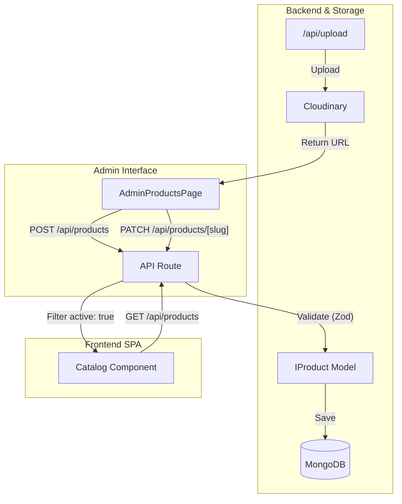
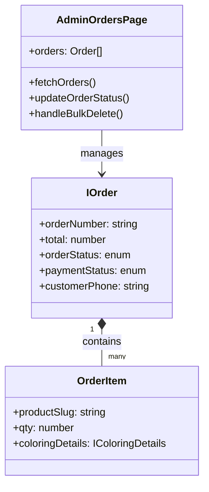

# Products & Orders Management

Relevant source files

The following files were used as context for generating this wiki page:

- [scripts/migrate-product-images.ts](scripts/migrate-product-images.ts)
- [src/app/admin/orders/page.tsx](src/app/admin/orders/page.tsx)
- [src/app/admin/products/page.tsx](src/app/admin/products/page.tsx)
- [src/app/admin/stories/page.tsx](src/app/admin/stories/page.tsx)
- [src/app/api/orders/route.ts](src/app/api/orders/route.ts)
- [src/app/api/upload-child-photo/route.ts](src/app/api/upload-child-photo/route.ts)
- [src/lib/db.ts](src/lib/db.ts)
- [src/lib/models/Order.ts](src/lib/models/Order.ts)
- [src/lib/rateLimit.ts](src/lib/rateLimit.ts)

The admin dashboard provides a centralized interface for managing the Seraj Store catalog, customer orders, and custom story production workflows. These modules leverage Next.js App Router's server actions and API routes to perform CRUD operations, manage media assets via Cloudinary, and facilitate customer communication through WhatsApp integration.

## Product Catalog Management

The `AdminProductsPage` handles the lifecycle of store products. It supports a "soft delete" mechanism where products are first deactivated (hidden from the frontend) before being eligible for "hard delete" (removal from MongoDB).

### Implementation Details
- **CRUD Operations**: The page uses `fetch` to interact with `/api/products` for listing and creation, and `/api/products/[slug]` for updates and deletion [src/app/admin/products/page.tsx:157-212]().
- **Section Mapping**: Products are categorized into specific store sections using `sectionLabelMap` and `sectionColorMap` to ensure consistent UI branding (e.g., "tales" maps to "سباق الفتوحات") [src/app/admin/products/page.tsx:96-108]().
- **Mockup Fallback**: The system uses a `media.type` field (e.g., `book3d`) to determine which 3D CSS mockup to render in the frontend SPA [src/app/admin/products/page.tsx:85]().
- **Gallery Management**: Supports multi-file uploads to Cloudinary via the `/api/upload` endpoint, maintaining a `sortOrder` for gallery images [src/app/admin/products/page.tsx:55-62]().

### Product Data Flow
The following diagram illustrates the transition from a product's creation to its visibility in the frontend.

**Product Lifecycle Diagram**

*Sources: [src/app/admin/products/page.tsx:110-130](), [src/lib/models/Product.ts:1-50]()*

---

## Order Management & Polling

The `AdminOrdersPage` is designed for high-concurrency monitoring of incoming customer purchases. It features an automated polling mechanism to alert admins of new orders without requiring manual refreshes.

### Key Features
- **30-Second Polling**: Uses a `setInterval` within a `useEffect` hook to fetch the first page of orders every 30 seconds. It compares the `json.total` count against `prevTotalRef.current` to detect and notify the admin of new arrivals [src/app/admin/orders/page.tsx:159-167]().
- **Status State Machine**: Orders progress through `orderStatus` (pending → in_progress → shipped → delivered) and `paymentStatus` (unpaid → deposit_paid → fully_paid) [src/lib/models/Order.ts:79-80]().
- **WhatsApp Link Generation**: A utility function `getWhatsAppLink` dynamically constructs a URI using the customer's phone number and order number to facilitate quick follow-ups [src/app/admin/orders/page.tsx:103-108]().
- **Bulk Operations**: Admins can select multiple orders via `selectedIds` to perform bulk deletions via `DELETE /api/orders` [src/app/admin/orders/page.tsx:191-212]().

### Order Entity Association
This diagram maps the UI state and components to the underlying Mongoose schema entities.

**Order Component Mapping**

*Sources: [src/app/admin/orders/page.tsx:54-71](), [src/lib/models/Order.ts:64-95]()*

---

## Custom Story Workflow

The `AdminStoriesPage` provides a specialized view for orders containing a `customStory` object. These orders require a multi-stage production process managed through the `storyStatus` field.

### Production Workflow
The workflow is strictly governed by the following status transitions:
1.  **Pending**: Default state after customer checkout [src/lib/models/Order.ts:47]().
2.  **Reviewed**: Admin has verified the child's photo and the requested "challenge" [src/app/admin/stories/page.tsx:47]().
3.  **Sent to Print**: The story content has been generated and sent to the physical printing service [src/app/admin/stories/page.tsx:48]().
4.  **Delivered**: The physical book has reached the customer [src/app/admin/stories/page.tsx:49]().

### Media Handling
- **Child Photo Uploads**: Customers upload photos via the public `/api/upload-child-photo` endpoint, which enforces a 5MB limit and image-only MIME types [src/app/api/upload-child-photo/route.ts:18-58]().
- **Admin Review**: Admins can view these photos in a `Dialog` component to ensure quality before proceeding to the "Reviewed" stage [src/app/admin/stories/page.tsx:157-163]().

### Technical Summary Table

| Feature | Implementation | File Reference |
| :--- | :--- | :--- |
| **Order Numbering** | Atomic counter (SRJ-YYYY-XXXX) | [src/lib/models/Order.ts:158-184]() |
| **Price Integrity** | Server-side recalculation on POST | [src/app/api/orders/route.ts:125-148]() |
| **Rate Limiting** | 10 orders / 15 mins per IP | [src/app/api/orders/route.ts:111-117]() |
| **Image Migration** | One-time script for Cloudinary URLs | [scripts/migrate-product-images.ts:10-31]() |

**Sources:**
- [src/app/admin/products/page.tsx]()
- [src/app/admin/orders/page.tsx]()
- [src/app/admin/stories/page.tsx]()
- [src/app/api/orders/route.ts]()
- [src/app/api/upload-child-photo/route.ts]()
- [src/lib/models/Order.ts]()
- [src/lib/db.ts]()
