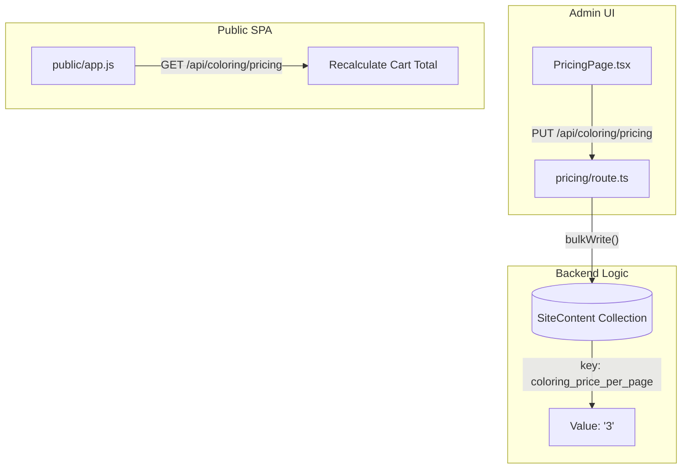
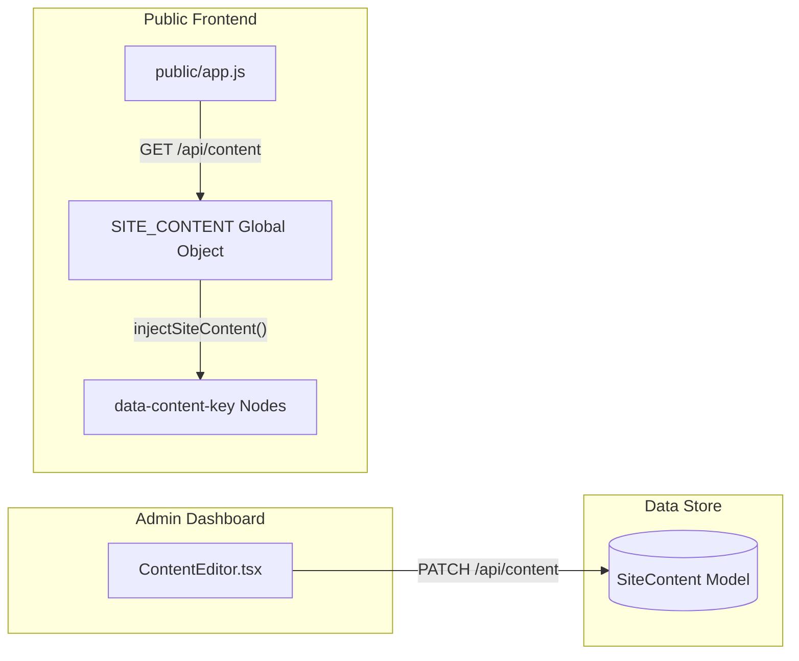

# Coloring, Articles & Content Admin

Relevant source files

The following files were used as context for generating this wiki page:

- [docs/ARTICALS.md](docs/ARTICALS.md)
- [scripts/seed-articles.ts](scripts/seed-articles.ts)
- [scripts/seedContent.ts](scripts/seedContent.ts)
- [src/app/admin/articles/page.tsx](src/app/admin/articles/page.tsx)
- [src/app/admin/coloring/categories/page.tsx](src/app/admin/coloring/categories/page.tsx)
- [src/app/admin/coloring/items/page.tsx](src/app/admin/coloring/items/page.tsx)
- [src/app/admin/coloring/page.tsx](src/app/admin/coloring/page.tsx)
- [src/app/admin/coloring/pricing/page.tsx](src/app/admin/coloring/pricing/page.tsx)
- [src/app/admin/content/ContentEditor.tsx](src/app/admin/content/ContentEditor.tsx)
- [src/app/admin/layout.tsx](src/app/admin/layout.tsx)
- [src/app/admin/testimonials/page.tsx](src/app/admin/testimonials/page.tsx)
- [src/app/api/articles/[slug]/route.ts](src/app/api/articles/[slug]/route.ts)
- [src/app/api/articles/route.ts](src/app/api/articles/route.ts)
- [src/app/api/coloring/categories/[slug]/route.ts](src/app/api/coloring/categories/[slug]/route.ts)
- [src/app/api/coloring/items/[slug]/route.ts](src/app/api/coloring/items/[slug]/route.ts)
- [src/app/api/coloring/pricing/route.ts](src/app/api/coloring/pricing/route.ts)
- [src/app/api/dev/seed/route.ts](src/app/api/dev/seed/route.ts)
- [src/app/api/testimonials/[id]/route.ts](src/app/api/testimonials/[id]/route.ts)
- [src/lib/models/Article.ts](src/lib/models/Article.ts)
- [src/lib/seed/contentDefaults.ts](src/lib/seed/contentDefaults.ts)

This section documents the administrative modules responsible for managing the "Mama World" portal content, the coloring workbook ecosystem, the site-wide key-value CMS, and customer testimonials. These modules bridge the gap between static content and a dynamic, admin-controlled user experience.

## 1. Coloring Admin Hub

The Coloring Admin Hub provides full lifecycle management for the **ألوان سراج** (Seraj Colors) product. It manages a hierarchical tree of categories, thousands of individual coloring items, and a dynamic pricing engine.

### 1.1 Categories & Items Management
The category system supports a parent-child hierarchy. When items are moved between categories or deleted, the system maintains referential integrity by updating the `itemCount` on the respective `ColoringCategory` documents [src/app/api/coloring/items/[slug]/route.ts:150-162]().

*   **Category Tree**: Fetched via `/api/coloring/categories?tree=1&all=true` [src/app/admin/coloring/categories/page.tsx:47](). It displays the relationship between parent categories (e.g., Animals) and children (e.g., Lions) [src/app/admin/coloring/categories/page.tsx:132-171]().
*   **Item Interactions**: Admin can view interaction counters for every item, including `savedCount`, `shareCount`, and `printCount` [src/app/api/coloring/items/[slug]/route.ts:59-64]().
*   **Media Processing**: Images are uploaded via `/api/upload` to Cloudinary before being saved to the `ColoringItem` or `ColoringCategory` [src/app/admin/coloring/categories/page.tsx:77-92]().

### 1.2 Pricing Configuration & Live Preview
The pricing engine allows admins to adjust the financial model of the Coloring Workbook without code changes. These values are stored in the `SiteContent` model under the `coloring-pricing` section [src/app/api/coloring/pricing/route.ts:87]().

| Field | Key in SiteContent | Purpose |
| :--- | :--- | :--- |
| `pricePerPage` | `coloring_price_per_page` | Cost per individual printed sheet [src/app/api/coloring/pricing/route.ts:20]() |
| `coverPrice` | `coloring_cover_price` | Surcharge for adding a custom cover [src/app/api/coloring/pricing/route.ts:21]() |
| `minPages` | `coloring_min_pages` | Minimum sheets required for an order [src/app/api/coloring/pricing/route.ts:22]() |
| `freeShippingMin`| `coloring_free_shipping_min` | Threshold for EGP 0 shipping [src/app/api/coloring/pricing/route.ts:24]() |

**Pricing Data Flow**
The `PricingPage` component includes a "Live Preview" logic that simulates the customer's total cost in real-time as admin tweaks the inputs [src/app/admin/coloring/pricing/page.tsx:116-129]().

**Sources:** [src/app/api/coloring/pricing/route.ts:19-28](), [src/app/admin/coloring/pricing/page.tsx:14-20](), [src/app/api/coloring/items/[slug]/route.ts:110-162]()

---

## 2. Articles Admin (Mama World)

The Articles module manages the blog-style content in the "Mama World" portal. It features a Markdown-based editing workflow and a taxonomy system based on age groups and parenting sections.

### 2.1 Data Ingestion & Taxonomy
While the admin panel allows CRUD operations, the initial database population is handled by `seed-articles.ts`. This script parses `docs/ARTICALS.md`, extracts metadata, and maps content to a predefined taxonomy [scripts/seed-articles.ts:14-55]().

*   **Section Mapping**: Articles are categorized into 12 distinct sections like "العلاقة مع الأم نفسيا" (Relationship with Mother) or "الحمل والرضاعة" (Pregnancy & Breastfeeding) [scripts/seed-articles.ts:14-55]().
*   **Age Groups**: Articles are tagged with age ranges (e.g., `0-2`, `2-5`, `5-10`) or marked as `متنوع` (Diverse) [scripts/seed-articles.ts:57-71]().
*   **Reading Time**: Calculated during seeding or editing to provide user metadata [scripts/seed-articles.ts:96]().

### 2.2 Content Model
The `Article` model uses a Mongoose schema with text indexes on `title`, `excerpt`, and `contentMarkdown` to support full-text search in the portal [scripts/seed-articles.ts:106]().

**Sources:** [scripts/seed-articles.ts:83-104](), [src/app/admin/layout.tsx:13]()

---

## 3. Site Content Editor (Key-Value CMS)

The Content Editor is a tabbed interface that allows non-technical admins to modify almost every string appearing in the vanilla JS SPA without touching the HTML files.

### 3.1 Implementation Details
The system uses a flat key-value store in the `SiteContent` collection. The `ContentEditor` component organizes these keys into logical tabs using the `SECTION_LABELS` mapping [src/app/admin/content/ContentEditor.tsx:9-23]().

*   **Tabbed Organization**: Sections include `hero`, `how` (How it works), `wizard`, and `testimonials` [src/app/admin/content/ContentEditor.tsx:9-23]().
*   **Bulk Updates**: Instead of saving one key at a time, the editor performs a `PATCH` request with an array of items for the entire active tab [src/app/admin/content/ContentEditor.tsx:48-54]().
*   **Formatting Support**: The editor supports HTML tags like ` ` for line breaks and `` for the Seraj branding style [src/app/admin/content/ContentEditor.tsx:94-96]().

### 3.2 Seeding & Defaults
The `DEFAULT_CONTENT` constant serves as the ground truth for the site's initial state [src/lib/seed/contentDefaults.ts:1-86](). The `seedContent.ts` script uses `$setOnInsert` to ensure existing customizations are not overwritten during deployment updates [scripts/seedContent.ts:11-21]().

**CMS Architecture Diagram**

**Sources:** [src/app/admin/content/ContentEditor.tsx:25-41](), [src/lib/seed/contentDefaults.ts:1-25](), [scripts/seedContent.ts:11-21]()

---

## 4. Testimonials Admin

The Testimonials module manages customer reviews displayed on the landing page.

*   **Structure**: Each testimonial includes the customer name, their feedback text, and an optional image.
*   **API**: Handled via `/api/testimonials` for listing and `/api/testimonials/[id]` for specific operations.
*   **Integration**: These are grouped under the `testimonials` section in the Site Content CMS for the heading and kicker text [src/lib/seed/contentDefaults.ts:31-33]().

**Sources:** [src/app/admin/layout.tsx:16](), [src/lib/seed/contentDefaults.ts:31-33]()
