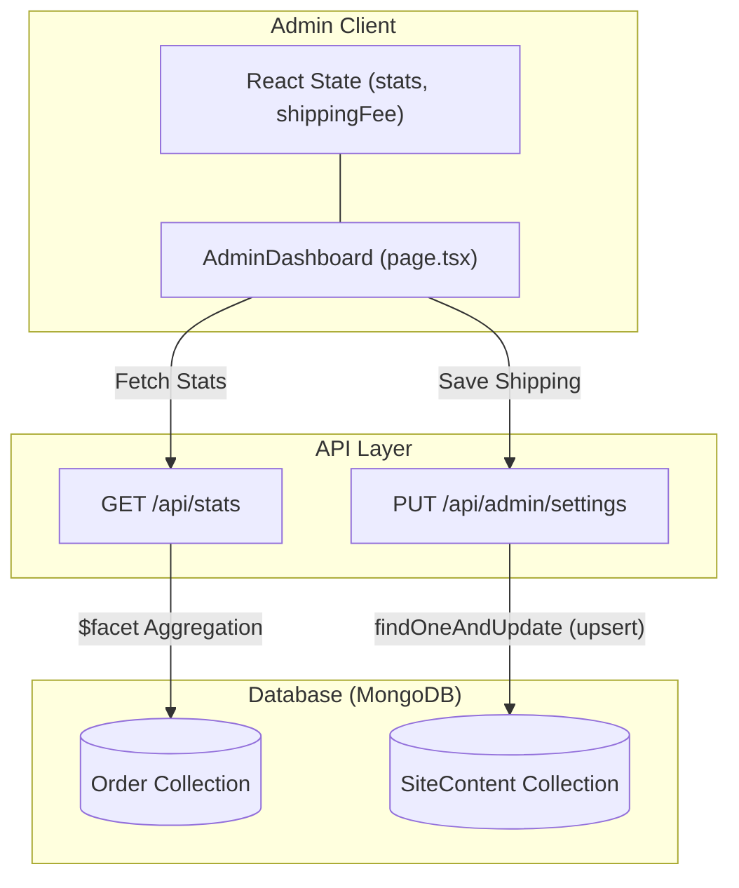
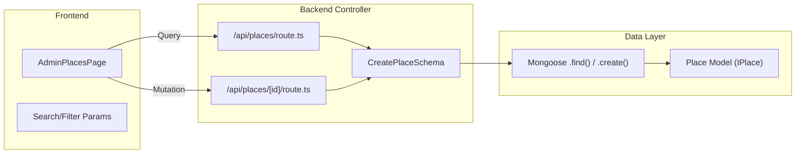

# Places Admin & Dashboard Stats

Relevant source files

The following files were used as context for generating this wiki page:

- [CHANGELOG.md](CHANGELOG.md)
- [DEVLOG.md](DEVLOG.md)
- [scripts/seed-new-places.ts](scripts/seed-new-places.ts)
- [src/app/admin/page.tsx](src/app/admin/page.tsx)
- [src/app/admin/places/page.tsx](src/app/admin/places/page.tsx)
- [src/app/api/admin/settings/route.ts](src/app/api/admin/settings/route.ts)
- [src/app/api/config/route.ts](src/app/api/config/route.ts)
- [src/app/api/orders/[id]/route.ts](src/app/api/orders/[id]/route.ts)
- [src/app/api/places/[id]/route.ts](src/app/api/places/[id]/route.ts)
- [src/app/api/places/route.ts](src/app/api/places/route.ts)
- [src/app/api/stats/route.ts](src/app/api/stats/route.ts)
- [src/app/api/upload/route.ts](src/app/api/upload/route.ts)
- [src/lib/models/Place.ts](src/lib/models/Place.ts)

The Admin Dashboard serves as the central control hub for the Seraj Store. It provides high-level business intelligence via an aggregated statistics engine, full CRUD management for the "Fas7a Helwa" (Outings) directory, and configuration panels for global store settings like shipping fees.

## 1. Admin Dashboard Home

The dashboard home page ([src/app/admin/page.tsx]()) provides an immediate overview of the store's health using four key metric cards and a "Recent Orders" table.

### 1.1 Dashboard Statistics Aggregation
The dashboard fetches data from the `/api/stats` endpoint. This route utilizes a MongoDB `$facet` aggregation pipeline to perform multiple calculations in a single database pass [src/app/api/stats/route.ts:17-44]().

| Metric | Logic / Filter |
| :--- | :--- |
| **Total Orders** | Count of all documents in the `Order` collection [src/app/api/stats/route.ts:20](). |
| **Pending Orders** | Count where `orderStatus` is `"pending"` [src/app/api/stats/route.ts:21-24](). |
| **Pending Stories** | Count where `customStory.heroName` exists AND `orderStatus` is `"pending"` or `"in_progress"` [src/app/api/stats/route.ts:25-33](). |
| **Total Revenue** | Sum of the `total` field across all orders [src/app/api/stats/route.ts:34-36](). |
| **Recent Orders** | The 5 most recent orders sorted by `createdAt` descending [src/app/api/stats/route.ts:37-41](). |

### 1.2 Shipping Settings Panel
The dashboard includes a dedicated section for managing shipping logistics. These settings are persisted in the `SiteContent` collection to allow real-time updates without code redeployment [src/app/api/admin/settings/route.ts:57-63]().

*   **Shipping Fee**: Global flat rate applied to orders [src/app/admin/page.tsx:180-188]().
*   **Free Shipping Threshold**: The order total above which the shipping fee is waived [src/app/admin/page.tsx:189-198]().
*   **Implementation**: The frontend SPA fetches these values from `/api/config` to update the "Free Shipping Progress Bar" in the cart [src/app/api/config/route.ts:7-35]().

### Data Flow: Dashboard Stats & Settings

**Sources:** [src/app/admin/page.tsx:48-88](), [src/app/api/stats/route.ts:10-63](), [src/app/api/admin/settings/route.ts:39-73]()

---

## 2. Places Management (Fas7a Helwa)

The Places Admin page provides full lifecycle management for the venues listed in the "Mama World" portal.

### 2.1 The IPlace Data Model
Venues are stored using the `IPlace` schema, which supports complex filtering for the frontend (city, area, price range, and age group) [src/lib/models/Place.ts:13-49]().

*   **Geospatial Data**: Stores `lat` and `lon` for future map integrations [src/lib/models/Place.ts:4-10]().
*   **Search Optimization**: A compound text index is defined on `name_en`, `name_ar`, `city`, and `area` to support the frontend search bar [src/lib/models/Place.ts:94]().
*   **Offer System**: Supports `offer_text` and `offer_active` flags to highlight specific venue deals [src/lib/models/Place.ts:84-86]().

### 2.2 CRUD Operations
The system uses standard RESTful patterns for place management:

*   **GET `/api/places`**: Supports extensive query parameters for both the public site and admin panel. Admins can pass `?all=true` to see inactive (soft-deleted) places [src/app/api/places/route.ts:15-36]().
*   **POST `/api/places`**: Creates new venues. It uses `CreatePlaceSchema` (Zod) for validation and ensures `name_en` uniqueness [src/app/api/places/route.ts:136-166]().
*   **PATCH `/api/places/[id]`**: Updates specific fields using dot-notation to prevent overwriting sub-documents like `location` [src/app/api/places/[id]/route.ts:94-121]().
*   **DELETE `/api/places/[id]`**: Performs a **soft-delete** by setting the `active` flag to `false`, preserving the record for historical order reference or restoration [src/app/api/places/[id]/route.ts:161-189]().

### 2.3 Cairo Sub-Filter Logic
To handle the high density of venues in Cairo, the system implements a sub-filtering mechanism.
*   **Data Matching**: The `area` field in the database must match the `data-area` attributes in the frontend HTML [DEVLOG.md:44-46]().
*   **Filtering**: When `city` is set to "Cairo", the API filters by the `area` parameter [src/app/api/places/route.ts:52-54]().

### Code Entity Mapping: Places Domain

**Sources:** [src/lib/models/Place.ts:52-101](), [src/app/api/places/route.ts:96-130](), [src/app/api/places/[id]/route.ts:54-88](), [DEVLOG.md:30-49]()

---

## 3. Media Upload Pipeline

The admin dashboard integrates with Cloudinary for hosting venue and product images. The `/api/upload` route handles the ingestion and transformation of media.

### 3.1 Upload Implementation
*   **Security**: Restricted to admins via `requireAdmin()` [src/app/api/upload/route.ts:37-38]().
*   **Validation**: Enforces strict MIME type checks and file size limits (10MB for images, 50MB for videos) [src/app/api/upload/route.ts:73-97]().
*   **Transformations**: 
    *   **Images**: Automatically resized to 1200x1200px and optimized for web [src/app/api/upload/route.ts:113-118]().
    *   **Videos**: Eagerly transcoded to MP4 (h264) [src/app/api/upload/route.ts:121-126]().

**Sources:** [src/app/api/upload/route.ts:9-34](), [src/app/api/upload/route.ts:99-143]()

---

## 4. Data Seeding & Maintenance

The codebase includes specialized scripts for populating and updating the places database.

### 4.1 Seeding Scripts
*   **`seed-new-places.ts`**: Used to manually enrich the database with high-quality venues in Cairo, such as "Africano Park" and "Gezira Sporting Club" [scripts/seed-new-places.ts:14-143]().
*   **Kidzapp Pipeline**: A scraper was used in earlier phases to import ~480 places, which were subsequently updated to replace Kidzapp links with Google Search links for better UX [CHANGELOG.md:141-149](), [CHANGELOG.md:16-23]().

### Place Category Mapping
The system uses numeric IDs for categories within the `category_ids` array [scripts/seed-new-places.ts:12]():
1.  **Play & Fun**
2.  **Cinema**
3.  **Gardens & Parks**
4.  **Arts & Education**
5.  **Animals & Farms**
6.  **Restaurants**

**Sources:** [scripts/seed-new-places.ts:1-13](), [CHANGELOG.md:11-24]()
