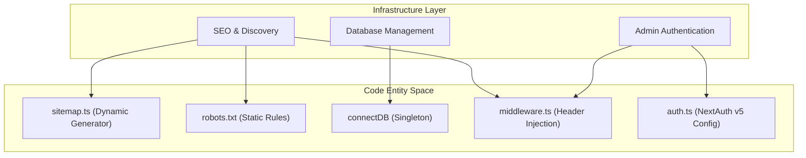
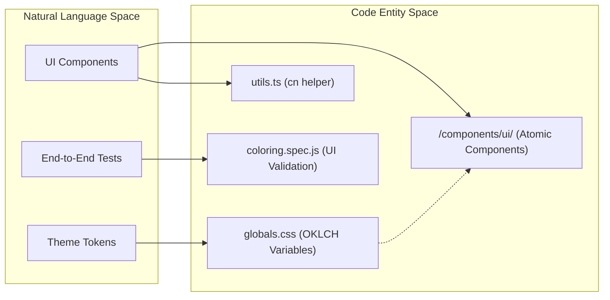

# Infrastructure & Tooling

Relevant source files

The following files were used as context for generating this wiki page:

- [components.json](components.json)
- [public/robots.txt](public/robots.txt)
- [src/app/api/auth/[...nextauth]/route.ts](src/app/api/auth/[...nextauth]/route.ts)
- [src/app/globals.css](src/app/globals.css)
- [src/app/sitemap.ts](src/app/sitemap.ts)
- [src/components/ui/badge.tsx](src/components/ui/badge.tsx)
- [src/components/ui/button.tsx](src/components/ui/button.tsx)
- [src/components/ui/card.tsx](src/components/ui/card.tsx)
- [src/lib/auth.ts](src/lib/auth.ts)
- [src/lib/utils.ts](src/lib/utils.ts)
- [src/middleware.ts](src/middleware.ts)
- [tests/coloring.spec.js](tests/coloring.spec.js)

This section provides a high-level overview of the cross-cutting infrastructure that supports the Seraj Store ecosystem. It covers the mechanisms for search engine visibility, database lifecycle management, the UI component architecture used in the administrative interfaces, and automated quality assurance.

## SEO, Sitemap & Robots

The application implements a dynamic SEO strategy to ensure that content within the "Mama World" portal (Articles and Coloring Workbook) is discoverable by search engines and AI agents. This is achieved through a combination of dynamic sitemap generation and explicit crawler instructions.

*   **Dynamic Sitemap**: The system generates a `sitemap.xml` that aggregates static application routes with dynamic slugs fetched from MongoDB for `Article` and `ColoringCategory` models [src/app/sitemap.ts:10-60]().
*   **Agent Discovery**: A middleware layer injects `Link` headers into the root response to point crawlers directly to the sitemap and robots configuration [src/middleware.ts:35-45]().
*   **AI Agent Policy**: The `robots.txt` file defines specific permissions for modern AI crawlers like `GPTBot` and `ClaudeBot`, while using `Content-Signal` headers to opt-out of AI training [public/robots.txt:15-45]().

For details, see [SEO, Sitemap & Robots](#6.1).

## Database Utilities & Seeding Scripts

The data layer relies on a robust set of utilities to manage connections and populate the environment across development, staging, and production.

*   **Connection Management**: The `connectDB` utility implements a singleton pattern using `globalThis` to prevent connection exhaustion in serverless environments [src/lib/db.ts]().
*   **Seeding Pipeline**: A comprehensive suite of scripts in the `scripts/` directory handles the initial population and migration of data, including product catalogs, outing locations (Fas7a Helwa), and the coloring workbook library.
*   **Rate Limiting**: An in-memory sliding window utility is used to protect sensitive endpoints, such as order submission and child photo uploads, from abuse.

For details, see [Database Utilities & Seeding Scripts](#6.2).

### Data Flow: Infrastructure to Code
The following diagram illustrates how infrastructure configurations map to specific code entities and files.

**Sources:** [src/app/sitemap.ts:1-60](), [public/robots.txt:1-51](), [src/middleware.ts:1-52](), [src/lib/auth.ts:9-75]()

## UI Component Library & Testing

The administrative dashboard is built using a modern UI stack designed for consistency and rapid development.

*   **Shadcn/UI**: The project utilizes a customized version of `shadcn/ui` components (e.g., `Button`, `Badge`, `Card`) located in `src/components/ui/` [src/components/ui/button.tsx:43-56](), [src/components/ui/badge.tsx:30-50]().
*   **Styling**: Built on **Tailwind CSS**, the system uses a centralized `globals.css` file defining a theme with CSS variables for light and dark modes [src/app/globals.css:7-118](). A `cn()` utility helper facilitates conditional class merging [src/lib/utils.ts:4-6]().
*   **Automated Testing**: Quality is maintained via **Playwright** integration tests. For example, the coloring catalog flow—from category selection to checkout—is verified through automated browser scripts [tests/coloring.spec.js:4-68]().

For details, see [UI Component Library & Testing](#6.3).

### Component & Styling Architecture
This diagram maps the UI infrastructure from design tokens to the rendered component logic.

**Sources:** [src/app/globals.css:51-84](), [src/components/ui/card.tsx:5-21](), [src/lib/utils.ts:4-6](), [tests/coloring.spec.js:1-69]()

## Authentication & Security

Administrative access is governed by **NextAuth.js v5**, providing a secure boundary for the store's management tools.

| Feature | Implementation Detail | Reference |
| :--- | :--- | :--- |
| **Provider** | Credentials Provider (Email/Password) | [src/lib/auth.ts:11]() |
| **Storage** | JWT Session Strategy (24-hour expiry) | [src/lib/auth.ts:50-53]() |
| **Security** | Bcrypt password hashing | [src/lib/auth.ts:28-30]() |
| **Protection** | Middleware-based route guarding for `/admin/*` | [src/middleware.ts:23-33]() |

**Sources:** [src/lib/auth.ts:1-75](), [src/middleware.ts:9-48]()
