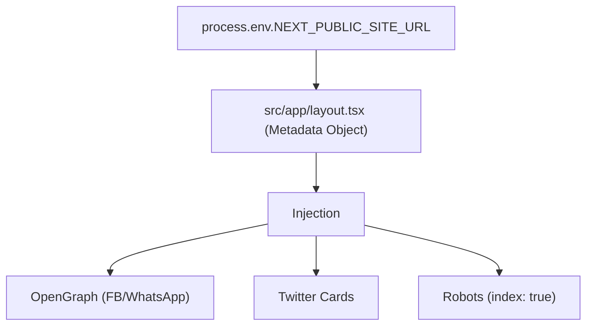
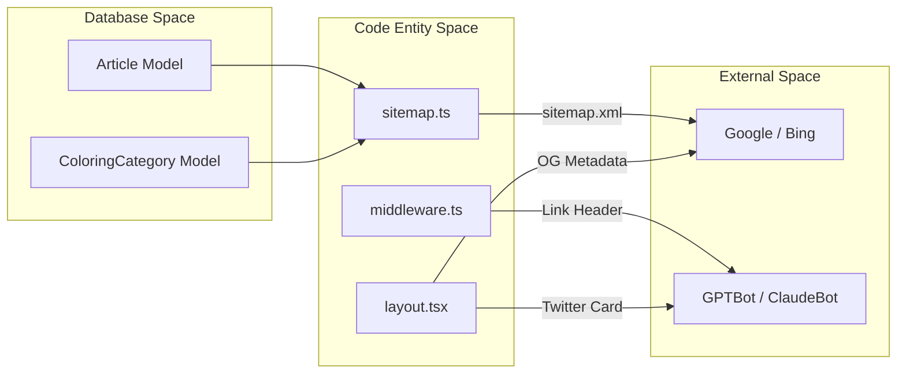

# SEO, Sitemap & Robots

<details>
<summary>Relevant source files</summary>

The following files were used as context for generating this wiki page:

- [public/assets/share-banner.jpg](public/assets/share-banner.jpg)
- [public/assets/sharelinkbannar.png](public/assets/sharelinkbannar.png)
- [public/robots.txt](public/robots.txt)
- [src/app/api/auth/[...nextauth]/route.ts](src/app/api/auth/[...nextauth]/route.ts)
- [src/app/layout.tsx](src/app/layout.tsx)
- [src/app/sitemap.ts](src/app/sitemap.ts)
- [src/lib/auth.ts](src/lib/auth.ts)
- [src/middleware.ts](src/middleware.ts)

</details>


This page documents the search engine optimization (SEO) infrastructure of Seraj Store. The system utilizes a combination of Next.js Metadata API, dynamic sitemap generation, strict crawler access controls via `robots.txt`, and middleware-based discovery headers to ensure high visibility and controlled AI agent access.

## Metadata Configuration

The global SEO settings are defined in the root layout using the Next.js `Metadata` object. This configuration ensures that every page served by the Next.js backend (including the SPA entry point at `/`) carries essential OpenGraph and Twitter card information.

### Key Metadata Properties
*   **Base URL**: Configured via `NEXT_PUBLIC_SITE_URL`, defaulting to the Vercel production URL [src/app/layout.tsx:5-7]().
*   **Localization**: The site is explicitly set to `ar_EG` (Arabic, Egypt) with RTL directionality [src/app/layout.tsx:16-46]().
*   **Social Banners**: Uses a high-resolution banner (`/assets/share-banner.jpg`) for both OpenGraph and Twitter cards [src/app/layout.tsx:18-33]().

**Metadata Data Flow**

Sources: [src/app/layout.tsx:4-38](), [src/app/layout.tsx:40-64]()

---

## Dynamic Sitemap Generation

The sitemap is generated dynamically at `/sitemap.xml` via `src/app/sitemap.ts`. It aggregates static application routes with dynamic slugs fetched directly from the MongoDB database.

### Dynamic Route Sources
The sitemap generator queries two primary collections:
1.  **Articles**: Fetches all active articles to generate URLs for the blog section [src/app/sitemap.ts:29-39]().
2.  **Coloring Categories**: Fetches categories that are active and contain at least one item (`itemCount > 0`) [src/app/sitemap.ts:42-52]().

### Priority & Frequency
| Route Type | URL Pattern | Change Frequency | Priority |
| :--- | :--- | :--- | :--- |
| Home (Static) | `/` | Daily | 1.0 |
| Articles | `/api/articles/[slug]` | Monthly | 0.6 |
| Coloring | `/api/coloring/categories/[slug]` | Weekly | 0.5 |

Sources: [src/app/sitemap.ts:10-60]()

---

## Robots & AI Agent Control

The `public/robots.txt` file defines access rules for standard search engines and specific behaviors for AI crawlers.

### AI Agent Rules
Seraj Store explicitly allows major AI bots to crawl the site for search and discovery but uses the `Content-Signal` header to restrict usage for training.
*   **Allowed AI Bots**: `GPTBot`, `ChatGPT-User`, `ClaudeBot`, `PerplexityBot`, and `Google-Extended` [public/robots.txt:15-31]().
*   **Content Signals**: Implements the IETF draft `Content-Signal` to signal `ai-train=no`, preventing the data from being used in LLM training sets while allowing `search=yes` [public/robots.txt:45]().

### Restrictions
*   **Admin Panel**: `/admin/` is disallowed for all agents [public/robots.txt:9]().
*   **API Layer**: `/api/` is disallowed to prevent direct scraping of raw JSON endpoints [public/robots.txt:10]().

Sources: [public/robots.txt:1-51]()

---

## Agent Discovery & Middleware

To ensure crawlers find the sitemap and robots instructions efficiently, `src/middleware.ts` injects `Link` headers into the response of the homepage.

### Link Header Injection
When a request hits the root path (`/`), the middleware appends a `Link` header containing the absolute URLs for the sitemap and robots file [src/middleware.ts:37-45](). This facilitates "agent discovery" even if the crawler does not check the root directory for files first.

**Discovery Logic Flow**
```mermaid
sequenceDiagram
    participant C as Crawler/Bot
    participant M as src/middleware.ts
    participant H as Home Page (/)
    
    C->>M: GET /
    M->>M: Check pathname === "/"
    M->>H: Proceed to Next.js Response
    H-->>M: Response Object
    M->>M: setHeader("Link", "<sitemap.xml>; rel='sitemap'")
    M-->>C: 200 OK + Link Headers
```

Sources: [src/middleware.ts:4-48]()

---

## Technical Implementation Summary

### Code Entity Mapping

| System Concept | Code Entity | File Path |
| :--- | :--- | :--- |
| Metadata Schema | `Metadata` type | [src/app/layout.tsx:4-38]() |
| Sitemap Logic | `sitemap()` function | [src/app/sitemap.ts:10-60]() |
| DB Connection | `connectDB()` | [src/app/sitemap.ts:26]() |
| Header Injection | `middleware()` | [src/middleware.ts:9-48]() |
| Asset Path | `/assets/share-banner.jpg` | [src/app/layout.tsx:20]() |

### Implementation Diagram
The following diagram illustrates how the SEO infrastructure bridges the database content to external search engines.



Sources: [src/app/sitemap.ts:1-5](), [src/middleware.ts:35-45](), [src/app/layout.tsx:4-38]()
