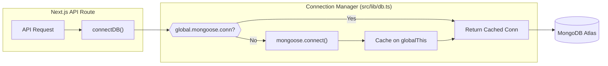
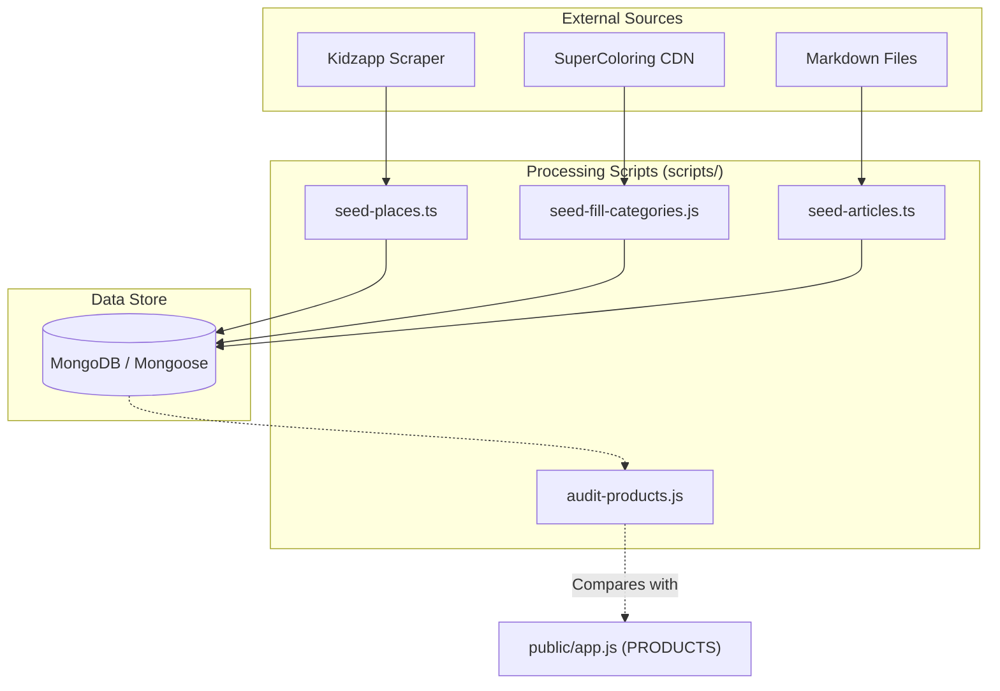

# Database Utilities & Seeding Scripts

Relevant source files

The following files were used as context for generating this wiki page:

- [.gitignore](.gitignore)
- [DEVELOPMENT_LOG.md](DEVELOPMENT_LOG.md)
- [data/.gitkeep](data/.gitkeep)
- [docs/mama-world-articles-plan.md](docs/mama-world-articles-plan.md)
- [scripts/audit-articles.js](scripts/audit-articles.js)
- [scripts/audit-products.js](scripts/audit-products.js)
- [scripts/check-db.js](scripts/check-db.js)
- [scripts/fix-duplicate-sources.js](scripts/fix-duplicate-sources.js)
- [scripts/force-update-db.js](scripts/force-update-db.js)
- [scripts/kidzapp-types.ts](scripts/kidzapp-types.ts)
- [scripts/migrate-counter.js](scripts/migrate-counter.js)
- [scripts/parks-gardens-egypt.ts](scripts/parks-gardens-egypt.ts)
- [scripts/scrape-kidzapp-egypt.ts](scripts/scrape-kidzapp-egypt.ts)
- [scripts/seed-empty-categories.js](scripts/seed-empty-categories.js)
- [scripts/seed-fill-categories.js](scripts/seed-fill-categories.js)
- [scripts/seed-places.ts](scripts/seed-places.ts)
- [scripts/seed-products.js](scripts/seed-products.js)
- [src/app/admin/stories/page.tsx](src/app/admin/stories/page.tsx)
- [src/app/api/upload-child-photo/route.ts](src/app/api/upload-child-photo/route.ts)
- [src/lib/db.ts](src/lib/db.ts)
- [src/lib/rateLimit.ts](src/lib/rateLimit.ts)

This page documents the infrastructure supporting the Seraj Store data layer, including the database connection singleton, rate-limiting utilities, and the extensive suite of scripts used for data migration, auditing, and seeding from external sources.

## Database Connection Singleton

The application uses a singleton pattern for MongoDB connections via Mongoose to prevent socket exhaustion in serverless environments (like Vercel). This implementation caches the connection on `globalThis` to persist across hot reloads during development and function re-use in production.

### Implementation Details
The `connectDB` function manages the lifecycle of the connection:
- **Caching**: Checks for an existing connection in `global.mongoose`. If absent, it initializes a new promise [src/lib/db.ts:10-15]().
- **Connection Options**: Uses `bufferCommands: false` to ensure operations fail fast if the connection is lost [src/lib/db.ts:24-24]().
- **Lifecycle**: Returns the cached promise, ensuring that multiple concurrent calls to `connectDB` wait for the same single connection event [src/lib/db.ts:28-32]().

### Data Access Flow

Sources: [src/lib/db.ts:1-35]()

---

## Rate Limiting Utility

To protect sensitive endpoints (e.g., child photo uploads, AI chat), the system implements an in-memory sliding window rate limiter.

### key Entities
- **`isRateLimited(key, limit, windowMs)`**: The core function that tracks hits for a specific identifier (like an IP + action) within a time window [src/lib/rateLimit.ts:10-10]().
- **`getClientIp(request)`**: A helper that extracts the IP address from `x-forwarded-for` or `x-real-ip` headers, crucial for accurate limiting in proxied environments [src/lib/rateLimit.ts:35-35]().

### Usage Example: Photo Uploads
The `/api/upload-child-photo` route applies a limit of 20 uploads per 10 minutes per IP to prevent storage abuse [src/app/api/upload-child-photo/route.ts:20-26]().

Sources: [src/lib/rateLimit.ts:1-45](), [src/app/api/upload-child-photo/route.ts:18-26]()

---

## Seeding & Migration Scripts

The `scripts/` directory contains tools for initializing the database and keeping it in sync with the frontend fallback data.

### 1. Product Seeding (`seed-products.js`)
This script populates the `Product` collection with the core catalog. It mirrors the `PRODUCTS` object found in `public/app.js` to ensure the database-driven API and the SPA fallback remain consistent.
- **Logic**: Defines a local Mongoose schema, connects to `MONGODB_URI`, and performs a bulk insertion of product data including nested `media` and `reviews` [scripts/seed-products.js:49-85]().
- **Fields**: Handles the `section` and `series` fields introduced during the multi-category refactor [scripts/seed-products.js:64-69]().

### 2. Fas7a Helwa (Places) Pipeline
The system uses a multi-stage pipeline to populate the outings directory:
- **`scrape-kidzapp-egypt.ts`**: A scraper that targets the Kidzapp Egypt portal to extract venue data.
- **`parks-gardens-egypt.ts`**: A hardcoded dataset of public Egyptian parks (e.g., Al-Azhar Park) used to enrich scraped data with free/low-cost options [scripts/parks-gardens-egypt.ts:31-45]().
- **`seed-places.ts`**: Parses the final `fas7a-helwa-merged.csv` and performs a `deleteMany({})` followed by `insertMany()` to refresh the collection [scripts/seed-places.ts:208-215]().

### 3. Coloring Workbook Seeding
- **`seed-empty-categories.js`**: Fetches thumbnail URLs from SuperColoring for categories like "Arabic Letters" and "Mazes" [scripts/seed-empty-categories.js:22-72]().
- **`seed-fill-categories.js`**: Uses hand-picked CDN URLs for categories where scraping is unreliable (e.g., `col-vehicles`, `craft-masks`) [scripts/seed-fill-categories.js:19-53]().

### 4. Article & Content Management
- **`seed-articles.ts`**: Imports Markdown files into the `Article` collection, calculating reading time and generating slugs.
- **`fix-duplicate-sources.js`**: A cleanup utility that removes redundant "Sources" sections from article Markdown content using string marker detection [scripts/fix-duplicate-sources.js:16-39]().

---

## Audit & Maintenance Tools

To ensure data integrity between the code and the database, several audit scripts are provided.

### Product Audit (`audit-products.js`)
This script compares the `PRODUCTS` object in `public/app.js` against the live MongoDB database.
- **Slug Sync**: Identifies products that exist only in the frontend or only in the backend [scripts/audit-products.js:168-184]().
- **Reachability**: Validates that all `imageUrl` and `gallery` links (both local and Cloudinary) return a `200 OK` status [scripts/audit-products.js:44-58]().

### Article Audit (`audit-articles.js`)
Checks for formatting issues in the blog subsystem:
- **Markdown Integrity**: Flags very long lines (>200 chars) that might break RTL layout [scripts/audit-articles.js:33-46]().
- **Table Detection**: Identifies articles containing Markdown tables to verify responsive rendering [scripts/audit-articles.js:58-71]().

### Data Flow: Script to Database

| Script Name | Purpose | Target Model |
| :--- | :--- | :--- |
| `seed-products.js` | Syncs SPA fallback products to DB | `Product` |
| `seed-places.ts` | Imports CSV data for Fas7a Helwa | `Place` |
| `seed-fill-categories.js` | Populates coloring items from CDN | `ColoringItem` |
| `audit-products.js` | Validates slug sync and image URLs | N/A (Audit) |
| `fix-duplicate-sources.js` | Cleans up Markdown formatting | `Article` |

Sources: [scripts/seed-products.js:1-114](), [scripts/seed-places.ts:1-215](), [scripts/audit-products.js:1-184](), [scripts/seed-fill-categories.js:1-70](), [scripts/fix-duplicate-sources.js:1-63](), [scripts/audit-articles.js:1-79]()
