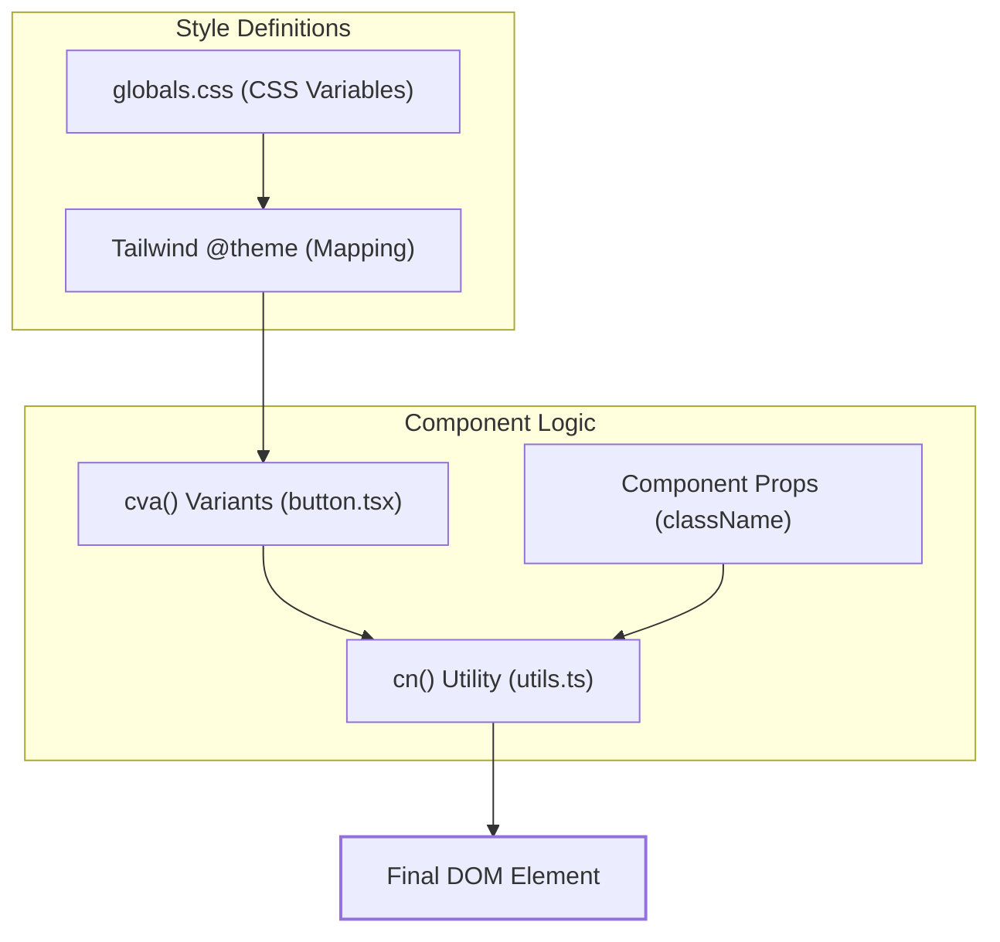
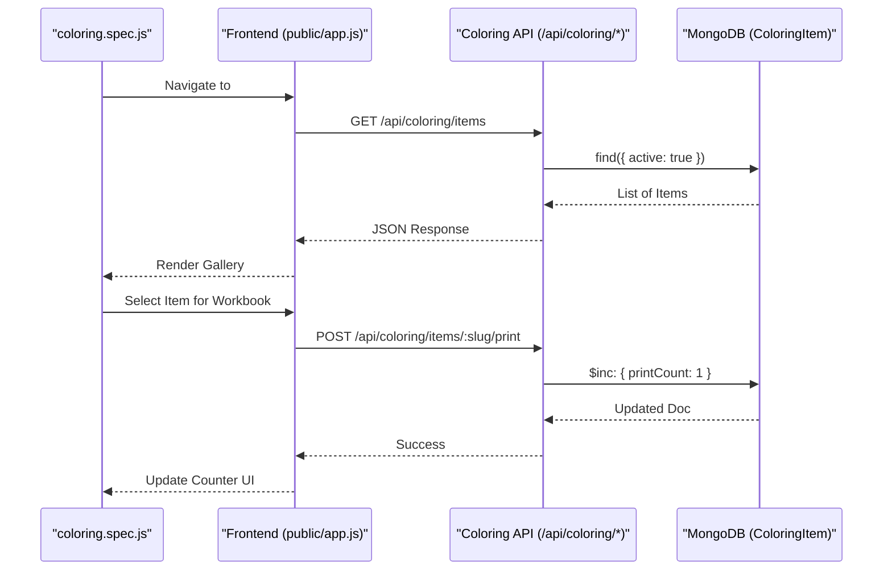

# UI Component Library & Testing

Relevant source files

The following files were used as context for generating this wiki page:

- [components.json](components.json)
- [eslint.config.mjs](eslint.config.mjs)
- [postcss.config.mjs](postcss.config.mjs)
- [src/app/globals.css](src/app/globals.css)
- [src/components/ui/badge.tsx](src/components/ui/badge.tsx)
- [src/components/ui/button.tsx](src/components/ui/button.tsx)
- [src/components/ui/card.tsx](src/components/ui/card.tsx)
- [src/components/ui/dialog.tsx](src/components/ui/dialog.tsx)
- [src/components/ui/dropdown-menu.tsx](src/components/ui/dropdown-menu.tsx)
- [src/components/ui/input.tsx](src/components/ui/input.tsx)
- [src/components/ui/table.tsx](src/components/ui/table.tsx)
- [src/components/ui/tabs.tsx](src/components/ui/tabs.tsx)
- [src/lib/utils.ts](src/lib/utils.ts)
- [test-results/.last-run.json](test-results/.last-run.json)
- [tests/coloring.spec.js](tests/coloring.spec.js)
- [tsconfig.json](tsconfig.json)

This section documents the architectural choices for the admin panel's user interface, the styling infrastructure, and the automated testing suite used to ensure the integrity of the coloring catalog.

## UI Component Library (shadcn/ui)

The Seraj Store admin panel utilizes a customized version of the **shadcn/ui** component library. Unlike traditional component libraries distributed as npm packages, these components are source-controlled within the repository under `src/components/ui/` [components.json:18-18](), allowing for direct modification of styles and behaviors.

### Implementation Pattern
The components are built using **Base UI** primitives (from `@base-ui/react`) and styled using **Tailwind CSS** with **Class Variance Authority (CVA)** for variant management [src/components/ui/button.tsx:1-3]().

Key utilities and patterns include:
*   **`cn()` Helper**: A utility function located in `src/lib/utils.ts` that combines `clsx` and `tailwind-merge` to handle conditional class joining and resolve Tailwind conflict logic [src/lib/utils.ts:4-6]().
*   **Data Slots**: Components use `data-slot` attributes (e.g., `data-slot="card"`) to provide a stable selector for nested styling and testing [src/components/ui/card.tsx:12-12]().
*   **Variant Management**: CVA is used to define standardized design tokens for `variant` (e.g., `default`, `destructive`, `outline`) and `size` (e.g., `sm`, `lg`, `icon`) [src/components/ui/button.tsx:6-41]().

### Core Admin Components
The following table summarizes the primary UI components used in the admin dashboard:

| Component | File Path | Primary Use Case |
| :--- | :--- | :--- |
| **Button** | `src/components/ui/button.tsx` | Form submissions, actions, and navigation triggers. |
| **Badge** | `src/components/ui/badge.tsx` | Status indicators (e.g., Order Status, Stock level). |
| **Card** | `src/components/ui/card.tsx` | Dashboard statistics and grouping form sections. |
| **Dialog** | `src/components/ui/dialog.tsx` | Confirmation modals and "Add New Item" overlays. |
| **Table** | `src/components/ui/table.tsx` | Listing products, orders, and coloring items. |
| **Tabs** | `src/components/ui/tabs.tsx` | Categorizing CMS content and article sections. |
| **Input** | `src/components/ui/input.tsx` | Standard text, number, and file upload fields. |

**Sources:** [src/components/ui/button.tsx:1-58](), [src/components/ui/card.tsx:1-103](), [src/components/ui/table.tsx:1-117](), [src/lib/utils.ts:1-7]().

---

## Styling Infrastructure

The project uses **Tailwind CSS v4** with **PostCSS** for its styling engine [src/app/globals.css:1-3]().

### Theme Configuration
The system uses CSS variables defined in the `:root` and `.dark` selectors of `src/app/globals.css` to manage the color palette and spacing [src/app/globals.css:51-118](). The colors are defined using the **OKLCH** color space for better perceptual uniformity [src/app/globals.css:52-74]().

### CSS Layering & Variables
The theme is integrated into Tailwind via the `@theme inline` block, mapping CSS variables to Tailwind utility classes [src/app/globals.css:7-49]().

### Component Styling Flow
The following diagram illustrates how a UI component's final class list is generated.

**UI Styling & Component Composition**

**Sources:** [src/app/globals.css:1-130](), [src/lib/utils.ts:1-7](), [src/components/ui/button.tsx:6-55]().

---

## Testing with Playwright

The codebase includes an automated test suite using **Playwright** to validate critical user flows, specifically focusing on the coloring catalog and Mama World portal.

### Coloring Catalog Flow
The primary test file `tests/coloring.spec.js` covers the "Coloring Workbook" builder logic. This ensures that the dynamic interaction between the frontend SPA and the backend API remains functional.

**Test Suite Coverage:**
1.  **Navigation**: Verifies the hash-based router correctly loads the coloring section.
2.  **Category Filtering**: Validates that clicking category chips triggers the correct API calls to `/api/coloring/items`.
3.  **Item Interaction**: Tests the incrementing of interaction counters (print, share, save) via the API.
4.  **Pricing Engine**: Validates that the pricing data fetched from the CMS correctly updates the UI total.

### Code-to-Test Mapping
The following diagram maps system features to their corresponding test entities and API endpoints.

**Test Execution & System Interaction**

**Sources:** [tests/coloring.spec.js:1-50](), [src/app/api/coloring/items/route.ts:1-20](), [test-results/.last-run.json:1-4]().

---

## Configuration Files

The UI and testing infrastructure are supported by several configuration files:

*   **`components.json`**: Configures the shadcn/ui CLI, defining aliases for `@/components/ui` and specifying `src/app/globals.css` as the global CSS entry point [components.json:1-26]().
*   **`postcss.config.mjs`**: Configures CSS processing, including Tailwind integration.
*   **`tsconfig.json`**: Defines path aliases (e.g., `@/*` mapping to `./src/*`) used throughout the React components and testing suite.
*   **`eslint.config.mjs`**: Enforces coding standards across both the Next.js admin panel and the vanilla JS frontend.

**Sources:** [components.json:1-26](), [tsconfig.json:1-30]().
