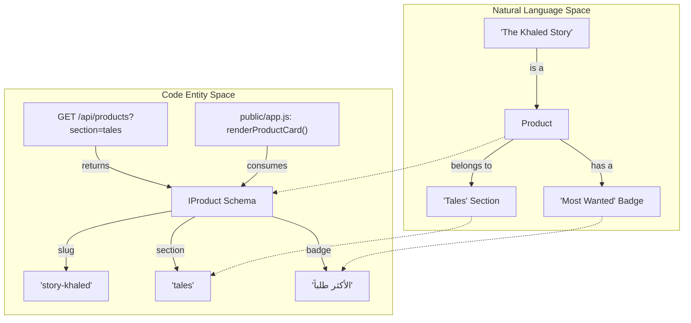
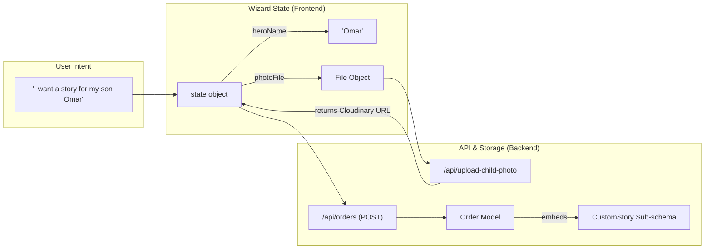
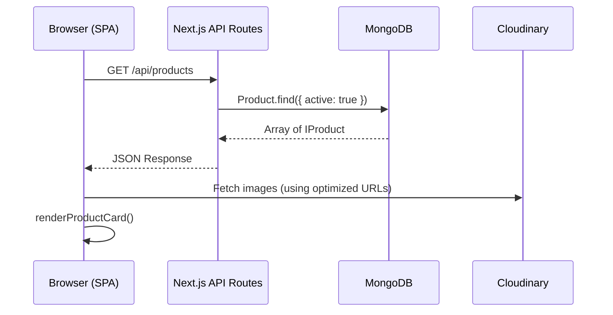

# Glossary

Relevant source files

The following files were used as context for generating this wiki page:

- [.planning/4-admin-SUMMARY.md](.planning/4-admin-SUMMARY.md)
- [.planning/ROADMAP.md](.planning/ROADMAP.md)
- [.planning/STATE.md](.planning/STATE.md)
- [.planning/phases/07-fas7a-helwa-data/07-01-SUMMARY.md](.planning/phases/07-fas7a-helwa-data/07-01-SUMMARY.md)
- [.planning/phases/07-fas7a-helwa-data/07-02-SUMMARY.md](.planning/phases/07-fas7a-helwa-data/07-02-SUMMARY.md)
- [.planning/phases/07-fas7a-helwa-data/07-03-SUMMARY.md](.planning/phases/07-fas7a-helwa-data/07-03-SUMMARY.md)
- [CHANGELOG.md](CHANGELOG.md)
- [DEVLOG.md](DEVLOG.md)
- [docs/ARTICALS.md](docs/ARTICALS.md)
- [public/app.js](public/app.js)
- [public/index.html](public/index.html)
- [public/robots.txt](public/robots.txt)
- [public/styles.css](public/styles.css)
- [scripts/seed-articles.ts](scripts/seed-articles.ts)
- [scripts/seed-new-places.ts](scripts/seed-new-places.ts)
- [scripts/seed.ts](scripts/seed.ts)
- [src/app/admin/articles/page.tsx](src/app/admin/articles/page.tsx)
- [src/app/admin/coloring/categories/page.tsx](src/app/admin/coloring/categories/page.tsx)
- [src/app/admin/content/ContentEditor.tsx](src/app/admin/content/ContentEditor.tsx)
- [src/app/admin/layout.tsx](src/app/admin/layout.tsx)
- [src/app/admin/orders/page.tsx](src/app/admin/orders/page.tsx)
- [src/app/admin/places/page.tsx](src/app/admin/places/page.tsx)
- [src/app/api/articles/[slug]/route.ts](src/app/api/articles/[slug]/route.ts)
- [src/app/api/articles/route.ts](src/app/api/articles/route.ts)
- [src/app/api/auth/[...nextauth]/route.ts](src/app/api/auth/[...nextauth]/route.ts)
- [src/app/api/coloring/categories/[slug]/route.ts](src/app/api/coloring/categories/[slug]/route.ts)
- [src/app/api/coloring/items/[slug]/route.ts](src/app/api/coloring/items/[slug]/route.ts)
- [src/app/api/orders/route.ts](src/app/api/orders/route.ts)
- [src/app/api/places/[id]/route.ts](src/app/api/places/[id]/route.ts)
- [src/app/api/places/route.ts](src/app/api/places/route.ts)
- [src/app/api/products/[slug]/route.ts](src/app/api/products/[slug]/route.ts)
- [src/app/api/products/route.ts](src/app/api/products/route.ts)
- [src/app/sitemap.ts](src/app/sitemap.ts)
- [src/lib/auth.ts](src/lib/auth.ts)
- [src/lib/models/Article.ts](src/lib/models/Article.ts)
- [src/lib/models/Order.ts](src/lib/models/Order.ts)
- [src/lib/models/Place.ts](src/lib/models/Place.ts)
- [src/lib/models/Product.ts](src/lib/models/Product.ts)
- [src/lib/seed/contentDefaults.ts](src/lib/seed/contentDefaults.ts)
- [src/middleware.ts](src/middleware.ts)

This glossary defines the domain-specific terms, Arabic brand concepts, and technical abbreviations used throughout the Seraj Store codebase.

## Core Brand & Domain Concepts

| Term | Meaning | Code Pointers |
|:---|:---|:---|
| **Seraj (سِراج)** | The brand name, meaning "Lamp" or "Light". Represents the mission to enlighten children through reading. | [public/index.html:12-13]() |
| **Mama World (عالم ماما)** | The content portal for parents, containing articles, outings, and AI advisory. | [public/app.js:110-110]() |
| **Fas7a Helwa (فسحة حلوة)** | "A Nice Outing" — A directory of child-friendly locations in Egypt. | [src/app/admin/layout.tsx:17-17]() |
| **Mama Zainab (الجددة زينب)** | An AI persona (Parenting Advisor) that provides advice in Egyptian Arabic. | [CHANGELOG.md:32-33]() |
| **Story Wizard** | The multi-step flow where users customize a story with a child's name and photo. | [public/app.js:22-32]() |
| **InstaPay** | The primary payment gateway used in Egypt for instant bank transfers. | [public/app.js:10-11]() |

## Technical Terms & Implementation Details

### Product Taxonomy
The system uses a two-tier classification for products to support both programmatic grouping and user-facing labels.
*   **Section**: An English enum (`tales`, `seraj-stories`, `custom-stories`, `play-learn`) used for routing and UI layout logic. [src/lib/models/Product.ts:135-135]() (implied by schema usage in [src/app/api/products/route.ts:90-90]()).
*   **Category**: An Arabic string (`قصص جاهزة`, `قصص مخصصة`, etc.) used for display and admin filtering. [src/app/api/products/route.ts:89-89]().
*   **Series**: A grouping within a section (e.g., "سباق الفتوحات") that adds a special badge to product cards. [public/app.js:63-63]().

### Order Status State Machine
Orders transition through several statuses managed in the Admin Dashboard:
*   `pending`: Initial state upon submission.
*   `in_progress`: Admin has acknowledged and is preparing the order.
*   `shipped` / `delivered`: Logistics completion states.
*   `cancelled`: Order invalidated.
*   **Payment Status**: Tracked separately as `unpaid`, `deposit_paid`, or `fully_paid`. [src/app/admin/orders/page.tsx:62-63]().

### Content Management (CMS)
*   **SiteContent**: A flat key-value store in MongoDB that allows admins to edit website text (e.g., navbar labels, shipping fees) without code changes. [src/lib/seed/contentDefaults.ts:1-10]().
*   **InjectSiteContent**: The client-side mechanism that scans the DOM for `data-content-key` and replaces text with values from the API. [public/app.js:110-112]().

## System Flow Diagrams

### From Natural Language to Code Entities (Product Domain)
This diagram maps how a physical product in the "Seraj" world is represented as code structures across the stack.

Sources: [src/lib/models/Product.ts:1-20](), [src/app/api/products/route.ts:14-46](), [public/app.js:35-55]()

### From Natural Language to Code Entities (Order & Wizard Domain)
This diagram maps the user's intent to create a custom story into the underlying data models and API endpoints.

Sources: [public/app.js:22-32](), [src/app/api/orders/route.ts:31-43](), [src/app/api/orders/route.ts:163-175]()

## Key Abbreviations

| Abbreviation | Full Term | Context |
|:---|:---|:---|
| **SPA** | Single Page Application | The architecture of the `public/` folder using hash-based routing. [public/app.js:1-5]() |
| **SSE** | Server-Sent Events | Used for streaming AI responses from Mama Zainab chat. [CHANGELOG.md:31-31]() |
| **PWA** | Progressive Web App | Implementation of offline caching via `sw.js`. [public/index.html:79-79]() |
| **CRUD** | Create, Read, Update, Delete | Standard operations provided by the Admin API routes. [src/app/api/products/[slug]/route.ts:99-207]() |
| **JSON-LD** | JSON for Linked Data | Structured data injected into the head for SEO. [public/index.html:25-41]() |

## Technical Architecture Overview

The Seraj Store uses a hybrid architecture designed for performance and SEO:

1.  **Client-Side (SPA)**: A vanilla JavaScript engine in `public/app.js` handles routing (`handleRoute`), state management (`state`), and dynamic UI updates.
2.  **Server-Side (Next.js)**: Provides the API layer under `src/app/api/` and the Admin Dashboard under `src/app/admin/`.
3.  **Data Layer**: MongoDB via Mongoose. Models are defined in `src/lib/models/` with strict Zod validation at the API entry points.

Sources: [public/app.js:140-150](), [src/app/api/products/route.ts:14-54](), [src/lib/db.ts:1-10]()
